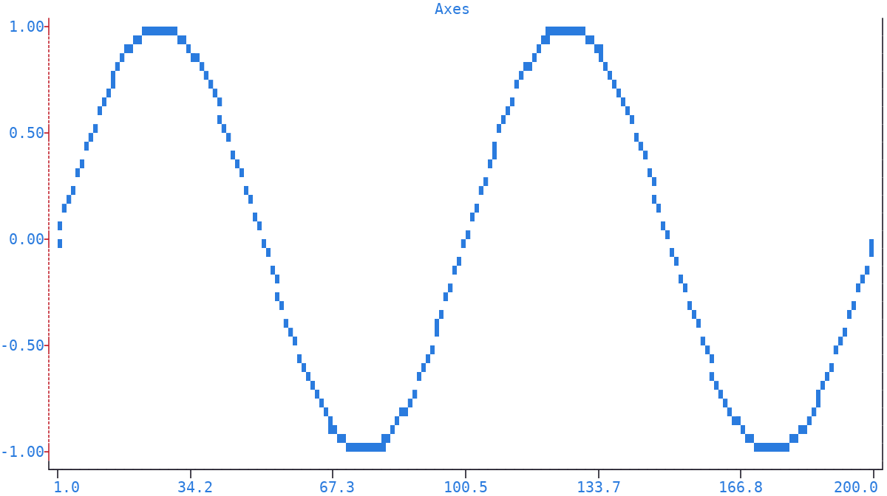
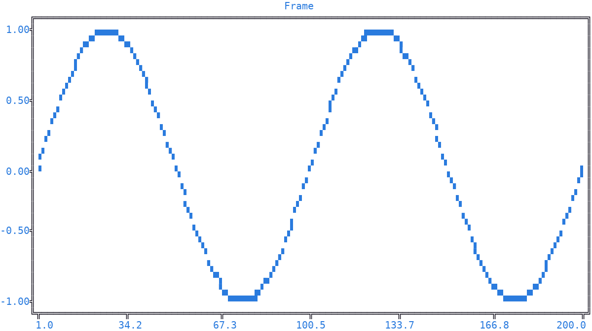

Axes
====

| The *axes* are the **four** lines drawn at the edges of the plot :doc:`canvas <canvas>`: the lower and upper *x* axes, and the left and right *y* axes.
| They form the visible frame of the plot, and carry the tick marks of the :ref:`numerical ticks <ticks>` placed by the :doc:`rulers <ruler>`.

Axes
----

The :meth:`axes() <plotext._plotter.plot.plot_class.axes>` method of the figure, and of any :ref:`subplot <subplots>`, controls the **visibility**, line style and colors of the selected axes.

.. code-block:: python

   import plotext as plt
   fig = plt.figure
   fig.clear()

   y = plt.sin()
   signal = fig.signal(y)
   fig.draw(signal)

   fig.axes(active = False, axis = "x", side = "upper")   # hide the upper x axis
   fig.axes(style = "dotted",                             # red dotted left y axis
            pixel = plt.pixel(foreground = "red"),
            axis = "y", side = "left")

   fig.title("Axes")
   fig.show()

.. note:: The default axes pixel is *black* on a *white* background, with no style.

| With its parameters you can turn the selected axes on or off (``active``) and set their :ref:`line style <line_styles>` (``style``): the axes are the **only** lines displaying every style, *rounded* included.
| You can set the colors of the axes (``pixel``, as a :ref:`pixel <pixel>` object).
| Finally, you can narrow the selection (``axis`` and ``side``), from all four sides (the default) down to one.

Frame
-----

With ``axis`` and ``side`` left at their defaults, the same settings apply to **every frame side** in one call.

.. code-block:: python

   import plotext as plt
   fig = plt.figure
   fig.clear()

   y = plt.sin()
   signal = fig.signal(y)
   fig.draw(signal)

   fig.axes(style = "double")    # a common line style for the whole frame

   fig.title("Frame")
   fig.show()

.. note:: The :meth:`plotext.figure.axes(False) <plotext._plotter.plot.plot_class.axes>` call hides the whole frame.

.. _axis:

Axis Selection
--------------

Many |plotext| methods take an ``axis`` parameter, and a ``side`` one, to choose **which axis** they apply to.

The ``axis`` parameter accepts:

- *x* or ``0``, for the *x* axis
- *y* or ``1``, for the *y* axis
- a list, like ``["x", "y"]`` or ``[0, 1]``, or the word *both*, for the two axes at once

The ``side`` parameter accepts:

- *lower* or ``0`` (the default), and *upper* or ``1``, on the *x* axis
- *left* or ``0`` (the default), and *right* or ``1``, on the *y* axis
- a list, or the word *both*, for the two sides at once

.. note:: The :meth:`axes() <plotext._plotter.plot.plot_class.axes>` method is the exception: with ``axis`` and ``side`` not given, it selects all four sides, not the lower *x* axis alone.

Every method placing content on the canvas at data coordinates takes the ``xside`` and ``yside`` parameters instead, to pick which *x* and *y* axis to plot against:

- the ``xside`` parameter accepts *lower* (the default) or *upper*, or the integers ``0`` or ``1``
- the ``yside`` parameter accepts *left* (the default) or *right*, or the integers ``0`` or ``1``

.. note:: These are the signal creating methods (:meth:`signal <plotext._plotter.plot.plot_class.signal>`, :meth:`bar <plotext._plotter.plot.plot_class.bar>`, :meth:`hist <plotext._plotter.plot.plot_class.hist>`, :meth:`box <plotext._plotter.plot.plot_class.box>`, :meth:`candlestick <plotext._plotter.plot.plot_class.candlestick>`, :meth:`error <plotext._plotter.plot.plot_class.error>`, :meth:`heatmap <plotext._plotter.plot.plot_class.heatmap>`, :meth:`rectangle <plotext._plotter.plot.plot_class.rectangle>`, :meth:`polygon <plotext._plotter.plot.plot_class.polygon>`, :meth:`segment <plotext._plotter.plot.plot_class.segment>` and :meth:`text <plotext._plotter.plot.plot_class.text>`), plus :meth:`line <plotext._plotter.plot.plot_class.line>` and :meth:`legend <plotext._plotter.plot.plot_class.legend>`, which place their content directly, with no signal involved.

Clear
-----

The axes have no dedicated clear method: they reset through the figure, or subplot, :doc:`clear <clear>` object, :meth:`plotext.figure.clear.settings() <plotext._plotter.clear.clear_class.settings>` restoring their visibility, :meth:`plotext.figure.clear.pixels() <plotext._plotter.clear.clear_class.pixels>` their colors and :meth:`plotext.figure.clear.styles() <plotext._plotter.clear.clear_class.styles>` their line styles.

.. caution:: These methods are not specific to the axes: each resets its whole family of settings across the plot, as described in the :doc:`clear <clear>` page.
