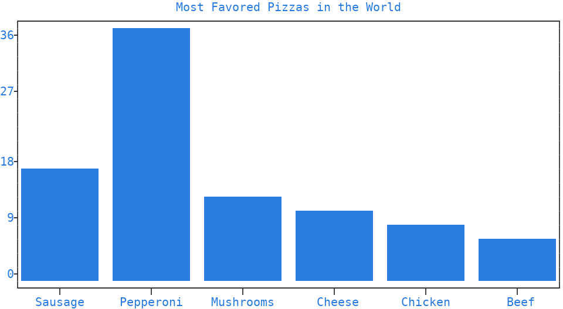
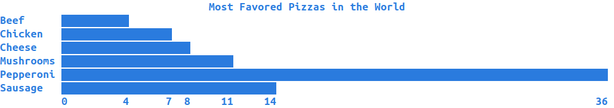
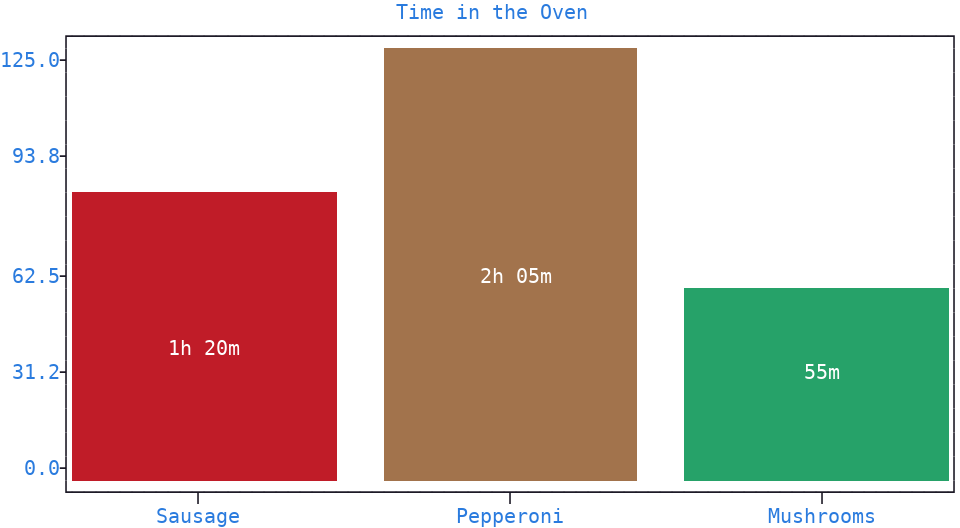
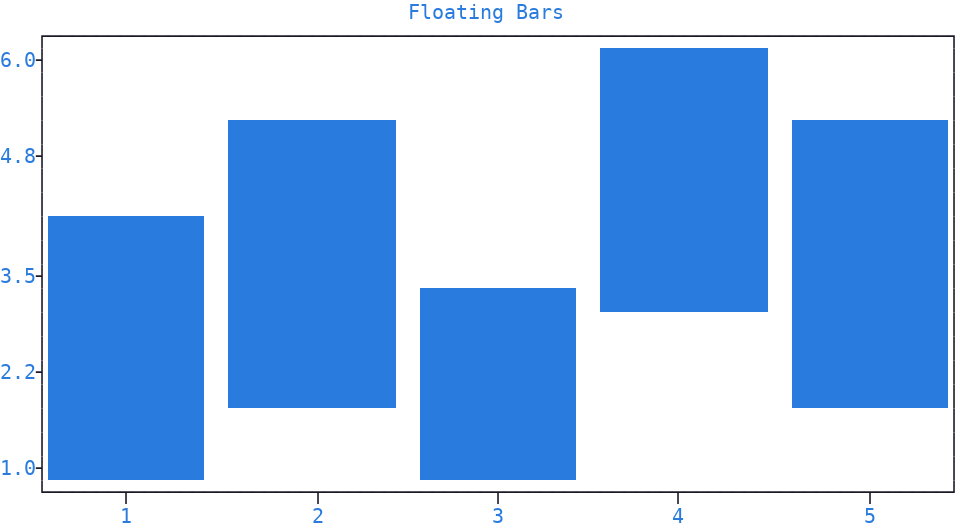
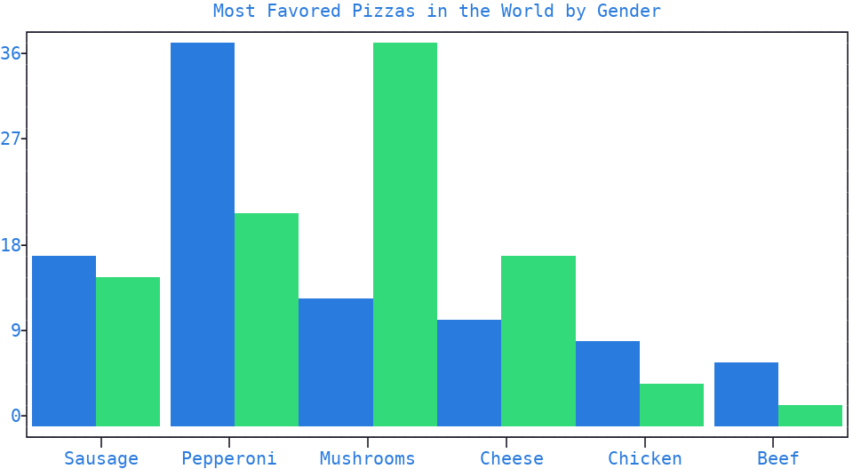
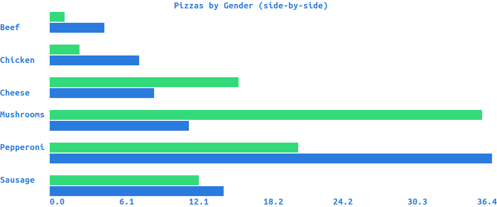
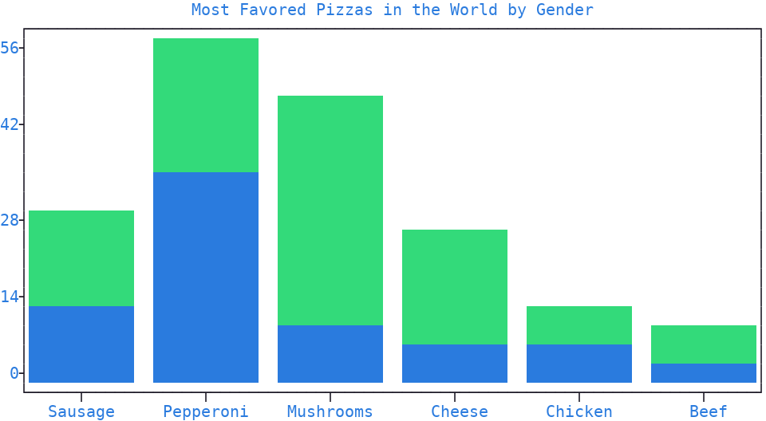
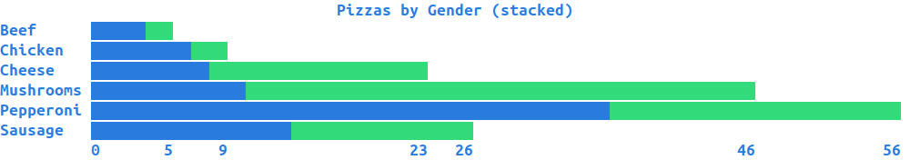
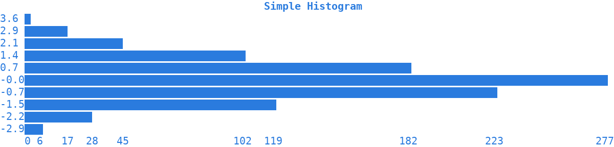
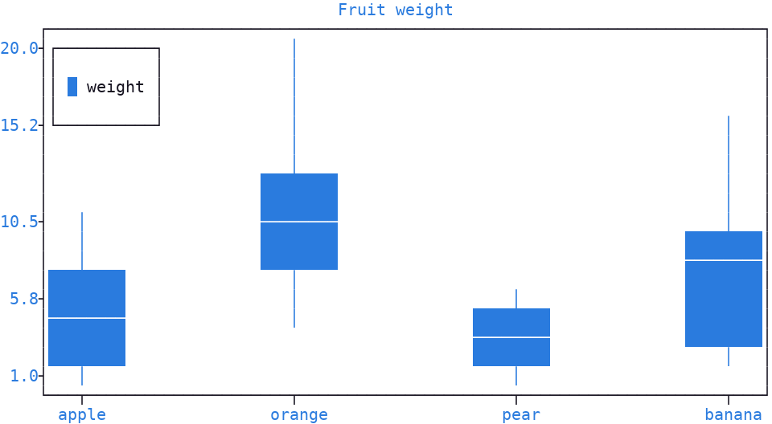

Bar Plots
=========

:meth:`~plotext._plotter.plot.plot_class.bar` builds a bar plot signal made of
**one rectangle** per bar: like every other plot, it returns a signal to pass to
:meth:`~plotext._plotter.plot.plot_class.draw`.

.. note:: Internally, each bar is a :meth:`rectangle() <plotext._plotter.plot.plot_class.rectangle>`.

.. _argument_forms:

Argument Forms
--------------

:meth:`~plotext._plotter.plot.plot_class.bar` accepts one, two or three positional sequences:

- a **single** sequence sets the bar heights, with the bar coordinates automatically ranging from 1 onwards
- **two** sequences set the bar coordinates and heights
- **three** sequences set the bar coordinates, baselines and heights, drawing the :ref:`floating bars <floating_bars>` described below

The heights may also be a list of sequences, one per group, all sharing the same coordinates: this draws the :ref:`grouped <multiple_bar>` or :ref:`stacked <stacked_bar>` bars described below.

String coordinates are also accepted: they are placed at integer positions and shown as :ref:`tick labels <ticks>` along the bar :doc:`axis <axis>`.

Basic Bar Plot
--------------

.. code-block:: python

   import plotext as plt
   fig = plt.figure
   fig.clear()

   pizzas      = ["Sausage", "Pepperoni", "Mushrooms", "Cheese", "Chicken", "Beef"]
   percentages = [14, 36, 11, 8, 7, 4]

   signal = fig.bar(pizzas, percentages)
   fig.draw(signal)

   fig.title("Most Favored Pizzas in the World")
   fig.show()

Or directly from the shell:

.. code-block:: shell

   plotext --figure --bar @sample:pizzas --draw --title 'Most Favored Pizzas in the World' --show

| With its parameters you can set the symbol rendering the bars (``marker``, ``full`` by default: see the :doc:`marker <marker>` page for all the accepted forms) and their thickness (``width``), as a fraction of the smallest spacing between bar coordinates, where the default 0.8 leaves a small gap and 1 makes neighboring bars touch.
| You can draw the bars upright (*vertical*, the default) or sideways (*horizontal*) with the ``orientation`` parameter.
| Finally, you can control each bar's outline and body (``lines`` and ``fill``, both drawn by default).

.. note:: More documentation is available via ``plotext.doc.bar()``.

.. _simple_bar:

Simple Bar Style
~~~~~~~~~~~~~~~~

A simpler, **frame-less** bar plot can be assembled from the regular :meth:`~plotext._plotter.plot.plot_class.bar` plus a few configuration calls.

.. code-block:: python

   import plotext as plt

   pizzas = ["Sausage", "Pepperoni", "Mushrooms", "Cheese", "Chicken", "Beef"]
   percentages = [14, 36, 11, 8, 7, 4]

   fig = plt.figure
   fig.clear()
   fig.plot_size(100, len(pizzas) + 2)

   signal = fig.bar([p + " " for p in pizzas], percentages,
                    orientation = "horizontal",
                    marker = "brick",
                    width = 0,
                    lines = True)
   fig.draw(signal)

   fig.axes(False)
   fig.ruler("x").lim(0, max(percentages) * 1.01)
   fig.ruler("x").ticks([0] + percentages, [str(v) for v in [0] + percentages])
   fig.ruler("y").alignment(tick = "left")
   fig.ruler("x").pixel(plt.pixel(style = "bold"))
   fig.ruler("y").pixel(plt.pixel(style = "bold"))

   fig.title(plt.colorize(" Most Favored Pizzas in the World ", pixel = (None, None, "bold")))
   fig.show()

| In the recipe, the ``brick`` :ref:`marker <markers>` draws solid horizontal bars, one plot row each, slightly separated by the thin gap the brick symbol ``▇`` leaves above itself.
| The ``axes(False)`` call removes the chart frame, the explicit ``ticks`` show each bar value along the *x* :doc:`axis <axis>`, and the *y* tick alignment left-justifies the category names.
| The :ref:`pixels <pixel>` make the :doc:`rulers <ruler>` and the title bold.

.. _labeled_bars:

Labelled Bars
~~~~~~~~~~~~~

| Every bar method, :meth:`hist() <plotext._plotter.plot.plot_class.hist>` included, can write text inside each bar.
| ``labeled = True`` writes the bar's own height, centered in the rectangle, its colors adapting to the bar.
| A **list** writes your own text instead.

.. note:: One entry per bar, and a shorter list starts again from its beginning. Each entry is a string, a :ref:`colorize <colorize>` or a :ref:`matrix <matrix>`, so an :ref:`animated text <effects>` can sit in a bar too.

.. note:: When the bars are grouped or stacked, you give one such list per series, exactly as you give the heights.

.. tip:: The ``marker`` parameter follows the same rule: a list gives **one marker per bar**, so each can carry its own :ref:`color <colors>`.

.. code-block:: python

   import plotext as plt
   fig = plt.figure
   fig.clear()

   pizzas  = ["Sausage", "Pepperoni", "Mushrooms"]
   minutes = [80, 125, 55]
   colors  = [plt.marker("full", pixel = color) for color in ("red", "orange", "green")]

   fig.draw(fig.bar(pizzas, minutes, labeled = ["1h 20m", "2h 05m", "55m"], marker = colors))
   fig.title("Time in the Oven")
   fig.show()

.. _floating_bars:

Floating Bars
~~~~~~~~~~~~~

The three-argument form is the way to draw bars that don't touch the zero baseline, useful to display *ranges* of values.

.. code-block:: python

   import plotext as plt
   fig = plt.figure
   fig.clear()

   x      = [1, 2, 3, 4, 5]
   y_min  = [1, 2, 1, 3, 2]
   y_max  = [4, 5, 3, 6, 5]

   signal = fig.bar(x, y_min, y_max)
   fig.draw(signal)

   fig.title("Floating Bars")
   fig.show()

Or directly from the shell:

.. code-block:: shell

   plotext --figure --bar [1,2,3,4,5] [1,2,1,3,2] [4,5,3,6,5] --draw --show

.. _multiple_bar:

Multiple Bar Plot
-----------------

| To plot **grouped** bars, one per series placed *side by side* at each *x* slot, pass :meth:`~plotext._plotter.plot.plot_class.bar` a list of height sequences, one per group: the bar width splits evenly between the groups, and each group takes its own color from the cycler.
| With the ``marker`` parameter you can pass a single value, shared by every group, or a list with one entry per group.
| Pass ``labeled = True`` to label each bar with its height (see the :ref:`labeled-bars note <labeled_bars>`).

.. code-block:: python

   import plotext as plt
   fig = plt.figure
   fig.clear()

   pizzas = ["Sausage", "Pepperoni", "Mushrooms", "Cheese", "Chicken", "Beef"]
   men    = [14, 36, 11,  8,  7, 4]
   women  = [12, 20, 35, 15,  2, 1]

   signal = fig.bar(pizzas, [men, women])
   fig.draw(signal)

   fig.title("Most Favored Pizzas in the World by Gender")
   fig.show()

Or directly from the shell:

.. code-block:: shell

   plotext --figure --bar [Sausage,Pepperoni,Mushrooms,Cheese,Chicken,Beef] \
                 [[14,36,11,8,7,4],[12,20,35,15,2,1]] --draw --show

.. _simple_multiple_bar:

Simple Multiple Bar
~~~~~~~~~~~~~~~~~~~

The same recipe used for :ref:`simple bar style <simple_bar>` applies to grouped bars; each group keeps its own color from the cycler.

.. code-block:: python

   import plotext as plt

   pizzas = ["Sausage", "Pepperoni", "Mushrooms", "Cheese", "Chicken", "Beef"]
   men    = [14, 36, 11,  8,  7, 4]
   women  = [12, 20, 35, 15,  2, 1]

   fig = plt.figure
   fig.clear()
   fig.plot_size(100, 3 * len(pizzas) + 1)   # 3 rows per pizza slot: women + men + gap

   signal = fig.bar([p + " " for p in pizzas], [men, women],
                    orientation = "horizontal",
                    marker = "brick",
                    width = 0,
                    lines = True,
                    _offset = -0.25)   # align the y-tick label with the first sub-bar's row
   fig.draw(signal)

   fig.axes(False)
   fig.ruler("x").lim(0, max(max(men), max(women)) * 1.01)
   fig.ruler("y").alignment(tick = "left")
   fig.ruler("x").pixel(plt.pixel(style = "bold"))
   fig.ruler("y").pixel(plt.pixel(style = "bold"))

   fig.title(plt.colorize(" Pizzas by Gender (side-by-side) ", pixel = (None, None, "bold")))
   fig.show()

The plot height counts three rows per category (one per group plus a separating gap), without the last gap, plus the *x* :doc:`axis <axis>` and title rows: with ``L`` categories, ``3 * L - 1 + 1 + 1 = 3 * L + 1``.

.. _stacked_bar:

Stacked Bar Plot
----------------

| To plot bars **stacked** on top of each other, heights adding up *cumulatively* at each *x* slot, pass ``stacked = True`` alongside the list of height sequences: each group's bar starts where the previous group's bar ended.
| With the ``marker`` parameter you can pass a single value, shared by every group, or a list with one entry per group.
| Pass ``labeled = True`` to label each segment with its height (see the :ref:`labeled-bars note <labeled_bars>`).

.. code-block:: python

   import plotext as plt
   fig = plt.figure
   fig.clear()

   pizzas = ["Sausage", "Pepperoni", "Mushrooms", "Cheese", "Chicken", "Beef"]
   men    = [14, 36, 11,  8,  7, 4]
   women  = [12, 20, 35, 15,  2, 1]

   signal = fig.bar(pizzas, [men, women], stacked = True)
   fig.draw(signal)

   fig.title("Most Favored Pizzas in the World by Gender")
   fig.show()

Or directly from the shell:

.. code-block:: shell

   plotext --figure --bar [Sausage,Pepperoni,Mushrooms,Cheese,Chicken,Beef] \
                 [[14,36,11,8,7,4],[12,20,35,15,2,1]] stacked=true --draw --show

.. _simple_stacked_bar:

Simple Stacked Bar
~~~~~~~~~~~~~~~~~~

Same recipe as :ref:`simple bar style <simple_bar>`, but the bars are now cumulative per category, the numerical *x* ticks at each segment boundary make the contribution of each group visible at a glance.

.. code-block:: python

   import plotext as plt

   pizzas = ["Sausage", "Pepperoni", "Mushrooms", "Cheese", "Chicken", "Beef"]
   men    = [14, 36, 11,  8,  7, 4]
   women  = [12, 20, 35, 15,  2, 1]
   totals = [m + w for m, w in zip(men, women)]

   fig = plt.figure
   fig.clear()
   fig.plot_size(100, len(pizzas) + 2)

   signal = fig.bar([p + " " for p in pizzas], [men, women], stacked = True,
                    orientation = "horizontal",
                    marker = "brick",
                    width = 0,
                    lines = True)
   fig.draw(signal)

   fig.axes(False)
   fig.ruler("x").lim(0, max(totals) * 1.01)
   fig.ruler("x").ticks([0] + totals, [str(v) for v in [0] + totals])
   fig.ruler("y").alignment(tick = "left")
   fig.ruler("x").pixel(plt.pixel(style = "bold"))
   fig.ruler("y").pixel(plt.pixel(style = "bold"))

   fig.title(plt.colorize(" Pizzas by Gender (stacked) ", pixel = (None, None, "bold")))
   fig.show()

.. _histogram:

Histogram
---------

:meth:`~plotext._plotter.plot.plot_class.hist` draws the histogram of a simple data sequence: the data range is split into evenly-spaced **buckets**, and each bar **counts** the values falling in its bucket.

.. code-block:: python

   import plotext as plt

   fig = plt.figure
   fig.clear()

   l = 7 * 10 ** 4
   fig.draw(fig.hist(plt.noise(length = 10 * l, offset = 0, seed = 0), bins = 60).label("mean 0"))
   fig.draw(fig.hist(plt.noise(length =  6 * l, offset = 3, seed = 1), bins = 60).label("mean 3"))
   fig.draw(fig.hist(plt.noise(length =  4 * l, offset = 6, seed = 2), bins = 60).label("mean 6"))

   fig.title("Histogram")
   fig.show()

Or directly from the shell:

.. code-block:: shell

   plotext --figure --noise --hist bins=20 --draw --show

| Parameters mirror :meth:`~plotext._plotter.plot.plot_class.bar`, with two additions.
| With them you can set the number of buckets (``bins``, 10 by default) and divide each count by the total number of values (``norm``), so all bin heights sum to 1.
| As in bar, you can set the symbol rendering the bars (``marker``, ``full`` by default).

.. note:: More documentation is available via ``plotext.doc.hist()``.

.. _simple_hist:

Simple Histogram
~~~~~~~~~~~~~~~~

Same recipe as :ref:`simple bar style <simple_bar>`, with the bars coming from the histogram of a data sequence: the internal ``hist_data`` helper returns the bucket centers and counts, plotted with :meth:`~plotext._plotter.plot.plot_class.bar`, so the centers become the *y* tick labels and the counts the bar lengths.

.. code-block:: python

   import random
   import plotext as plt
   from plotext._methods.bar import hist_data
   random.seed(0)

   data = [random.gauss(0, 1) for _ in range(1000)]
   binx, biny = hist_data(data, bins = 10)

   fig = plt.figure
   fig.clear()
   fig.plot_size(100, len(binx) + 2)
   fig.axes(False)
   fig.ruler("x").lim(0, max(biny) * 1.01)
   fig.ruler("x").ticks([0] + biny, [str(v) for v in [0] + biny])
   fig.ruler("y").alignment(tick = "left")
   fig.title(plt.colorize(" Simple Histogram ", pixel = (None, None, "bold")))

   signal = fig.bar(binx, biny, orientation = "horizontal", marker = "brick", width = 0, lines = True)
   fig.draw(signal)

   fig.show()

.. _box:

Box Plot
--------

| :meth:`~plotext._plotter.plot.plot_class.box` summarizes how the values of each category are distributed: a rectangle stretches from the 25% to the 75% value of the sorted data for each category, a horizontal line inside it marks the **median**, and thin vertical lines reach out to the minimum and maximum.
| It takes the category labels and one list of values per category.

.. code-block:: python

   import plotext as plt

   fig = plt.figure
   fig.clear()

   labels = ["apple", "orange", "pear", "banana"]
   data   = [
       [1, 2, 3, 5, 10, 8],
       [4, 9, 6, 12, 20, 13],
       [1, 2, 3, 4, 5, 6],
       [3, 9, 12, 16, 9, 8, 3, 7, 2],
   ]

   signal = fig.box(labels, data, width = 0.3).label("weight")
   fig.draw(signal)

   fig.title("Fruit weight")
   fig.show()

Or directly from the shell:

.. code-block:: shell

   plotext --figure --box [apple,orange,pear,banana] \
                 [[1,2,3,5,10,8],[4,9,6,12,20,13],[1,2,3,4,5,6],[3,9,12,16,9,8,3,7,2]] \
                 width=0.3 --draw --show

Parameters mirror :meth:`~plotext._plotter.plot.plot_class.bar`, with no box-specific additions.

.. note:: The median line colors are picked automatically, contrasting the box color and the :doc:`canvas <canvas>`, so no extra color decision falls on the user.

.. note:: More documentation is available via ``plotext.doc.box()``.
