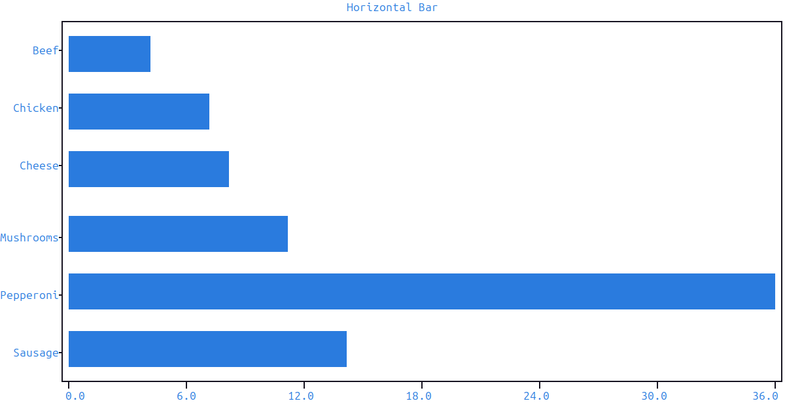

Bar Plots
=========

:meth:`~plotext._plotter.plot.plot_class.bar` builds a bar plot signal made of one rectangle per bar. Like every other drawable in plotext it returns a signal — the caller passes it to :meth:`~plotext._plotter.plot.plot_class.draw`.

Internally, ``bar()`` calls :meth:`~plotext._plotter.plot.plot_class.rectangle` for each bin and concatenates the results into a single signal, so all of plotext's standard chart machinery (axes, ticks, log scale, legend, subplots, …) works out of the box.

.. _argument_forms:

Argument Forms
--------------

``bar()`` accepts one, two, or three positional arguments. Each form is handled by :func:`~plotext._correct.data.bar_data` so scalar broadcasting and length truncation behave the same as for plain :meth:`~plotext._plotter.plot.plot_class.signal`.

- ``bar(heights)`` — heights only; bars are placed at integer coordinates ``1..N`` and rest on a ``0`` baseline.
- ``bar(coordinates, heights)`` — explicit coordinates with a ``0`` baseline.
- ``bar(coordinates, baselines, heights)`` — three sequences for floating bars; each bar spans ``baseline[i]`` to ``height[i]``.

.. code-block:: python

   import plotext as plt
   fig = plt.figure
   fig.clear()

   pizzas      = ["Sausage", "Pepperoni", "Mushrooms", "Cheese", "Chicken", "Beef"]
   percentages = [14, 36, 11, 8, 7, 4]

   fig.draw(fig.bar(pizzas, percentages).label("popularity"))
   fig.title("Most Favored Pizzas in the World")
   fig.show()

.. image:: images/argument_forms.png

When the coordinates are strings, ``bar()`` automatically maps them to ``1..N`` and registers the original strings as tick labels along the bar axis.

.. _bar_style:

Orientation, Width and Style
----------------------------

- ``orientation`` — ``"vertical"`` (or ``"v"``, the default) draws bars upright; ``"horizontal"`` (or ``"h"``) lays them sideways.
- ``width`` — bar thickness as a fraction of the inter-bar spacing. Default ``0.8`` leaves a small gap; ``1.0`` makes neighbouring bars touch.
- ``marker`` — symbol used to render the bars; accepts a single character, a code from :func:`plotext.markers`, or an HD code (``"hd"``, ``"fhd"``, ``"braille"``).
- ``lines`` — when ``True`` (default), each bar's outline is densified so the body fills cleanly. When ``False``, only the corner points are placed.
- ``fill`` — when ``True`` (default), the bar's interior is filled with the marker. When ``False``, only the outline is drawn.

.. code-block:: python

   import plotext as plt
   fig = plt.figure
   fig.clear()

   pizzas      = ["Sausage", "Pepperoni", "Mushrooms", "Cheese", "Chicken", "Beef"]
   percentages = [14, 36, 11, 8, 7, 4]

   fig.draw(fig.bar(pizzas, percentages, orientation = "horizontal", width = 0.5))
   fig.title("Horizontal Bar")
   fig.show()

.. _floating_bars:

Floating Bars
-------------

The three-argument form is the way to draw bars that don't touch the zero baseline — useful for ranges, value-at-time intervals, gantt-style segments, and so on.

.. code-block:: python

   import plotext as plt
   fig = plt.figure
   fig.clear()

   x      = [1, 2, 3, 4, 5]
   y_min  = [1, 2, 1, 3, 2]
   y_max  = [4, 5, 3, 6, 5]

   fig.draw(fig.bar(x, y_min, y_max).label("range"))
   fig.title("Floating Bars")
   fig.show()

.. image:: images/floating_bars.png

Composition with Subplots
-------------------------

Because ``bar()`` produces a regular signal, multiple bar series can be drawn on the same plot by calling ``draw()`` more than once, and the result composes naturally inside a matrix of subplots. See :doc:`subplot` for the matrix layout API.

.. _multiple_bar:

Multiple Bar Plot
-----------------

To plot grouped bars sharing the same x coordinate — one bar per series, placed side by side at each x slot — use :meth:`~plotext._plotter.plot.plot_class.multiple_bar`. It accepts a list of height-sequences (one per group), splits the bar width evenly between them, and offsets each group so they don't overlap. Each group gets its own colour from the cycler.

.. code-block:: python

   import plotext as plt
   fig = plt.figure
   fig.clear()

   pizzas = ["Sausage", "Pepperoni", "Mushrooms", "Cheese", "Chicken", "Beef"]
   men    = [14, 36, 11,  8,  7, 4]
   women  = [12, 20, 35, 15,  2, 1]

   fig.draw(fig.multiple_bar(pizzas, [men, women]))
   fig.title("Most Favored Pizzas in the World by Gender")
   fig.show()

.. image:: images/multiple_bar.png

.. _simple_multiple_bar:

Simple Multiple Bar
~~~~~~~~~~~~~~~~~~~

The same sketchy frame-less recipe used for :ref:`simple_bar` applies cleanly to ``multiple_bar``: horizontal bars, ``marker = "▇"``, ``width = 0``, ``lines = True``, frame off, left-aligned y ticks and a bold ruler/title pixel. Each group still picks up its own colour from the cycler so the side-by-side comparison stays readable.

.. code-block:: python

   import plotext as plt

   pizzas = ["Sausage", "Pepperoni", "Mushrooms", "Cheese", "Chicken", "Beef"]
   men    = [14, 36, 11,  8,  7, 4]
   women  = [12, 20, 35, 15,  2, 1]

   fig = plt.figure
   fig.clear()
   fig.plot_size(100, 3 * len(pizzas) + 1)   # 3 rows per pizza slot: women + men + gap

   fig.draw(fig.multiple_bar([p + " " for p in pizzas], [men, women],
                             orientation = "horizontal",
                             marker = "▇",
                             width = 0,
                             lines = True))
   fig.frame(False)
   fig.lim(0, max(max(men), max(women)) * 1.01, axis = "x")
   fig.tick_alignment("left", axis = "y")
   fig.ruler_pixel(plt.pixel(style = "bold"), axis = [0, 1])

   fig.title(plt.colorize(" Pizzas by Gender (side-by-side) ", style = "bold"))
   fig.show()

.. image:: images/simple_multiple_bar.png

.. _stacked_bar:

Stacked Bar Plot
----------------

To plot bars stacked on top of each other at the same x coordinate — heights add up cumulatively per slot — use :meth:`~plotext._plotter.plot.plot_class.stacked_bar`. It takes the same input shape as ``multiple_bar`` (a list of height-sequences, one per group) and dispatches to the 3-arg ``bar(x, y_min, y_max)`` form so each group's bar starts where the previous group's bar ended.

.. code-block:: python

   import plotext as plt
   fig = plt.figure
   fig.clear()

   pizzas = ["Sausage", "Pepperoni", "Mushrooms", "Cheese", "Chicken", "Beef"]
   men    = [14, 36, 11,  8,  7, 4]
   women  = [12, 20, 35, 15,  2, 1]

   fig.draw(fig.stacked_bar(pizzas, [men, women]))
   fig.title("Most Favored Pizzas in the World by Gender")
   fig.show()

.. image:: images/stacked_bar.png

.. _simple_stacked_bar:

Simple Stacked Bar
~~~~~~~~~~~~~~~~~~

Same recipe as :ref:`simple_bar`, but the bars are now cumulative per category — the x ticks at each segment boundary make the contribution of each group visible at a glance.

.. code-block:: python

   import plotext as plt

   pizzas = ["Sausage", "Pepperoni", "Mushrooms", "Cheese", "Chicken", "Beef"]
   men    = [14, 36, 11,  8,  7, 4]
   women  = [12, 20, 35, 15,  2, 1]
   totals = [m + w for m, w in zip(men, women)]

   fig = plt.figure
   fig.clear()
   fig.plot_size(100, len(pizzas) + 2)

   fig.draw(fig.stacked_bar([p + " " for p in pizzas], [men, women],
                            orientation = "horizontal",
                            marker = "▇",
                            width = 0,
                            lines = True))
   fig.frame(False)
   fig.lim(0, max(totals) * 1.01, axis = "x")
   fig.ticks([0] + totals, [str(v) for v in [0] + totals], axis = "x")
   fig.tick_alignment("left", axis = "y")
   fig.ruler_pixel(plt.pixel(style = "bold"), axis = [0, 1])

   fig.title(plt.colorize(" Pizzas by Gender (stacked) ", style = "bold"))
   fig.show()

.. image:: images/simple_stacked_bar.png

.. _simple_bar:

Simple Bar Style
----------------

A sketchier, frame-less bar plot — solid horizontal blocks, one row per category, with values shown as x-axis ticks at each bar's tip — can be assembled from the regular ``bar()`` plus a few standard plot config calls. No new method is needed; the recipe just leans on ``frame``, ``ticks``, ``tick_alignment`` and ``ruler_pixel`` to strip the chart frame and place value ticks directly under the bars.

.. code-block:: python

   import plotext as plt

   pizzas = ["Sausage", "Pepperoni", "Mushrooms", "Cheese", "Chicken", "Beef"]
   percentages = [14, 36, 11, 8, 7, 4]

   width = 100
   fig = plt.figure
   fig.clear()
   fig.plot_size(100, len(pizzas) + 2)

   fig.draw(fig.bar([p + " " for p in pizzas], percentages,
                    orientation = "horizontal",
                    marker = "▇",
                    width = 0,
                    lines = True))
   fig.frame(False)
   fig.lim(0, max(percentages) * 1.01, axis = "x")
   fig.ticks([0] + percentages, [str(v) for v in [0] + percentages], axis = "x")
   fig.tick_alignment("left", axis = "y")
   fig.ruler_pixel(plt.pixel(style = "bold"), axis = [0, 1])

   fig.title(plt.colorize(" Most Favored Pizzas in the World ", style = "bold"))
   fig.show()

.. image:: images/simple_bar.png

The pieces:

- ``orientation = "horizontal"`` and ``marker = "█"`` (full block) give solid sideways bars.
- ``width = 1.0`` paired with ``plot_size(width, 2 * N + 1)`` (two rows per bar) keeps adjacent bars from rasterising into each other's row.
- ``frame(False)`` hides the chart frame and the corner symbol; ``ticks(..., axis = "x")`` places the bar values as x-axis ticks (with ``frequency`` overridden by the explicit positions).
- ``tick_alignment("left", axis = "y")`` left-justifies the categorical labels in the y-tick region (the default is right-justified).
- ``ruler_pixel(plt.pixel(style = "bold"))`` and the bold ``colorize`` title pick up the existing ruler/label colours and add a bold style — sparse pixels are merged with the active defaults rather than overwriting them.

.. note:: More documentation is available via :code:`plotext.doc.bar()`.
