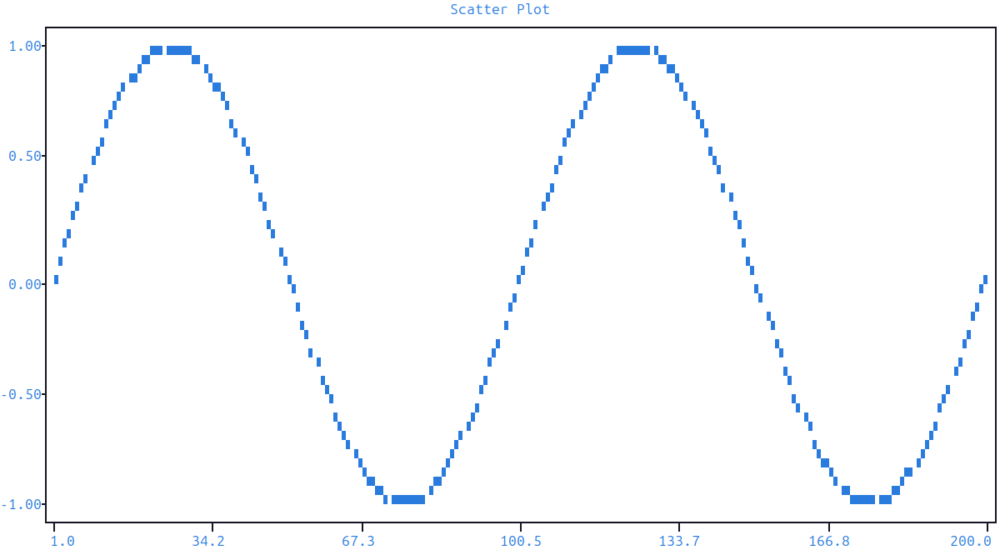
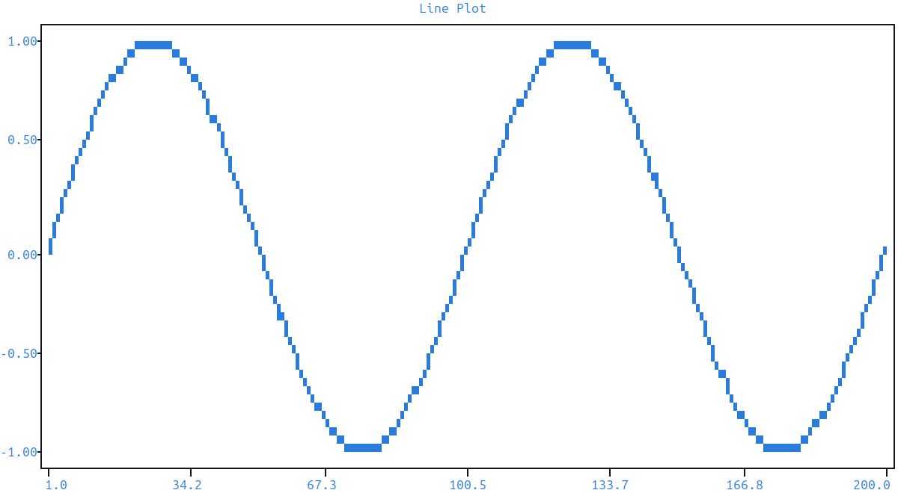
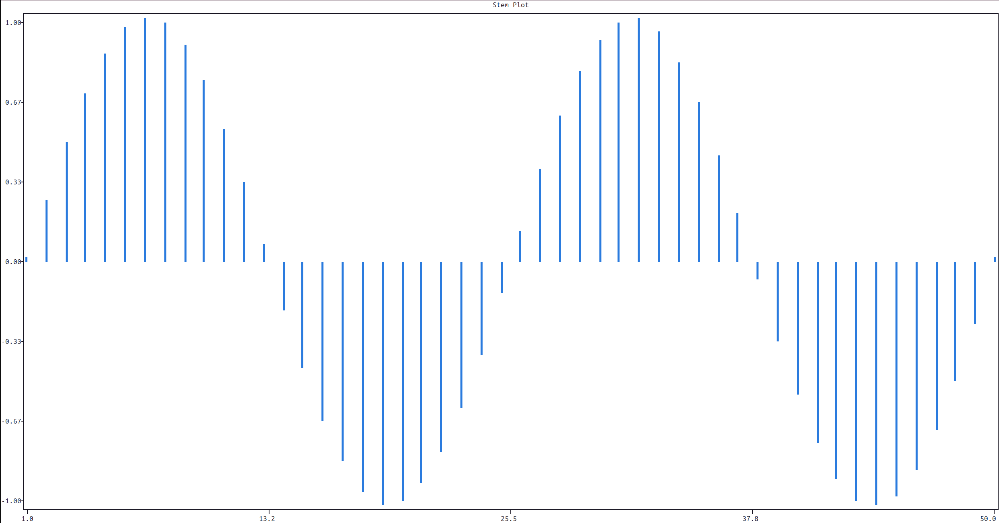
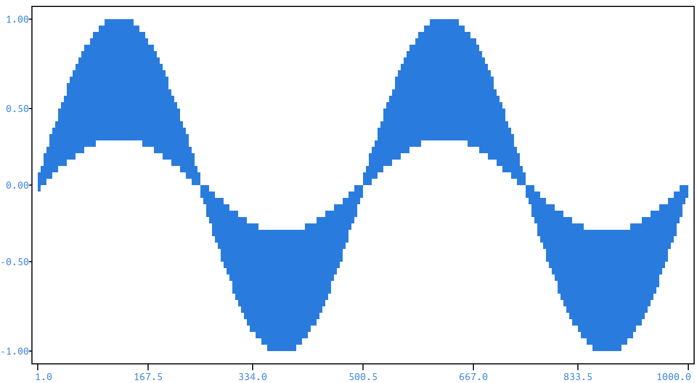

Basic Plots
===========

.. _scatter:

Scatter Plot
------------

To create a basic plot, build a signal with ``signal`` and pass it to ``draw`` on the master figure:

.. code-block:: python

   import plotext as plt
   fig = plt.figure
   fig.clear()

   y = plt.sin()                     # sinusoidal test signal
   signal = fig.signal(y)

   fig.draw(signal)
   fig.title("Scatter Plot")
   fig.show()

.. note:: The plot is built and rendered only when ``show`` is called.

.. note:: More documentation is available via :code:`plotext.doc.signal()`.

.. note::

   Inspect a signal's current point count via :meth:`.get_length() <plotext._signal.signal.signal_class.get_length>`. Useful when programmatically building signals (e.g. via ``_append``) before deciding on the number of ticks or grid divisions.

.. note::

   A signal can be deep-copied with :meth:`.copy() <plotext._signal.signal.signal_class.copy>`, or have its points overwritten in place from another signal with :meth:`.clone(other) <plotext._signal.signal.signal_class.clone>`. Use ``copy`` when you want to keep the original configuration and replay it with new data alongside; use ``clone`` to swap one signal's points for another's while keeping the rest of the configuration intact.

.. _line:

Line Plot
---------

For a line plot, chain :meth:`.lines() <plotext._signal.signal.signal_class.lines>` onto a signal — it connects every point and switches the signal from a scatter into a continuous line:

.. code-block:: python

   import plotext as plt
   fig = plt.figure
   fig.clear()

   y = plt.sin()
   signal = fig.signal(y).lines(True)

   fig.draw(signal)
   fig.title("Line Plot")
   fig.show()

.. note::

   :meth:`.lines() <plotext._signal.signal.signal_class.lines>` toggles every segment uniformly. To turn a single segment on or off without touching the rest, use :meth:`.point_lines() <plotext._signal.signal.signal_class.point_lines>` with the index of the point whose incoming segment you want to change (effective range ``1..N-1``).

.. note::

   Plotext offers two line drawing methods:
      - ``simple`` (the default) — draws evenly-spaced points along the line, similar to ``linspace``. Light and fast, but may leave small gaps on steep segments.
      - ``full`` — fills every cell crossed by the line, producing a denser, visually continuous result.

   Switch via the ``line_method`` parameter on ``signal()`` at construction, or fluently afterwards with :meth:`.line_method() <plotext._signal.signal.signal_class.line_method>` on the returned signal — e.g. ``fig.signal(y).line_method("full").lines(True)``.

.. _stem:

Stem Plot
---------

A *stem plot* draws a line from each data point down to an axis baseline (typically ``y = 0`` for a vertical stem, or ``x = 0`` for a horizontal one). It is useful for emphasising discrete values — impulse responses, sampled signals, simple bar-like displays — rather than a smooth curve.

In plotext, any signal becomes a stem plot by chaining :meth:`.fillx() <plotext._signal.signal.signal_class.fillx>` (vertical stems to the x axis) or :meth:`.filly() <plotext._signal.signal.signal_class.filly>` (horizontal stems to the y axis) onto it before drawing:

.. code-block:: python

   import plotext as plt
   fig = plt.figure
   fig.clear()

   y = plt.sin(length = 50)
   signal = fig.signal(y).fillx()

   fig.draw(signal)
   fig.title("Stem Plot")
   fig.show()

.. note::

   Stem fills follow the same densification choice as lines. ``simple`` draws evenly-spaced points along each stem; ``full`` fills every cell crossed. Switch via the ``fill_method`` parameter on ``signal()`` at construction, or fluently afterwards with :meth:`.fill_method() <plotext._signal.signal.signal_class.fill_method>` on the returned signal — e.g. ``fig.signal(y).fill_method("full").fillx()``.

.. _stem2:

Elaborate Stem Plot
~~~~~~~~~~~~~~~~~~~

By default the stem baseline is the axis (``0``). For a varying baseline, build a second signal describing the fill level and pass it to the main signal's :meth:`.fill() <plotext._signal.signal.signal_class.fill>` method:

.. code-block:: python

   import plotext as plt
   fig = plt.figure
   fig.clear()

   l      = 1000
   y      = plt.sin(length = l, periods = 2)
   y_fill = plt.sin(length = l, periods = 2, amplitude = 0.3)

   signal = fig.signal(y)                                            # base stems
   fill   = fig.signal(y_fill, marker = plt.marker("hd", plt.pixel(foreground="blue+")))   # fill level

   signal.fill(fill)                                                 # link base and fill

   fig.draw(signal)
   fig.show()

.. note:: The base signal and the fill signal should have the same number of points. If they differ, filling is applied only up to the shorter of the two.
