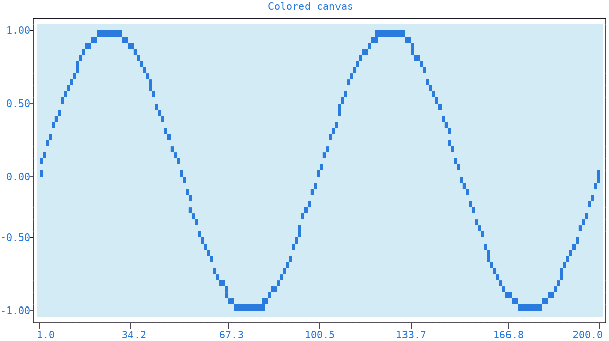
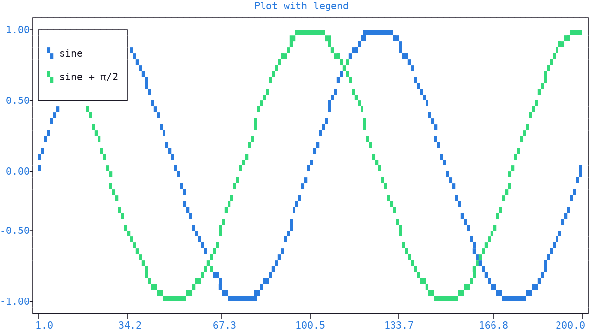

Canvas
======

| The *canvas* is the rectangular area **inside** the :doc:`axes <axis>` frame, where signals, grid lines and the :ref:`legend <legend>` are drawn.
| This page covers the background color of the canvas and the :ref:`legend <legend>` floating on top of it.
| The grid lines also land on the canvas, but they come from the :doc:`rulers <ruler>`, described in the :ref:`grid <grid>` section; the themes, coloring the whole plot at once, have a :doc:`page <theme>` of their own.

Background
----------

The :meth:`canvas() <plotext._plotter.plot.plot_class.canvas>` method sets the **background color** of the canvas.

.. note:: The color ``"default"`` leaves the canvas **unpainted**, so whatever the :doc:`terminal <terminal>` shows stays behind the plot, which is what a program drawing plotext into its own colored window wants.

.. note:: The frame, the :ref:`ticks <ticks>`, the labels and the :ref:`legend <legend>` carry a background of their own, so they keep painting theirs. The :doc:`colorless theme <theme>` clears every one of them, giving a plot that is see through from edge to edge.

.. code-block:: python

   import plotext as plt
   fig = plt.figure
   fig.clear()

   y = plt.sin()
   fig.draw(fig.signal(y))

   fig.canvas((210, 235, 245))

   fig.title("Colored canvas")
   fig.show()

The canvas itself holds **no characters**: the foreground colors and styles on it come from each drawn signal, through its :ref:`marker <markers>`.

.. note:: These markers are colored automatically, unless explicitly set by the user, as described in the :ref:`color cycling <color_cycling>` section.

.. seealso:: Pre-existing themes, coloring the whole plot at once, canvas background included, are described in the :doc:`themes <theme>` page.

.. _legend:

Legend
------

The legend is the floating box inside the canvas listing **each labelled signal** beside its :ref:`marker <markers>`. It appears **on its own** as soon as a signal, or a :ref:`line <shape_line>`, carries a label, so the :meth:`legend() <plotext._plotter.plot.plot_class.legend>` method is needed only to move it, color it or switch it off.

.. code-block:: python

   import plotext as plt
   fig = plt.figure
   fig.clear()

   y = plt.sin()
   fig.draw(fig.signal(y).label("sine"))
   fig.draw(fig.signal(plt.sin(phase = 0.5)).label("sine + π/2"))

   fig.title("Plot with legend")
   fig.show()

| With its parameters you can hide the legend (``active`` set to ``False``), which keeps it away even when labels are present.
| You can position it, in absolute or relative terms: the ``x`` and ``y`` parameters place its anchor point on the canvas, in character units, column from the left and row from the top, pinning the legend to a chosen spot regardless of the data, or, with ``relative`` set to ``True``, in the numerical units of the selected rulers, following the data like any plotted point.
| You can decide how the box hangs from its anchor: at its *left* (the default), *center* or *right* horizontally (``ha``), and from its *top* (the default), *center* or *bottom* vertically (``va``).
| You can color the box (``pixel``): its border, background and plain text labels take the given colors, while colorized labels and the marker samples keep their own.
| You can draw its border in any :ref:`line style <line_styles>` (``style``), as in ``plotext.figure.legend(style = "rounded")``.
| Finally, you can pick which *x* and *y* axis the coordinates are read against (``xside`` and ``yside``): see :ref:`axis selection <axis>`.

.. note:: A signal drawn without a label stays out of the legend, so a plot where nothing is labelled shows no legend at all.
