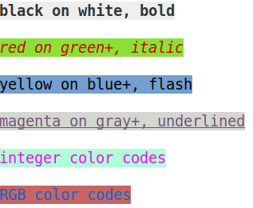
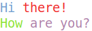
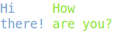
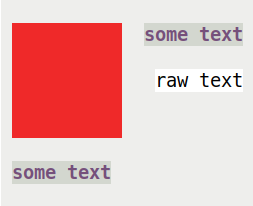
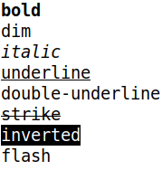
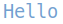

Colorful Text
==============

There are different tools to handle and generate colorful content in ``plotext``. 

.. note:: 

  In `plotext`, the term *coloring* refers to both *foreground* and *background* colors, as well as *style*. A color setting is encapsulated by the :ref:`pixel <pixel>` container.

.. _colorize:

Colored Text
------------
Use the ``colorize(string, foreground, background, style)`` class to apply the specified coloring to a string.

Below are a few examples:

.. literalinclude:: code/colorize.py
    :language: python

.. note::
    As shown, the `colorize` object can be **printed** using its ``print()`` method or using the built-in `print()` function. 

.. tip::
    To obtain the corresponding Python string instead, use its ``get_string()`` method, or the native ``str()`` method. 

.. tip::
    When the string is colored, it includes ANSI escape codes, which can be later removed, if needed, using the ``plotext.uncolorize()`` function.

.. seealso::
    The available :ref:`colors <colors>` and :ref:`styles <styles>` are presented in the  correspondent sections.

.. seealso::
   More details can be found in the :class:`plotext.colorize` API or by using the ``plotext.doc.colorize()`` method.

Multi-Colored Text
------------------
A ``colorize`` object can only apply one pixel to a string. For string of multiple colors, combine multiple ``colorize`` objects in two ways:

- using the ``+`` operator, to stack objects **horizontally** (or alternativelly its ``hstack()`` method)

- with the ``/`` operator, to stack objects **vertically** (or alternativelly its ``vstack()`` method)

Here is an example: 

.. literalinclude:: code/colorize2.py
    :language: python

.. rubric:: Multiple Lines

When a colorized string contains multiple lines, the ``colorize`` class accurately detects and handles them. This ensures that when stacked with other colored strings, the result is correctly represented. Here is an example:

.. literalinclude:: code/colorize3.py
    :language: python

.. note::
   The result of combining multiple colorized strings is no longer a ``colorize`` object but a ``matrix`` one, which behaves very similarly nevertheless and many of its methods are the same.

.. note::
    Strictly speaking, when combining matrices or colorized strings, their dimensions must be compatible. For example, for horizontal stacking, the two objects must have the same height. To relax this requirement, an ``adapt`` parameter has been introduced in both the ``hstack`` and ``vstack`` methods. By default, ``adapt`` is set to ``True``. It is to ``True`` when using the ``+`` and ``/`` operators.

.. _matrix:

Colored Matrix
--------------
You can think of a ``matrix`` as a two dimensional canvas of colored characters, while a ``colorize`` object is a simple string of one coloring (or :ref:`pixel <pixel>`). 

A matrix object is initialized with its ``width`` and ``height`` (in units of terminal character size):

.. code-block:: python

    import plotext as plt
    
    matrix = plt.matrix(100, 30) # width = 100, height = 30

By default the matrix if filled with a white :ref:`pixel <pixel>`, but a different one can be provided:

.. code-block:: python

    import plotext as plt

    pixel = plt.pixel(background = "blue+")
    matrix = plt.matrix(100, 30, pixel)

.. rubric:: Combining Matrices

Different matrices  can be combined using the ``matrix.insert()`` method:

.. literalinclude:: code/matrix.py
    :language: python

.. note::
    The ``insert()`` method accepts matrices, as well as raw strings and ``colorize`` objects.

.. note::
    The ``insert()`` method includes the ``ha`` parameter to select the horizontal alignment, as well as the ``va`` parameter to select the vertical one. The possible horizontal alignments are ``"left"``, ``"center"`` and ``"right"``, while the possible vertical alignments are ``"left"``, ``"center"`` and ``"right"``. In short, ``-1``, ``0`` and ``1`` can be used for both horizontal and vertical alignment. The default value is ``"left"``.

.. note::
    An ``adapt`` parameter has also been introduced for the ``insert()`` method, with a default value of ``True``. This allows objects to be inserted outside the matrix border without causing an error. The inserted object may be trimmed in size to ensure it does not extend beyond the matrix boundaries.

.. tip::
    While a ``colorize`` object doesn't have a native ``insert()`` method, it can easily be converted to a matrix using its ``get_matrix()`` method. Once converted, the full range of matrix manipulation methods, including ``insert()``, becomes available for flexible object placement and alignment.

.. seealso::
   More details can be found in the :class:`plotext.matrix` API or by using the ``plotext.doc.matrix()`` method.

.. _colors:

Colors
------
A `plotext` color can be either **foreground** or **background**. The correspondent `foreground` and `background` parameters accept the following color types:

- **Color String Codes**: you can use predefined color string codes. Refer to the image below for available color codes:

  .. image:: images/color-codes.png
     :alt: Color String Codes

  .. note::
    The `default` code will use the terminal’s default color. Any invalid color code will also default to the terminal's standard color.

- **Integer Codes**: you can specify colors using integers ranging from 0 to 255 (included). The image below shows the corresponding color codes:

  .. image:: images/integer-codes.png
     :alt: Integer Color Codes

  .. note::
    The first 16 integer values correspond to standard string color codes.

 .. |rgb| image:: images/rgb-color.png
    :width: 110

- **RGB Tuples**: you can define RGB colors using a tuple of three integers, such as |rgb|.

  .. note::
     The three integers represent the red, green, and blue components of the color. Ensure each component is within the range of 0 to 255 (included).

.. seealso::
  For a comprehensive list of all **available color codes**, access the ``plotext.colors()`` function.

.. _styles:

Styles
------

The `style` parameter accepts various style codes. Refer to the image below for available style codes:

.. note::
   Using the ``"flash"`` style will result in an actual white flashing marker.

.. note::
    You can apply multiple styles simultaneously by separating them with a space. For example, ``"bold italic"`` will apply both **bold** and *italic* styles o the text.

.. seealso::
    To view the complete list of available style codes, use the ``plotext.styles()`` function.

.. _pixel:

Pixel
-----

The ``pixel()`` object represents a single color configuration, combining both foreground and background colors, along with text style.

You can initialize a ``pixel()`` object by specifying its ``foreground``, ``background``, and ``style`` parameters:

.. code-block:: python

    import plotext as plt
    px = plt.pixel(foreground = 'red', background = 'blue', style = 'bold')

Once created, you can update its coloring using the ``set()`` method. For example:

.. code-block:: python

    px.set('green', 'yellow', 'italic')

.. rubric:: Use Cases:

1. **Update a colorized object**: You can easily modify the coloring of a colorized object after it has been created:

   .. code-block:: python
      :emphasize-lines: 4

      import plotext as plt
      string = plt.colorize("Colorless String")
      px = plt.pixel(foreground = 'red')
      string.set_pixel(px)

2. **Create a colorful** :ref:`matrix <matrix>`: 

   .. code-block:: python

      import plotext as plt

      pixel = plt.pixel(background = "blue+")
      matrix = plt.matrix(100, 30, pixel)

2. **Change prettydoc colors**: You can use the ``pixel()`` objects to change the coloring of any `prettydoc` component, as described in :ref:`this section <doc_color>`.

.. _slices:

Slices
------

.. rubric:: Colorized Strings

You can slice a ``colorize`` object in the same way you would slice a regular Python string. For example:

.. code-block:: python

    import plotext as plt
    plt.colorize("Hello there!", "blue+")[:5].print()

.. tip::
    When slicing a colorized string that contains multiple lines, the slicing operation remains one-dimensional. To achieve two-dimensional slicing, convert it to a matrix using its ``get_matrix()`` method.

.. rubric:: Colorized Matrices

A ``matrix`` object can be sliced similarly to a two-dimensional ``numpy`` array: the first slicing argument refers to rows, and the second to columns. 

As an example, if we start with the following initial matrix:

.. code-block:: python

    import plotext as plt

    # Create an 11x3 matrix filled with default pixel values
    matrix = plt.matrix(11, 3, plt.pixel())

    # Insert strings into the first row of the matrix
    matrix.insert(0, 0, "First Line")
    matrix.insert(0, 1, "Second Line")
    matrix.insert(0, 2, "Third Line")

.. code-block:: console

   >>> print(matrix)
   First Line 
   Second Line
   Third Line 

Here are some slicing options:

- **by specific row number**: extract a complete row by its index.

    .. code-block:: console

       >>> print(matrix[0])
       First Line 

- **by row range**: slice multiple rows without specifying columns, extracting entire rows.

    .. code-block:: console

       >>> print(matrix[0:2])
       First Line
       Second Line

- **by row range and specific column**: slice multiple rows but only select elements from a single column.

    .. code-block:: console

       >>> print(matrix[0:3, 0])
       F
       S
       T

- **by specific row and column number**: extract a specific element from the matrix using both row and column indices.

    .. code-block:: console

       >>> print(matrix[0, 0])
       F

- **by specific row and column range**: slice a portion of a row by specifying a range of columns.

    .. code-block:: console

       >>> print(matrix[0, 0:5])
       First

- **by row range and column range**: extract a sub-matrix by specifying both row and column ranges.

    .. code-block:: console

       >>> print(matrix[0:2, 0:6])
       First
       Second