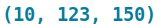

Colorful Text
=============

``plotext`` provides a few related tools for handling colored text in the terminal.

.. note::

   In ``plotext``, *coloring* refers to foreground colour, background colour, and text style together. A color setting is encapsulated by the :ref:`pixel` container.

.. _colorize:

Colored Text
------------

Use the :class:`~plotext.colorize` class with its ``string``, ``foreground``, ``background`` and ``style`` parameters to apply the specified coloring to a string:

.. literalinclude:: code/colorize.py
   :language: python

.. image:: images/colorize.png

.. seealso:: The available :ref:`colors` and :ref:`styles` are listed in their own sections.

.. note:: A :class:`~plotext.colorize` object can be printed with its own :meth:`~plotext.colorize.print` method or with the built-in ``print()``.

.. tip:: To obtain the underlying Python string, call :meth:`~plotext.colorize.get_string` or the native ``str()``.

.. tip:: The generated string contains ANSI escape codes, which can be stripped later with :func:`plotext.uncolorize`.

.. seealso:: More details are in the :class:`plotext.colorize` API or via ``plotext.doc.colorize()``.

Multi-Colored Text
------------------

A :class:`~plotext.colorize` object can only apply one pixel to a string. For multi-coloured output, combine several :class:`~plotext.colorize` objects:

- with ``+`` to stack horizontally (or the :meth:`~plotext.colorize.hstack` method)
- with ``/`` to stack vertically (or the :meth:`~plotext.colorize.vstack` method)

.. literalinclude:: code/colorize2.py
   :language: python

.. image:: images/colorize2.png

.. rubric:: Multiple lines

When a colorized string already contains newlines, :class:`~plotext.colorize` handles them correctly and stacks cleanly alongside other colored strings:

.. literalinclude:: code/colorize3.py
   :language: python

.. image:: images/colorize3.png

.. note:: Combining multiple colorized strings produces a :class:`~plotext.matrix` object, not a :class:`~plotext.colorize`. The two have similar methods and are usually interchangeable.

.. note:: Strictly speaking, stacking requires matching dimensions (same height for :meth:`~plotext.colorize.hstack`, same width for :meth:`~plotext.colorize.vstack`). The ``adapt`` parameter relaxes this requirement and is ``True`` by default; the ``+`` and ``/`` operators also pass ``adapt = True``.

.. _matrix:

Colored Matrix
--------------

A :class:`~plotext.matrix` is a two-dimensional canvas of colored characters, while a :class:`~plotext.colorize` object is a one-dimensional string with a single :ref:`pixel`.

Initialize a matrix with its ``width`` and ``height`` (in terminal character units):

.. code-block:: python

   import plotext as plt
   matrix = plt.matrix(100, 30)                # white pixel by default

To fill with a specific pixel instead:

.. code-block:: python

   import plotext as plt
   pixel  = plt.pixel(background = "blue+")
   matrix = plt.matrix(100, 30, pixel)

.. rubric:: Combining matrices

Different matrices can be combined with the :meth:`~plotext.matrix.insert` method:

.. literalinclude:: code/matrix.py
   :language: python

.. image:: images/matrix.png

.. note:: :meth:`~plotext.matrix.insert` accepts matrices, raw strings, and :class:`~plotext.colorize` objects.

.. note::

   :meth:`~plotext.matrix.insert` takes two alignment parameters:

   - ``ha`` — horizontal alignment: ``"left"``, ``"center"`` or ``"right"`` (short ``"l"``, ``"c"``, ``"r"``; or ``-1`` / ``0`` / ``1``). Default is ``"left"``.
   - ``va`` — vertical alignment: ``"top"``, ``"center"`` or ``"bottom"`` (short ``"t"``, ``"c"``, ``"b"``; or ``-1`` / ``0`` / ``1``). Default is ``"top"``.

.. note:: The ``adapt`` parameter of :meth:`~plotext.matrix.insert` (default ``True``) silently trims an inserted object if it extends beyond the matrix boundary, instead of raising an error.

.. tip:: :class:`~plotext.colorize` itself has no :meth:`~plotext.matrix.insert`, but its :meth:`~plotext.colorize.get_matrix` method converts it to a matrix, unlocking the full set of matrix operations.

.. seealso:: More details in the :class:`plotext.matrix` API or via ``plotext.doc.matrix()``.

.. _colors:

Colors
------

A plotext color is either a **foreground** or a **background** value. The corresponding parameters accept three input forms:

- **Color string codes.** Predefined short names (see the reference image below).

  .. image:: images/color-codes.png
     :alt: color string codes

  .. note:: ``"default"`` uses the terminal's own default color. Any unrecognised code falls back to the same.

- **Integer codes** from 0 to 255.

  .. image:: images/integer-codes.png
     :alt: integer color codes

  .. note:: The first 16 integers correspond to the string color codes above.

- **RGB tuples**: three integers for the red, green and blue channels, e.g. |rgb|. Each component must be 0–255.

.. seealso:: The :func:`plotext.colors` function prints the full live reference of available color codes.

.. _styles:

Styles
------

The ``style`` parameter accepts one or more style codes (see below).

.. image:: images/styles.png
   :alt: style codes
   :align: left

.. note:: The ``"flash"`` style renders as an actual flashing white marker.

.. note:: Multiple styles can be combined by separating them with a space: ``"bold italic"`` applies both **bold** and *italic* to the text.

.. seealso:: The :func:`plotext.styles` function prints the full live reference of available style codes.

.. _pixel:

Pixel
-----

A :class:`~plotext.pixel` object bundles a foreground colour, a background colour, and a style into one configuration.

Construct one with any combination of its three parameters:

.. code-block:: python

   import plotext as plt
   px = plt.pixel(foreground = 'red', background = 'blue', style = 'bold')

Update it later with :meth:`~plotext.pixel.set`:

.. code-block:: python

   px.set('green', 'yellow', 'italic')

.. rubric:: Common uses

1. **Recolor a colorize object** after creation:

   .. code-block:: python
      :emphasize-lines: 4

      import plotext as plt
      string = plt.colorize("Colorless String")
      px     = plt.pixel(foreground = 'red')
      string.set_pixel(px)

2. **Fill a** :ref:`matrix` **with a uniform pixel**:

   .. code-block:: python

      import plotext as plt
      pixel  = plt.pixel(background = "blue+")
      matrix = plt.matrix(100, 30, pixel)

3. **Style a prettydoc component** — pass a pixel to change the coloring of any prettydoc element (see :ref:`doc_color`).

.. _slices:

Slices
------

.. rubric:: Colorized strings

A :class:`~plotext.colorize` object can be sliced like a Python string:

.. code-block:: python

   import plotext as plt
   plt.colorize("Hello there!", "blue+")[:5].print()

.. image:: images/slice1.png

.. tip:: Slicing a multi-line colorized string is one-dimensional. For 2D slicing, convert to a matrix first with :meth:`~plotext.colorize.get_matrix`.

.. rubric:: Colorized matrices

A :class:`~plotext.matrix` object can be sliced like a two-dimensional NumPy array: the first index selects rows, the second selects columns.

Starting from this matrix:

.. code-block:: python

   import plotext as plt

   matrix = plt.matrix(11, 3, plt.pixel())       # 11 x 3 filled with default pixel

   matrix.insert(0, 0, "First Line")
   matrix.insert(0, 1, "Second Line")
   matrix.insert(0, 2, "Third Line")

.. code-block:: python

   print(matrix)

.. code-block:: console

   First Line
   Second Line
   Third Line

the available slicing forms are:

- **single row** — ``matrix[0]`` extracts a complete row.

  .. code-block:: python

     print(matrix[0])

  .. code-block:: console

     First Line

- **row range** — ``matrix[0:2]`` slices multiple rows (all columns).

  .. code-block:: python

     print(matrix[0:2])

  .. code-block:: console

     First Line
     Second Line

- **row range, single column** — ``matrix[0:3, 0]`` picks one column across several rows.

  .. code-block:: python

     print(matrix[0:3, 0])

  .. code-block:: console

     F
     S
     T

- **single cell** — ``matrix[0, 0]`` extracts one character.

  .. code-block:: python

     print(matrix[0, 0])

  .. code-block:: console

     F

- **single row, column range** — ``matrix[0, 0:5]`` slices a portion of a single row.

  .. code-block:: python

     print(matrix[0, 0:5])

  .. code-block:: console

     First

- **row range, column range** — ``matrix[0:2, 0:6]`` extracts a sub-matrix.

  .. code-block:: python

     print(matrix[0:2, 0:6])

  .. code-block:: console

     First
     Second

.. _text:

Text Annotations
----------------

A colorized string can be drawn directly on a plot at given data coordinates with :meth:`~plotext._plotter.plot.plot_class.text`. Like other drawables, the method returns a text object that the caller passes to :meth:`~plotext._plotter.plot.plot_class.draw`.

.. code-block:: python

   import plotext as plt
   fig = plt.figure
   fig.clear()

   y = plt.sin()
   fig.draw(fig.signal(y))

   fig.draw(fig.text(100, 0, "middle", alignment = "center"))
   fig.draw(fig.text(20, 0.5, plt.colorize("left", "green")))
   fig.draw(fig.text(180, -0.5, plt.colorize("right", "blue"), alignment = "right"))
   fig.draw(fig.text(100, 0.8, "vertical", orientation = "vertical", alignment = "top"))

   fig.title("Text Annotations")
   fig.show()

Parameters:

- ``x``, ``y`` — anchor coordinates of the text in data space.
- ``label`` — text content. A plain string is rendered with the default label coloring; a :class:`~plotext.colorize` keeps its own foreground, background and style.
- ``alignment`` — anchor placement along the writing direction. For horizontal text use *left*, *center* or *right* (short *l*, *c*, *r*); for vertical text use *top*, *center* or *bottom* (short *t*, *c*, *b*). Both naming sets map to the same -1, 0 or 1 internally.
- ``orientation`` — *horizontal* (default, short *h*) lays characters across columns; *vertical* (short *v*) lays them across rows.
- ``xside``, ``yside`` — which axis pair the text is anchored to (see :ref:`axis`).
- ``relative`` — when *true*, x and y are interpreted as absolute canvas-cell coordinates and skip the data-to-canvas rescaling.

.. note:: Text annotations contribute to the plot's autoscale: a figure that contains only texts (no signals) still produces sensible axis limits.
