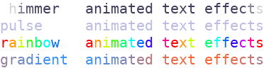

Colored Text
============

| A :class:`~plotext.colorize` object is a string carrying its **own coloring**, held by a single :ref:`pixel <pixel>`.
| It prints on the :doc:`terminal <terminal>` as colored text and can be used wherever |plotext| accepts a label, a :ref:`numerical tick label <ticks>` or a :ref:`marker <markers>` symbol.

.. note:: In |plotext|, *coloring* refers to foreground color, background color and text style together, the three fields of a :ref:`pixel <pixel>`.

.. _colorize:

Colorized Object
----------------

Use the :class:`~plotext.colorize` class with its ``string`` and ``pixel`` parameters to apply the chosen coloring to a string; the pixel takes any of the accepted :ref:`pixel forms <pixel_forms>`:

.. literalinclude:: code/colorize.py
   :language: python

.. image:: images/colorize.png

.. note:: In the example, the pixel is given as a plain tuple, a shorthand: the formal form is a :ref:`pixel <pixel>` object, as in ``plotext.colorize("some text", plotext.pixel("red", "green+", "italic"))``.

.. seealso:: The available :ref:`colors <colors>` and :ref:`styles <styles>` are listed in the :doc:`pixel <pixel>` page.

| The object prints with its own :meth:`print() <plotext.colorize.print>` method, or with the built-in ``print()``.
| The underlying Python string is returned by :meth:`string() <plotext.colorize.string>`, or by the native ``str()``; it contains the color codes, which can be stripped later with :func:`plotext.uncolorize`.
| The :meth:`upper() <plotext.colorize.upper>`, :meth:`lower() <plotext.colorize.lower>` and :meth:`title() <plotext.colorize.title>` methods return a new colorized object with the case transformed, keeping the coloring.

.. note:: A :class:`~plotext.colorize` object has no ``html()`` method of its own: to render one as HTML, convert it to a :ref:`matrix <matrix>` first with :meth:`matrix() <plotext.colorize.matrix>` and call :meth:`html() <plotext.matrix.html>`.

.. seealso:: The full method list is in the :ref:`colorize section <colorize_api>` of the :doc:`api <api>` page.

.. note:: More documentation for any of the methods is available via ``plotext.doc.colorize.<method>()`` (for example :meth:`plotext.doc.colorize.hstack() <plotext.colorize.hstack>`).

Multi-Colored Text
------------------

A :class:`~plotext.colorize` object can only apply one :ref:`pixel <pixel>` to a string. For multi-colored output, **combine** several :class:`~plotext.colorize` objects:

- with ``+`` to stack **horizontally** (or the :meth:`hstack() <plotext.colorize.hstack>` method)
- with ``/`` to stack **vertically** (or the :meth:`vstack() <plotext.colorize.vstack>` method)

.. literalinclude:: code/colorize2.py
   :language: python

.. image:: images/colorize2.png

.. caution:: Combining multiple colorized strings produces a :ref:`matrix <matrix>` object, not a :class:`~plotext.colorize`. The two have similar methods and are usually interchangeable.

Multiple Lines
~~~~~~~~~~~~~~

When a colorized string already contains newlines, they are kept, and the object stacks with other colored strings:

.. literalinclude:: code/colorize3.py
   :language: python

.. image:: images/colorize3.png

.. note:: Strictly speaking, stacking requires matching dimensions (same height for :meth:`hstack() <plotext.colorize.hstack>`, same width for :meth:`vstack() <plotext.colorize.vstack>`). The ``adapt`` parameter relaxes this requirement and is ``True`` by default; the ``+`` and ``/`` operators between two such objects (as in ``c1 + c2`` or ``c1 / c2``) also pass ``adapt = True``.

.. note:: The stacking is not limited to two colorized objects: the second operand of ``+`` and ``/``, or the argument of the stacking methods, can also be a :class:`~plotext.matrix` or a plain string.

.. _slices:

Slices
------

A :class:`~plotext.colorize` object can be **sliced** like a Python string:

.. code-block:: python

   import plotext as plt
   plt.colorize("Hello there!", "blue+")[:5].print()

.. image:: images/slice1.png

.. tip:: Slicing a multi-line colorized string is one-dimensional. For 2D slicing, convert to a :ref:`matrix <matrix>` first with :meth:`matrix() <plotext.colorize.matrix>` (see :ref:`matrix slices <matrix_slices>`).

.. _effects:

Animated Text Effects
---------------------

The :func:`plotext.effect` function returns a single-row :class:`~plotext.matrix` where each character is colored by a **moving effect**, advanced by the ``step`` parameter. Pass it to :meth:`plotext.figure.title() <plotext._plotter.plot.plot_class.title>` or :meth:`plotext.figure.label() <plotext._plotter.plot.plot_class.label>` inside a :doc:`streaming <stream>` loop, advancing ``step`` at each iteration, to animate titles and :doc:`axis <axis>` labels.

Available effects:

- ``"shimmer"``: a Gaussian bright spot sweeps across the text.
- ``"pulse"``: the whole string fades between two colors.
- ``"rainbow"``: hue cycles across the characters and scrolls with ``step``.
- ``"gradient"``: sinusoidal blend between two colors scrolls along the text.

.. code-block:: python

   import plotext as plt

   for step in range(100):
       for name in ("shimmer", "pulse", "rainbow", "gradient"):
           plt.effect(name.ljust(10) + "animated text effects", name, step = step).print()
       plt.sleep(0.1)
       plt.terminal.clean(4)

| With its parameters you can set the string to color (``text``) and pick the effect (``name``): *shimmer* (the default), *pulse*, *rainbow* or *gradient*, described above.
| You can advance the animation (``step``): each call is one still frame, and increasing the value between calls moves the effect along.
| Finally, you can set after how many step units the effect repeats (``period``); if ``None`` (the default), it is 10 for *pulse* and *rainbow*, and the text length for *shimmer* and *gradient*.

.. seealso:: The streaming example in :doc:`streaming plots <stream>` shows :func:`plotext.effect` driving an animated title and labels.

