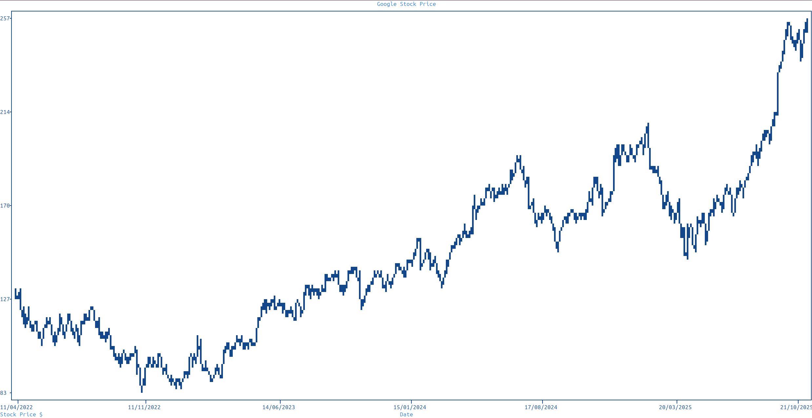

Datetime Plot
=============

Basic Plot
----------

To plot datetime objects, notify ``plotext`` that you intend to do so by calling ``fig.date(axis, side).activate()`` on the relevant ruler. ``fig.date(axis, side)`` is a getter — it returns the ``date_class`` instance bound to that ruler, and all date operations live on the returned object: ``.activate(active, form, origin)`` to turn date handling on (and optionally set the format and the time origin), ``.convert(time, output)`` to translate between string / datetime / timestamp, ``.today(output)`` for today's date, ``.clear()`` to reset.

.. note:: Once notified via ``activate()``, ``plotext`` automatically recognises the input type and interprets date and time values from strings, ``datetime`` objects (including ``pandas.DatetimeIndex``), or timestamps (seconds from the origin of time).

Here is an example, which requires the ``yfinance`` package:

.. code-block:: python

   import plotext as plt
   import yfinance as yf

   fig = plt.figure
   fig.clear()

   fig.date('x').activate() # fig.date().activate() would also work in this case

   start = fig.date('x').convert('11/04/2024', "datetime")
   end   = fig.date('x').convert('22/10/2025', "datetime")
   data  = yf.download('GOOG', start = start, end = end, auto_adjust = False, progress = False)

   prices = data[('Close', 'GOOG')]
   dates  = data.index # or fig.date('x').convert(data.index, "string")

   signal = fig.signal(dates, prices, marker = "fhd").lines(True)
   fig.draw(signal)

   fig.title("Google Stock Price")
   fig.label("Date", 0)
   fig.label("Stock Price $", 1)
   fig.show()

.. note::
   By default, ``plotext`` assumes the date format to be ``"%d/%m/%Y"``. To change this, use the ``form`` parameter of ``date``.

.. note::
   The ``convert`` method can be used to explicitly convert between strings, ``datetime`` objects, and timestamps (i.e. floats).
   The input type is detected automatically, while the desired output type is specified with the ``output`` parameter.
   Valid output values are ``"datetime"``, ``"timestamp"``, and ``"string"``.

Candlestick Plot
----------------

To plot a candlestick chart, use ``candlestick``. It takes a single dictionary with string keys date, open, close, high, low, where each value is a sequence.

The method returns a signal that can be further configured (for example with :meth:`.label() <plotext._signal.signal.signal_class.label>`) and then passed to ``draw``.

Here is an example, which requires the ``yfinance`` package:

.. code-block:: python

   import yfinance as yf
   import plotext as plt

   fig = plt.figure
   fig.clear()

   fig.date("x").activate()                          # treat x as a date axis (default format "%d/%m/%Y")

   start = fig.date("x").convert("11/04/2022", "datetime")
   end   = fig.date("x").convert("11/06/2022", "datetime")
   data  = yf.download("GOOG", start = start, end = end,
                       auto_adjust = False, progress = False)

   ohlc = {
       "date":  fig.date("x").convert(data.index, "string"),
       "open":  data[("Open",  "GOOG")],
       "close": data[("Close", "GOOG")],
       "high":  data[("High",  "GOOG")],
       "low":   data[("Low",   "GOOG")],
   }

   signal = fig.candlestick(ohlc).label("GOOG")
   fig.draw(signal)

   fig.title("Google Stock Price Candlesticks")
   fig.label("Date", "x")
   fig.label("Stock Price $", "y")
   fig.legend()
   fig.show()

.. note:: More documentation is available via :code:`plotext.doc.candlestick()`.

.. note:: The up/down candle colors come from ``plotext._settings.defaults.candlestick_up_color`` (``"green"``) and ``candlestick_down_color`` (``"red"``); override them globally to restyle every candlestick chart in the session:

   .. code-block:: python

      from plotext._settings import defaults
      defaults.candlestick_up_color   = "blue"
      defaults.candlestick_down_color = "magenta"

Command-line
------------

The :doc:`cli` chain syntax handles the date axis through *intermediate-object chaining*: ``--date axis=x`` calls ``fig.date(axis='x')`` which returns the underlying ``date_class`` instance, and the next method (``--activate``) resolves on that instance — so ``--date axis=x --activate`` is equivalent to ``fig.date(axis='x').activate()``.

The actual *plot* still needs dates and values from somewhere: the Python examples above use ``yfinance`` to fetch them, which is an external library the CLI can't call. Feed the data from another source instead (literal args, ``@path:<file>.csv``, or stdin):

.. code-block:: shell

   plotext --date axis=x --activate \
           --signal '["11/04/2024","12/04/2024","13/04/2024","14/04/2024"]' \
                    '[170.5, 172.3, 169.8, 174.1]' \
           --lines --draw \
           --title 'Stock Price' --label Date axis=x --show

Note the explicit ``--draw``: ``--lines`` and the other signal-config methods dispatch to the in-progress drawable, so figure-level methods (``--title``, ``--label``) only resolve to the figure once ``--draw`` closes the drawable phase.

For a longer series, pipe a CSV with a date column and a price column:

.. code-block:: shell

   plotext --date axis=x --activate \
           --signal @path:prices.csv --lines --draw \
           --title 'Stock Price' --show

The candlestick chart works the same way. The OHLC dict can be passed inline as a single literal argument:

.. code-block:: shell

   plotext --date axis=x --activate \
           --candlestick '{"date":["01/01/2024","02/01/2024","03/01/2024","04/01/2024","05/01/2024"],
                           "open":[10,12,11,13,14],
                           "close":[12,11,13,14,13],
                           "high":[13,13,14,15,15],
                           "low":[9,10,10,12,12]}' \
           --draw --title 'Candlestick' --show

Cleaner if the OHLC values live in a CSV with a header row — ``@path:<file>.csv:dict`` reads the first row as keys and returns a dict of column lists. plotext bundles a small sample CSV (``@sample:stock``) so the example runs out of the box:

.. code-block:: shell

   plotext --date axis=x --activate \
           --candlestick @sample:stock:dict \
           --draw --title 'Candlestick' --show

Replace ``@sample:stock:dict`` with ``@path:/path/to/your.csv:dict`` for your own data (the CSV needs a header row with ``date,open,close,high,low``).

When the data lives in a Python data frame (like the ``yfinance`` example), keep the Python API — building the OHLC dict programmatically is cleaner there than templating it onto a shell command line.
