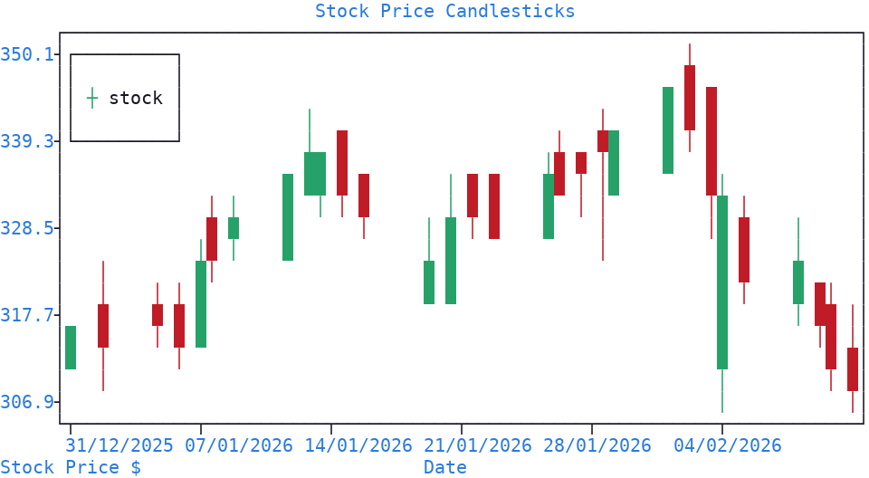

Date Plots
==========

| To plot dates and times, date support must first be **turned on** for the relevant :doc:`axis <axis>`, using the date selection returned by the :meth:`~plotext._plotter.plot.plot_class.date` method.
| A final section covers the :ref:`candlestick plot <candlestick>`, the classical financial chart of prices over time.

Date Converter
--------------

| The :meth:`~plotext._plotter.plot.plot_class.date` method addresses the **date converter** of the chosen :doc:`axis <axis>` (or axes); every date operation lives on it.
| Its :meth:`~plotext._plotter.frame.date.date_class.activate` method turns on date support for the specified :doc:`axis <axis>`, optionally setting the date string format and the time origin.
| A date can be expressed in three forms: a **string** (in the set date string format), a **datetime** object, or a **timestamp** (the number of seconds from the time origin).
| Its :meth:`~plotext._plotter.frame.date.date_class.convert` method translates a date, or a list of dates, from any form, detected automatically, to the one requested with the ``output`` parameter; :meth:`~plotext._plotter.frame.date.date_class.today` returns today's date and :meth:`~plotext._plotter.frame.date.date_class.clear` resets the support: deactivated, with default form and origin.

.. note:: Once activated, |plotext| recognizes the input type automatically, accepting dates as strings, ``datetime`` objects (including `pandas.DatetimeIndex <https://pandas.pydata.org/docs/reference/api/pandas.DatetimeIndex.html>`_), or timestamps (seconds from the time origin).

.. important:: By default, |plotext| assumes the date string format to be ``"%d/%m/%Y"``. To change this, use the ``form`` parameter of ``activate()``. The format follows the standard Python `strftime format codes <https://docs.python.org/3/library/datetime.html#strftime-and-strptime-format-codes>`_.

.. note:: Dates are counted from UTC. The ``zone`` parameter of ``activate()`` writes them in another one, given as the hours from UTC: ``activate(form = "%d/%m/%Y %H:%M", zone = 3)`` reads a date with no zone of its own as Moscow time, and writes every label in it, while a date carrying its own zone is honoured as given.

.. note:: More documentation is available via ``plotext.doc.date()``.

.. _basic_date_plot:

Basic Date Plot
---------------

Here is an example, drawing the closing prices of the bundled *stock* :ref:`sample <sample_files>`:

.. code-block:: python

   import plotext as plt

   fig = plt.figure
   fig.clear()

   fig.date('x').activate() # fig.date().activate() would also work in this case

   rows   = plt.file.csv(plt.sample("stock"))
   dates  = [row[0] for row in rows[1:]]
   prices = [float(row[2]) for row in rows[1:]]   # the close column

   signal = fig.signal(dates, prices, marker = "fhd").lines()
   fig.draw(signal)

   fig.title("Stock Price")
   fig.label("Date", 0)
   fig.label("Stock Price $", 1)
   fig.show()

.. image:: images/date.png
   :alt: Date and Time Plot

.. note:: The example reads the bundled *stock* :ref:`sample <sample_files>` with the :meth:`csv() <plotext._methods.file.file_class.csv>` method of the :ref:`file toolkit <tabular_data>`; for live data, see the :ref:`live stock prices <live_stock>` section below.

Or directly from the shell:

.. code-block:: shell

   plotext --figure --date axis=x --activate \
           --signal '["11/04/2024","12/04/2024","13/04/2024","14/04/2024"]' \
                    '[170.5, 172.3, 169.8, 174.1]' \
           --lines --draw \
           --title 'Stock Price' --label Date axis=x --show

.. _candlestick:

Candlestick Plot
----------------

| The :meth:`~plotext._plotter.plot.plot_class.candlestick` method draws the classical financial chart: each candle summarizes the prices over **one time interval**, using a rectangle spanning from the opening to the closing price and a thin vertical line spanning from the lowest to the highest price.
| The candle is **green** when the price rises and **red** when it falls.

Here is an example, drawing the bundled *stock* :ref:`sample <sample_files>`:

.. code-block:: python

   import plotext as plt

   fig = plt.figure
   fig.clear()

   fig.date("x").activate()                          # treat x as a date axis (default format "%d/%m/%Y")

   rows  = plt.file.csv(plt.sample("stock"))[:31]    # header plus the first 30 days
   stock = {key: list(values) if key == "date" else [float(value) for value in values]
            for key, values in zip(rows[0], zip(*rows[1:]))}

   signal = fig.candlestick(stock).label("stock")
   fig.draw(signal)

   fig.title("Stock Price Candlesticks")
   fig.label("Date", "x")
   fig.label("Stock Price $", "y")
   fig.show()

Or directly from the shell:

.. code-block:: shell

   plotext --figure --date axis=x --activate \
           --candlestick @sample:stock:dict \
           --draw --title Candlestick --show

.. note:: The example reads the bundled *stock* :ref:`sample <sample_files>` with the :meth:`csv() <plotext._methods.file.file_class.csv>` method of the :ref:`file toolkit <tabular_data>`; for live data, see the :ref:`live stock prices <live_stock>` section below.

| With its parameters you can set the data to draw (``data``, a dictionary with keys ``date``, ``open``, ``close``, ``high`` and ``low``, each holding a sequence of values).
| You can also pick the candle look (``style``): each body drawn as a rectangle (*candle*, the default), or replaced by two short horizontal lines at the opening and closing prices (*ohlc*), lighter when many candles are packed together.

.. note:: More documentation is available via ``plotext.doc.candlestick()``.

.. tip:: The up and down candle colors, green and red by default, can be changed for the whole session by overriding the package defaults, taking any :ref:`color code <colors>`:

   .. code-block:: python

      from plotext._settings import defaults
      defaults.candlestick_up_color   = "blue"
      defaults.candlestick_down_color = "magenta"

.. _live_stock:

Live Stock Prices
-----------------

Real stock data can be downloaded with the `yfinance <https://pypi.org/project/yfinance/>`_ package, which requires its own installation.

To prepare the data for the :ref:`basic date plot <basic_date_plot>`:

.. code-block:: python

   import plotext as plt
   import yfinance as yf

   fig = plt.figure
   fig.clear()
   fig.date("x").activate()

   start = fig.date("x").convert("11/04/2024", "datetime")
   end   = fig.date("x").convert("22/10/2025", "datetime")
   data  = yf.download("GOOG", start = start, end = end, auto_adjust = False, progress = False)

   prices = data[("Close", "GOOG")]
   dates  = data.index # or fig.date("x").convert(data.index, "string")

   signal = fig.signal(dates, prices, marker = "fhd").lines()

And for the :ref:`candlestick <candlestick>` one:

.. code-block:: python

   ohlc = {
       "date":  fig.date("x").convert(data.index, "string"),
       "open":  data[("Open",  "GOOG")],
       "close": data[("Close", "GOOG")],
       "high":  data[("High",  "GOOG")],
       "low":   data[("Low",   "GOOG")],
   }
