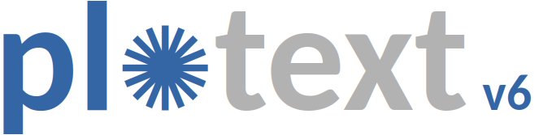
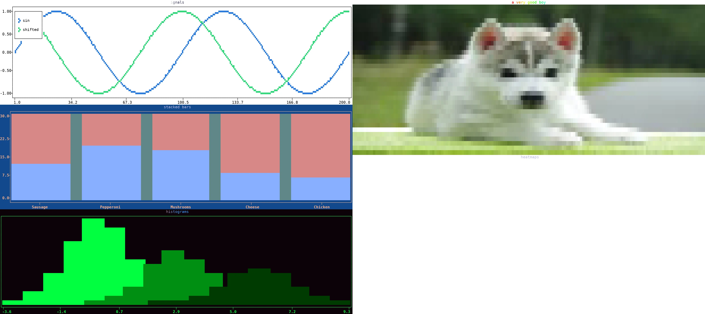

.. image:: https://badge.fury.io/py/plotext.svg
   :target: https://badge.fury.io/py/plotext
   :alt: PyPi
.. image:: https://img.shields.io/github/stars/piccolomo/plotext.svg
   :target: https://github.com/piccolomo/plotext/stargazers
   :alt: GitHub stars
.. image:: https://pepy.tech/badge/plotext/month
   :target: https://pepy.tech/project/plotext
   :alt: Downloads
.. image:: https://img.shields.io/badge/issue_tracking-github-blue.svg
   :target: https://github.com/piccolomo/plotext/issues
   :alt: GitHub Issues
.. image:: https://img.shields.io/badge/PR-Welcome-%23FF8300.svg
   :target: https://github.com/piccolomo/plotext/pulls
   :alt: PR Welcome

**plotting on terminal**

:ref:`image code <showcase_code>`

.. rst-class:: feature-list

- |plotext| draws its plots **inside the terminal**, as colored text, and its :doc:`installation <install>` needs **nothing beside itself**; only pictures and videos ask for the :ref:`optional extras <extras>`.
- **Basic plots**: :ref:`scatter <scatter>`, :ref:`line <line>` and :ref:`stem <stem>`, each returning a :doc:`signal <signal>` you configure and then draw.
- **Bars**: :ref:`simple <simple_bar>`, :ref:`labeled <labeled_bars>`, :ref:`floating <floating_bars>`, :ref:`multiple <multiple_bar>` and :ref:`stacked <stacked_bar>`, with :ref:`histograms <histogram>` and :ref:`box plots <box>`.
- **Specialized plots**: :ref:`error bars <error>`, :ref:`event plots <event>`, :ref:`heatmaps <heatmap>`, :ref:`confusion matrices <confusion_matrix>` and :ref:`indicators <indicator>`.
- **Shapes and text**: :ref:`rectangles <rectangle>`, :ref:`polygons <polygon>`, :ref:`segments <segment>` and :ref:`lines <shape_line>` in five :ref:`line styles <line_styles>`, plus text written anywhere on the plot.
- **Dates**: a :doc:`date and time axis <date>`, and the :ref:`candlestick <candlestick>` chart of financial prices.
- **Media**: :ref:`pictures <image>`, :ref:`gifs <gif>` and :ref:`video <video>` with its sound, YouTube included.
- **Live plots**: :doc:`streaming <stream>` that redraws in place, and :ref:`text animated <effects>` by a moving effect.
- **Plot settings**: the :doc:`size <size>`, the :doc:`title and labels <label>`, the :doc:`rulers <ruler>` and their :ref:`ticks <ticks>`, the :doc:`axes <axis>`, the :doc:`canvas <canvas>` and its :ref:`legend <legend>`, twelve :doc:`themes <theme>` and :ref:`your own <custom_themes>`.
- **Subplots**: a :ref:`grid of plots <subplots>`, each panel holding a grid of its own, to any number of levels, and each with its own :doc:`size <size>`, :doc:`theme <theme>` and settings.
- **Higher resolution**: :ref:`markers <resolutions>` splitting each character into a grid of sub-points, fitting four to eight times the data in the same space.
- **Colored primitives**: the :ref:`pixel <pixel>` holding a color pair and a style, :ref:`colored strings <colorize>`, the :ref:`matrix <matrix>` of colored characters a plot is made of, and the :ref:`marker <markers>` drawn at each point.
- **Terminal**: read its :ref:`size <terminal_size>`, :ref:`clear <terminal_clearing>` it, and catch a :ref:`key press <is_pressed>` without waiting.
- **Tools**: :doc:`test data <simulate>`, a :doc:`file toolkit <file>`, a :doc:`command line tool <cli>` drawing a plot with no Python written, :doc:`pretty docstrings <prettydoc>` browsable in a menu, and recipes for :doc:`other packages <packages>`.

|

.. _user_guide:

.. rst-class:: page-title

User Guide
==========

.. toctree::
   :maxdepth: 1
   :caption: Getting Started

   install
   basic
   signal

.. toctree::
   :maxdepth: 1
   :caption: Plot Types

   shape
   bar
   specialized
   date
   media
   stream

.. toctree::
   :maxdepth: 1
   :caption: Plot Settings

   size
   label
   ruler
   axis
   canvas
   theme
   clear
   interactive
   subplot

.. toctree::
   :maxdepth: 1
   :caption: Plot Utilities

   inspection
   terminal

.. toctree::
   :maxdepth: 1
   :caption: Colored Primitives

   pixel
   colorize
   matrix
   marker

.. toctree::
   :maxdepth: 1
   :caption: General Tools

   simulate
   file
   cli
   prettydoc
   packages

.. toctree::
   :maxdepth: 1
   :caption: Project

   api
   changelog
   future
   credits

.. note:: This project is under :ref:`active development <contributing>`.
