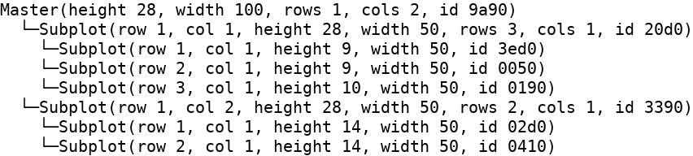
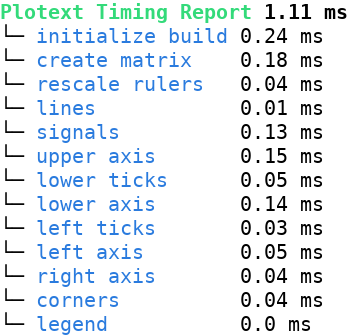

Plot Inspection
===============

|plotext| exposes a small set of helpers for poking at the live state of a plot, useful when investigating layout problems or profiling renders.

.. _navigate:

Navigate
--------

Once a tree of :ref:`subplots <subplots>` has been built, the following methods navigate it:

- :meth:`parent() <plotext._plotter.plot.plot_class.parent>`: returns the **parent** plot at the given nesting level: ``0`` is the plot itself, ``1`` (the default) its immediate parent, and so on; above the master sits the :doc:`terminal <terminal>` object, which is its own parent.
- :meth:`master() <plotext._plotter.plot.plot_class.master>`: returns the **master** plot at the top of the tree, that is :class:`plotext.figure <plotext._plotter.plot.plot_class>` itself.
- :meth:`position() <plotext._plotter.plot.plot_class.position>`: returns the subplot **position** ``(row, col)`` within its parent grid, ``(None, None)`` for the master.
- :meth:`size() <plotext._plotter.plot.plot_class.size>`: returns the subplot **size** ``(width, height)`` in :doc:`terminal <terminal>` characters.

.. note:: The tree itself can be printed with the :meth:`log() <plotext._plotter.plot.plot_class.log>` methods, described below.

Subplots Log
------------

| The :meth:`log() <plotext._plotter.plot.plot_class.log>` method, available on any plot or :ref:`subplot <subplots>`, prints that plot and every nested subplot, **one indented line** each, showing position, size and grid.
| The same method on :class:`plotext.terminal <plotext._kernel.terminal.terminal>` prints the tree from the top, the :doc:`terminal <terminal>` included.

For example, on the plot of the :ref:`subplots <subplots>` page example:

.. code-block:: python

   fig.log()

Timing
------

The :meth:`time() <plotext._plotter.plot.plot_class.time>` method prints a **timing report** of the most recent :meth:`show() <plotext._plotter.plot.plot_class.show>` or :meth:`build() <plotext._plotter.plot.plot_class.build>`: the total elapsed time and, when ``full`` is ``True`` (the default), a per-step breakdown for each profiled section.

.. note:: :meth:`build() <plotext._plotter.plot.plot_class.build>` renders the figure and gives back its :ref:`matrix <matrix>`, the grid of colored characters, which can be sliced, stacked, printed and saved.

.. code-block:: python

   import plotext as plt

   fig = plt.figure
   fig.clear()
   fig.draw(fig.signal(plt.sin()).lines())
   fig.show()
   fig.time()

.. caution:: This is a developer oriented tool, meant for investigating slow renders more than for everyday plotting.
