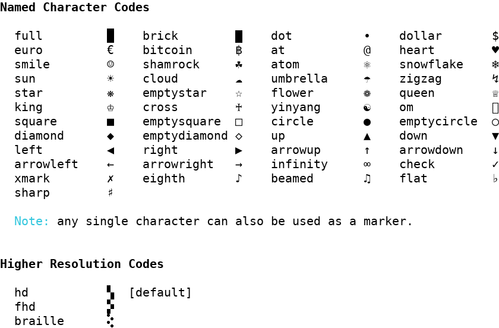
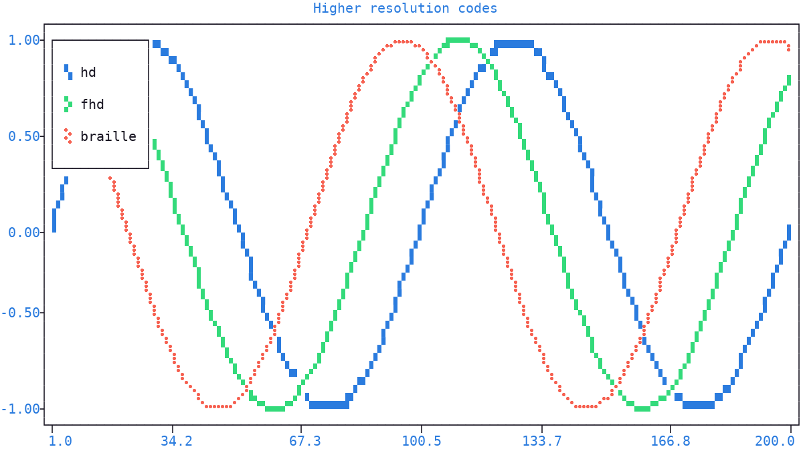
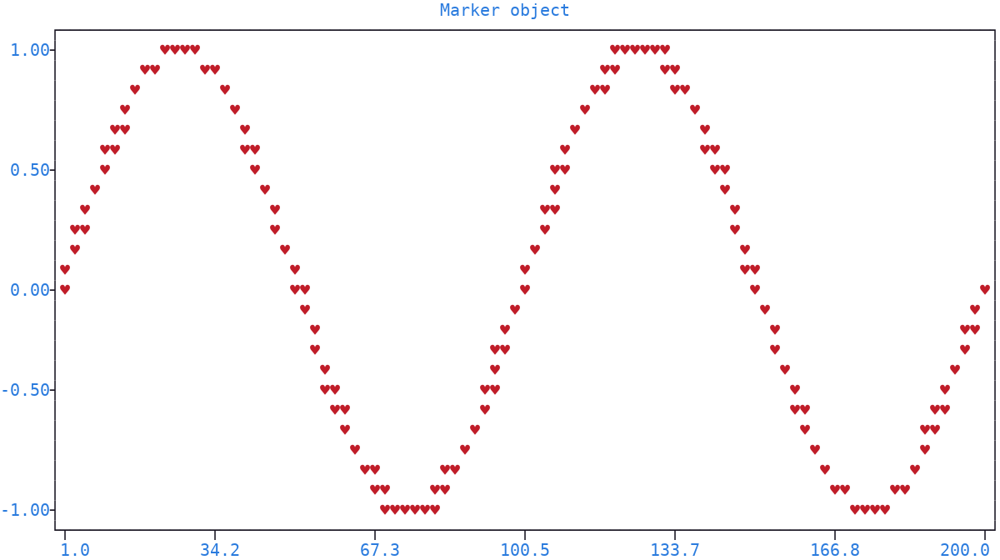
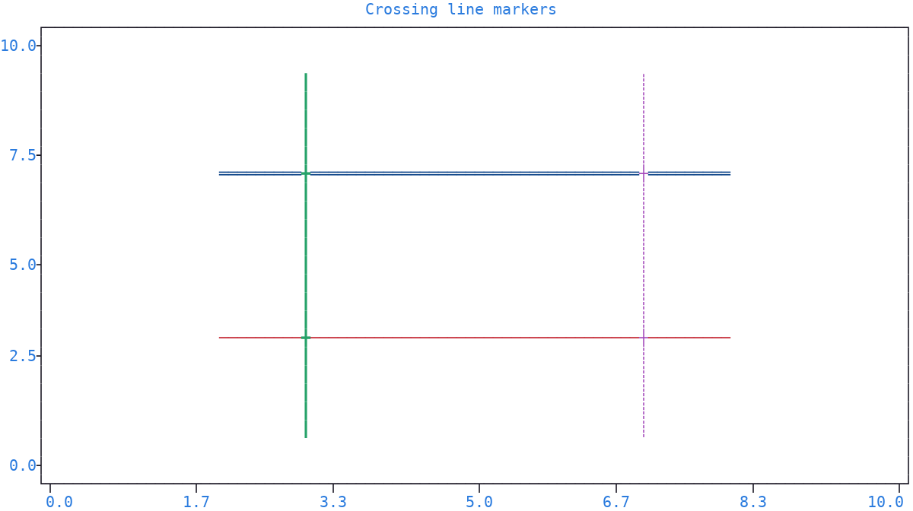

.. _markers:

Marker
======

A *marker* is the **symbol** used to render a single data point on the :doc:`canvas <canvas>`, with an optional color and style, basically a :ref:`pixel <pixel>`.

.. note:: A marker holds no coordinates: those belong to the *points* of a :ref:`signal <signal>`, each pairing its coordinates with a marker. A point cannot be created on its own, only inspected, through the :meth:`get() <plotext._signal.signal.signal_class.get>` method of a signal: see the :ref:`point <point>` section of the :doc:`api <api>` page.

.. _marker_parameter:

Marker Parameter
----------------

The ``marker`` parameter of the drawing methods accepts several forms:

- a **single character**, drawn as is (a space makes the point invisible)
- a :ref:`string code <string_codes>`, for quick selection
- a plain **multi-character** string, stamped whole at each point
- a `NumPy string <https://numpy.org/doc/stable/reference/arrays.scalars.html#numpy.str_>`_, treated exactly as its plain Python counterpart, in any of the forms above
- a :ref:`marker object <marker_objects>`, for full control over color and style
- a :ref:`matrix <matrix>` or :ref:`colorize <colorize>` object, stamped as a :ref:`multi-cell marker <plotting_matrices>`, with a fixed top left alignment

A list of either is also accepted, one entry per point: the list maps to the data points in :meth:`~plotext._plotter.plot.plot_class.signal` and :meth:`~plotext._plotter.plot.plot_class.candlestick`, and to the vertices in shapes like :meth:`~plotext._plotter.plot.plot_class.rectangle` and :meth:`~plotext._plotter.plot.plot_class.polygon`; in :meth:`bar() <plotext._plotter.plot.plot_class.bar>` and :meth:`hist() <plotext._plotter.plot.plot_class.hist>`, a list maps to the bar groups instead, as described in the :doc:`bar <bar>` page.

.. caution:: A list of markers shorter than the data is repeated to match its length.

.. code-block:: python

   fig.signal(x, y, marker = "x")                                # single character
   fig.signal(x, y, marker = "heart")                            # string code
   fig.signal(x, y, marker = "abc")                              # plain string, stamped whole
   fig.signal(x, y, marker = plt.marker("x", pixel = "red"))     # marker object
   fig.signal(x, y, marker = plt.colorize("hi!", "red"))         # colorize object
   fig.signal(x, y, marker = ["x", "heart", "star"])             # one marker per point

.. _string_codes:

String Codes
------------

A string code is one of two things:

- a named character code, like ``heart`` or ``star``, drawing the corresponding symbol at each point, easier to type than the symbol itself: see the image below for the full list
- a :ref:`higher resolution code <resolutions>`, *hd*, *fhd* or *braille*, splitting each character cell into sub-points, for a **higher plotting resolution**

Use :func:`plotext.markers() <plotext.markers>` for a preview of every available code next to its rendered symbol:

.. note:: A multi-character string that is not a known code is drawn as a multi-cell text marker: the whole string is stamped at each point.

.. _resolutions:

Higher Resolution Codes
~~~~~~~~~~~~~~~~~~~~~~~

A higher resolution code splits each character cell into a grid of sub-points, fitting more data points in the same space.

- ``hd``, *high definition* (the default): 2 × 2 block characters, like ``▞`` or ``▘``
- ``fhd``, *full high definition*: 3 × 2 block characters, like ``🬗``, on unix systems only
- ``braille``: 4 × 2 braille characters, like ``⢕``, the finest resolution

Some codes may not render on every :doc:`terminal <terminal>` or operating system.

.. note:: ``fhd`` **does not work on Windows**. Asking for it there draws the word itself, as any unrecognized marker does, so pick ``hd`` or ``braille`` instead.

.. note:: The sub-points falling within the same character cell cannot take different colors: they merge into a single character, which carries one foreground color. This is why a higher resolution code adds nothing to a :ref:`picture <image>`, which needs a different color at every point: a picture is drawn one whole character per pixel instead.

.. note:: Markers of different resolutions can coexist in the same plot across different signals. Within a single signal, mixing resolutions is safe for scatter plots but discouraged for line plots: the intermediate positions between consecutive points may not line up.

.. code-block:: python

   import plotext as plt
   fig = plt.figure
   fig.clear()

   for code, phase in zip(("hd", "fhd", "braille"), (0, 0.3, 0.6)):
       fig.draw(fig.signal(plt.sin(phase = phase), marker = code).lines().label(code))

   fig.title("Higher resolution codes")
   fig.show()

.. _marker_objects:

Marker Object
-------------

For full control over color and style, construct a marker with :class:`plotext.marker` and its own :ref:`pixel <pixel>`:

.. code-block:: python

   import plotext as plt
   fig = plt.figure
   fig.clear()

   y = plt.sin()
   m = plt.marker("heart", pixel = ("red", "white", "bold"))
   fig.draw(fig.signal(y, marker = m))

   fig.title("Marker object")
   fig.show()

.. note:: In the example, the pixel is given as a plain tuple, a shorthand: the formal form is a :ref:`pixel <pixel>` object, as in ``plotext.marker("heart", pixel = plotext.pixel("red", "white", "bold"))``.

| With its parameters you can set the symbol (``symbol``), accepting the same forms as the :ref:`marker parameter <marker_parameter>` itself, and its coloring (``pixel``), in any accepted :ref:`pixel form <pixel_forms>`; the pixel is ignored when the symbol is a :class:`~plotext.matrix` or :class:`~plotext.colorize` object, which carries its own per-cell :ref:`pixels <pixel>`.
| You can align a matrix or colorize symbol around the data point (``ha`` and ``va``), as described in the :ref:`multi-cell markers <plotting_matrices>` section; they are ignored for single-cell symbols.

.. _line_marker:

Line Marker
-----------

The :class:`plotext.line() <plotext.line>` function builds a marker drawn as a line character, horizontal ``─`` or vertical ``│``, in one of the :ref:`line styles <line_styles>`. Used as the marker of a signal, it draws each point as a small line piece instead of a dot; where two such lines cross, the characters merge properly, like ``┼``:

.. code-block:: python

   import plotext as plt
   fig = plt.figure
   fig.clear()

   fig.ruler("x").lim(0, 10)
   fig.ruler("y").lim(0, 10)

   x = range(2, 9)
   fig.draw(fig.signal(x, [3] * len(x), marker = plt.line(0, "red")).lines())
   fig.draw(fig.signal(x, [7] * len(x), marker = plt.line(0, "blue", "double")).lines())

   y = range(1, 10)
   fig.draw(fig.signal([3] * len(y), y, marker = plt.line(1, "green", "heavy")).lines())
   fig.draw(fig.signal([7] * len(y), y, marker = plt.line(1, "magenta", "dotted")).lines())

   fig.title("Crossing line markers")
   fig.show()

| With its parameters you can pick the orientation (``orientation``, 0 for horizontal, the default, and 1 for vertical), the color and style (``pixel``, in any accepted :ref:`pixel form <pixel_forms>`) and the line style (``style``), where *rounded* renders as *default*.

.. caution:: The :meth:`plotext.figure.line() <plotext._plotter.plot.plot_class.line>` method (see :ref:`line <shape_line>`) is a different tool: it draws a horizontal or vertical line across the whole plot, at a given position, while this marker paints one line character at each data point.

.. _color_cycling:

Color Cycling
-------------

| Each figure holds a *cycler*: an ordered sequence of **16 colors**.
| Every time a signal is created without an explicit color, that is with no :class:`plotext.pixel` on its :ref:`marker <marker_objects>`, the cycler hands it the next color of the sequence: successive signals come out in different colors, with no effort on the user side.
| A color of the sequence already on the plot is skipped, even when set by hand: two signals **never share** one by accident.
| Explicit colors are never limited, and any color outside the 16, an integer from 16 to 255 or an RGB tuple, plays no part in the cycling.
| Calling :meth:`plotext.figure.clear.data() <plotext._plotter.clear.clear_class.data>` or :meth:`plotext.figure.clear.pixels() <plotext._plotter.clear.clear_class.pixels>` restarts the cycler from the first color.

.. note:: A user defined sequence can be set through the ``sequence`` parameter of :func:`plotext.add_theme() <plotext.add_theme>`, and takes effect once the theme is applied: see the :ref:`custom themes <custom_themes>` section.

.. seealso:: The full method list is in the :ref:`marker section <marker_api>` of the :doc:`api <api>` page.

.. note:: More documentation is available via :meth:`plotext.doc.marker() <plotext.marker>` and :meth:`plotext.doc.line() <plotext.line>`.
