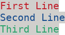
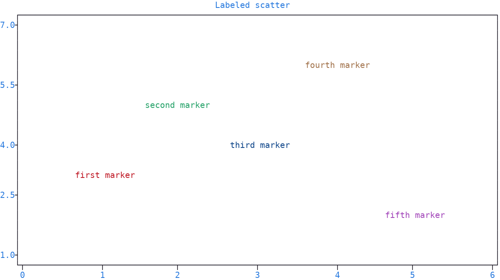
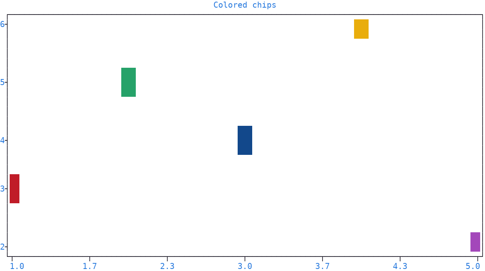

.. _matrix:

Matrix
======

| A :class:`~plotext.matrix` is a **two-dimensional** grid of colored characters, while a :ref:`colorize <colorize>` object is a **one-dimensional** string with a single :ref:`pixel <pixel>`.
| Its cells can be filled, stacked, sliced and drawn on a plot as a multi-cell :ref:`marker <markers>`.

Initialize a matrix with its ``width`` and ``height`` (in terminal characters):

.. code-block:: python

   import plotext as plt
   matrix = plt.matrix(50, 15)                 # white pixel by default

To fill with a specific :ref:`pixel <pixel>` instead:

.. code-block:: python

   import plotext as plt
   pixel  = plt.pixel(background = "blue+")
   matrix = plt.matrix(50, 15, pixel)
   matrix.print()

Combining Matrices
------------------

Different matrices can be combined with the :meth:`insert() <plotext.matrix.insert>` method:

.. literalinclude:: code/matrix.py
   :language: python

.. image:: images/matrix.png

| The :meth:`insert() <plotext.matrix.insert>` method accepts matrices, raw strings and :class:`~plotext.colorize` objects.
| The ``ha`` parameter decides the horizontal alignment: which side of the item, its *left* (the default), *center* or *right*, is placed at the given column.
| The ``va`` parameter decides the vertical alignment: its *top* (the default), *center* or *bottom*, placed at the given row.
| The :meth:`hstack() <plotext.matrix.hstack>` and :meth:`vstack() <plotext.matrix.vstack>` methods stack two matrices side by side or one above the other; the ``+`` and ``/`` operators are their shortcuts, as in ``m1 + m2`` and ``m1 / m2``, and accept a :class:`~plotext.matrix`, a :class:`~plotext.colorize` or a raw string on either side.
| The stacking methods take an ``adapt`` parameter, ``False`` by default, adjusting mismatched dimensions; the operators always adapt.
| The :meth:`transpose() <plotext.matrix.transpose>` method flips the matrix in place, its rows becoming its columns.
| A :class:`~plotext.colorize` object has no insert of its own, but its :meth:`matrix() <plotext.colorize.matrix>` method converts it to a matrix, with the full set of matrix operations.

.. caution:: An inserted object that does not fully fit within the matrix at the given position is dropped entirely, and silently.

.. seealso:: The full method list is in the :ref:`matrix section <matrix_api>` of the :doc:`api <api>` page.

.. note:: More documentation for any of the methods is available via ``plotext.doc.matrix.<method>()`` (for example :meth:`plotext.doc.matrix.insert() <plotext.matrix.insert>`).

.. _matrix_slices:

Slices
------

A :class:`~plotext.matrix` object can be sliced like a two-dimensional Python list or `NumPy <https://numpy.org/>`_ array: the first index selects rows, the second selects columns.

Starting from this matrix:

.. code-block:: python

   import plotext as plt

   matrix = plt.matrix(11, 3, plt.pixel(background = "white"))

   matrix.insert(0, 0, plt.colorize("First Line",  ("red",   "gray+")))
   matrix.insert(0, 1, plt.colorize("Second Line", ("blue",  "gray+")))
   matrix.insert(0, 2, plt.colorize("Third Line",  ("green", "gray+")))

   print(matrix)

the available slicing forms follow.

**Single row**: ``matrix[0]`` extracts a complete row.

.. code-block:: python

   print(matrix[0])

**Row range**: ``matrix[0:2]`` slices multiple rows, all columns.

.. code-block:: python

   print(matrix[0:2])

**Row range, single column**: ``matrix[0:3, 0]`` picks one column across several rows.

.. code-block:: python

   print(matrix[0:3, 0])

**Single cell**: ``matrix[0, 0]`` extracts one character.

.. code-block:: python

   print(matrix[0, 0])

**Single row, column range**: ``matrix[0, 0:5]`` slices a portion of a single row.

.. code-block:: python

   print(matrix[0, 0:5])

**Row range, column range**: ``matrix[0:2, 0:6]`` extracts a sub-matrix.

.. code-block:: python

   print(matrix[0:2, 0:6])

.. note:: Negative indexes count from the end, as in a Python list.

.. caution:: An index beyond the matrix size raises an ``IndexError``.

.. tip:: A slice gives back a matrix, never the coloring of one character: for that there is :meth:`get() <plotext.matrix.get>`, as ``matrix.get(1, 4)``, returning the :ref:`pixel <pixel>` of the character on row 1, column 4.

.. _plotting_matrices:

Multi-Cell Markers
------------------

| A :ref:`marker <markers>` is not limited to a single character: a :class:`~plotext.matrix`, a :class:`~plotext.colorize` object or a plain multi-character string can serve as its *symbol*.
| Passing one to :class:`plotext.marker` gives a multi-cell :ref:`marker <marker_objects>`, stamped **whole** at the coordinates of each data point.
| The ``ha`` and ``va`` parameters of :class:`plotext.marker` decide which side of it lands on the data point, as for the :meth:`insert() <plotext.matrix.insert>` method described above.
| Pass a list, one marker per point, to label each point individually.

.. caution:: A :class:`~plotext.matrix`, a :class:`~plotext.colorize` or a plain string can also be passed directly to the ``marker`` parameter, but the ``ha`` and ``va`` parameters of the :class:`marker() <plotext.marker>` method are then fixed to their defaults, *left* and *top*: construct the marker with it to control them.

Two common uses follow.

**Plotting colorized objects**, short colored strings as per-point labels:

.. code-block:: python

   import plotext as plt

   texts   = ["first marker", "second marker", "third marker", "fourth marker", "fifth marker"]
   colors  = ["red", "green", "blue", "orange", "magenta"]
   markers = [plt.marker(plt.colorize(text, pixel = color), ha = 0, va = 0)
              for text, color in zip(texts, colors)]

   x = [1, 2, 3, 4, 5]
   y = [3, 5, 4, 6, 2]

   fig = plt.figure
   fig.clear()
   fig.ruler("x").lim(0, 6)
   fig.ruler("y").lim(1, 7)
   fig.draw(fig.signal(x, y, marker = markers))
   fig.title("Labeled scatter")
   fig.show()

.. note:: The ``va`` parameter has no effect here: these colorized symbols are one row tall, so all three alignments place them on the same row. It matters again for a colorized string containing newlines, which spans several rows.

**Plotting colored matrices**, small painted blocks as per-point swatches:

.. code-block:: python

   import plotext as plt

   def chip(background):
       return plt.matrix(3, 3, plt.pixel(background = background))

   markers = [plt.marker(chip(c), ha = 0, va = 0) for c in ["red", "green", "blue", "yellow", "magenta"]]

   x = [1, 2, 3, 4, 5]
   y = [3, 5, 4, 6, 2]

   fig = plt.figure
   fig.clear()
   fig.draw(fig.signal(x, y, marker = markers))
   fig.title("Colored chips")
   fig.show()

The matrix is stamped centered on each data point (``ha = 0``, ``va = 0``), and its colors come from the matrix's own :ref:`pixels <pixel>`, not the :ref:`cycler <color_cycling>`.

.. note:: With :meth:`lines() <plotext._signal.signal.signal_class.lines>`, the marker is stamped at every step of the line connecting two consecutive markers; with a fill, it repeats from each point to the :doc:`axis <axis>`, or to the filling signal, as described in the :ref:`stem plot <stem>` section. This reads well with small painted matrices, and poorly with text markers: for text labels, keep the lines off.
