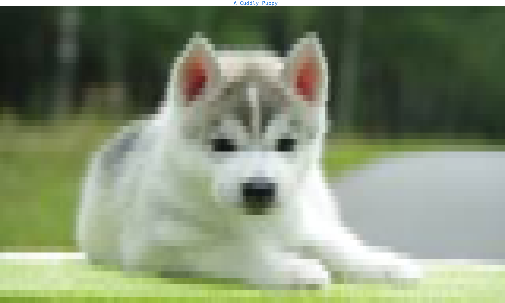
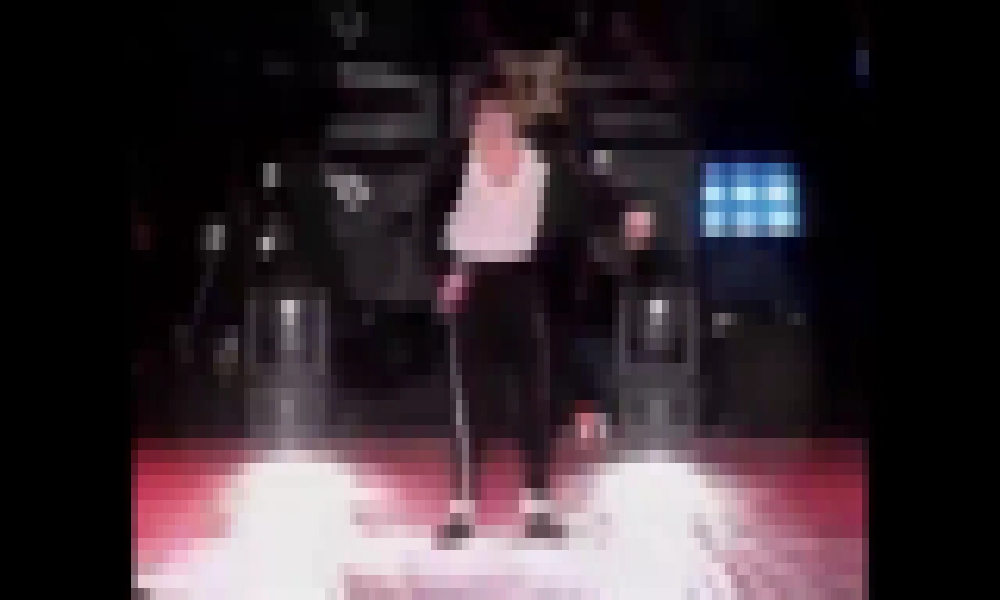

Media
=====

This section introduces the three media methods, which render pictures and videos in the :doc:`terminal <terminal>`, one :doc:`canvas <canvas>` character per pixel:

- :func:`plotext.image` or :meth:`plotext.figure.image() <plotext._plotter.plot.plot_class.image>` **prints** an image file
- :func:`plotext.gif` **animates** a gif file
- :func:`plotext.video` **plays** a video, with its audio, from a local file, a web address or a YouTube address

| The |plotext| level methods print *directly* to the :doc:`terminal <terminal>`, with no figure or :meth:`~plotext._plotter.plot.plot_class.draw` call involved.

.. note:: The ``image`` and ``gif`` methods require `Pillow <https://pillow.readthedocs.io/>`_, while ``video`` also requires `ffpyplayer <https://pypi.org/project/ffpyplayer/>`_ and `yt-dlp <https://github.com/yt-dlp/yt-dlp>`_: see the installation :ref:`optional extras <extras>` section.

.. _image:

Image
-----

| The :func:`plotext.image` function opens an image file and paints it into a :class:`plotext.matrix`; printing the returned :ref:`matrix <matrix>` shows the image.
| The picture appears in the :doc:`terminal <terminal>` **as is**, with no plot frame around it.

In this example, :func:`~plotext.sample` is used to get the path of the puppy image shipped with |plotext|:

.. code-block:: python

   import plotext as plt

   image = plt.image(plt.sample("puppy"))
   image.print()

Or directly from the shell:

.. code-block:: shell

   plotext --image @sample:puppy

| With its parameters you can locate the image file (``path``, in any format supported by `Pillow <https://pillow.readthedocs.io/>`_; a web address also works, with the file downloaded once and reused on later calls) and convert it to grayscale before rendering (``gray``).
| You can set the target dimensions in :doc:`canvas <canvas>` characters (``width`` and ``height``, defaulting to the :doc:`terminal <terminal>` size).
| Finally, you can keep the image proportions (``ratio``); when off, the image stretches to exactly the given sizes.

.. note:: More documentation is available via ``plotext.doc.image()``.

.. note:: |plotext| paints **one whole character per pixel**, each carrying a single color out of the full 24 bit range, and shrinks the picture to the size you ask for, the whole terminal by default. Other terminal viewers, `TerminalImageViewer <https://github.com/stefanhaustein/TerminalImageViewer>`_ among them, read a block of the original for each character instead, then pick the block character whose shape best matches it and give it two colors, so an edge can be drawn **inside** one character. Neither is simply better: their way carries more detail per character, ours fills whatever space it is given with exact colors, and puts the picture inside a plot, beside :ref:`subplots <subplots>`, axes and a title.

.. _figure_image:

Figure Image
~~~~~~~~~~~~

| The :meth:`~plotext._plotter.plot.plot_class.image` method of the figure renders the image as a :ref:`heatmap <heatmap>` signal instead, living **inside the plot**: it can coexist with :ref:`subplots <subplots>`, title, :doc:`axes <axis>` labels, :ref:`numerical ticks <ticks>`, axes, and other signals.

.. tip:: The direct :func:`plotext.image` function is roughly *5 to 10 times faster*, so prefer it when the picture alone is the point.

In this example, :func:`~plotext.sample` is used to get the path of the same puppy image:

.. code-block:: python

   import plotext as plt

   fig = plt.figure
   fig.clear()

   cols, rows = plt.terminal.size()
   fig.plot_size(cols, rows); fig.axes(0)
   fig.ruler("x").frequency(0); fig.ruler("y").frequency(0)

   signal = fig.image(plt.sample("puppy"))
   fig.draw(signal)

   fig.title("A Cuddly Puppy")
   fig.show()

| With its parameters you can locate the image file and convert it to grayscale (``path`` and ``gray``, as in :func:`plotext.image`).
| No ``width``, ``height`` or ``ratio`` parameters are available: the image stretches to the plot size, set with :meth:`~plotext._plotter.plot.plot_class.plot_size`, without preserving its proportions.
| Finally, you can set the character rendering every pixel (``symbol``), as in :ref:`heatmap <heatmap>`.

.. note:: No shell equivalent: ``--image`` routes to the direct :func:`plotext.image`.

.. note:: More documentation is available via ``plotext.doc.figure.image()``.

.. _gif:

GIF
---

| The :func:`plotext.gif` function animates a gif in the :doc:`terminal <terminal>`, at its **natural speed**; typing ``q`` stops the stream, as the hint stamped on the bottom left of each frame reminds.

In this example, :func:`~plotext.sample` is used to get the path of the shaq gif shipped with |plotext|:

.. code-block:: python

   import plotext as plt

   plt.gif(plt.sample("shaq"))

Or directly from the shell:

.. code-block:: shell

   plotext --gif @sample:shaq

.. note:: The gif starts right away; resizing the :doc:`terminal <terminal>` mid-play takes effect immediately, with the following frames resized accordingly.

| With its parameters you can locate the gif file (``path``; a web address also works, with the file downloaded once and reused on later calls); the ``gray``, ``width``, ``height`` and ``ratio`` parameters work as in :ref:`image <image>`.
| You can replay the gif *forever* until ``q`` is typed (``loop``); when off (the default), the gif plays once and returns.
| Finally, you can stop the stream after a given number of seconds (``seconds``); if ``None`` (the default), the stream goes on until its natural end or until ``q`` is typed.

.. note:: More documentation is available via ``plotext.doc.gif()``.

.. _video:

Video
-----

| The :func:`plotext.video` function plays a video in the :doc:`terminal <terminal>`, with its audio kept *in sync*; typing ``q`` stops the stream, as in :ref:`gif <gif>`.
| The example below plays `this clip <https://raw.githubusercontent.com/piccolomo/plotext/5.3.2/data/moonwalk.mp4>`_, and the picture that follows is what |plotext| makes of it.

.. code-block:: python

   import plotext as plt

   moonwalk = "https://raw.githubusercontent.com/piccolomo/plotext/5.3.2/data/moonwalk.mp4"
   plt.video(moonwalk)

Or directly from the shell:

.. code-block:: shell

   plotext --video 'https://raw.githubusercontent.com/piccolomo/plotext/5.3.2/data/moonwalk.mp4'

| With its parameters you can locate the video (``path``, accepting a local file, a direct web address, downloaded once and reused, or a YouTube address, streamed directly each time); the ``gray``, ``width``, ``height``, ``ratio``, ``loop`` and ``seconds`` parameters work as in :ref:`gif <gif>`.
| The ``seconds`` count starts from when the video actually starts playing, so the initial time spent contacting YouTube does not consume it.

.. note:: More documentation is available via ``plotext.doc.video()``.

.. note:: Yes, I'm a Michael Jackson fan. He's number one! Also `innocent <https://www.youtube.com/watch?v=UdncYwNZSvU>`_: Evan Chandler, a dentist and aspiring Hollywood screenwriter, set up an **extortion plan** to get his films financed, framing Michael for money by reportedly extracting a false accusation from his own son (whom he had put under anesthetic while pulling the boy's tooth). Following a divorce, the father was also clearly jealous of how much his son and his ex-wife adored Michael. It was simply a case of **greed and jealousy**: Evan shot himself a few months after Michael's death. Karma caught up with him in the end!