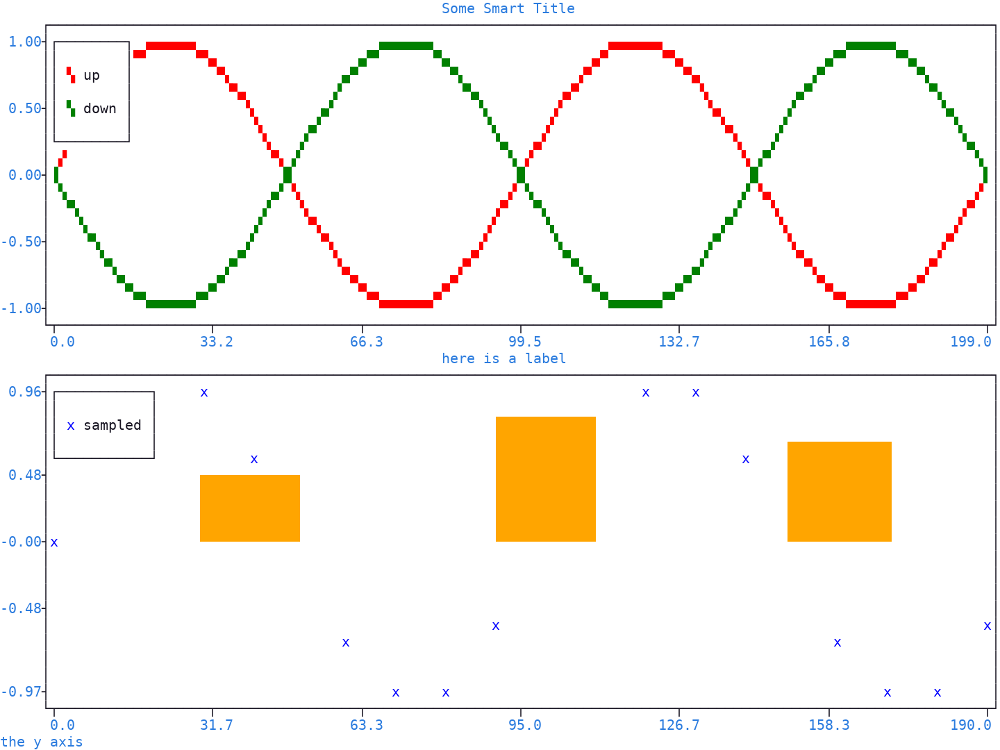
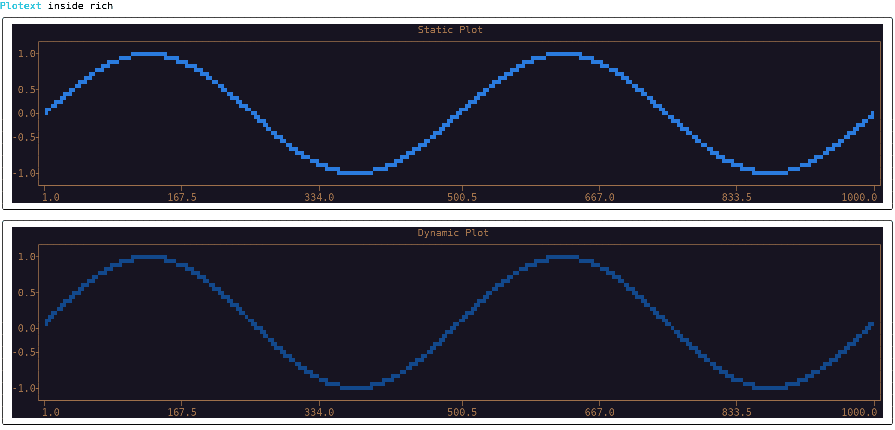
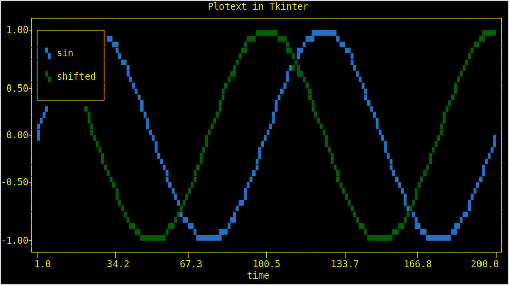
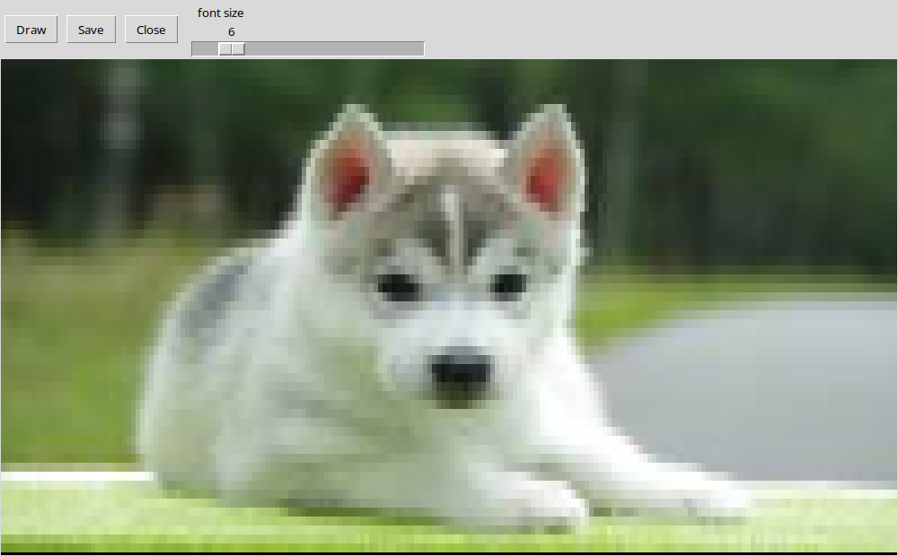

Other Packages
==============

| A |plotext| plot is **text**, colored with the standard color codes of the :doc:`terminal <terminal>`.
| Anything that can print text can therefore print a plot, and this page shows it done inside three other packages.

Matplotlib
----------

The :func:`plotext.matplotlib() <plotext.matplotlib>` function turns a matplotlib figure into :class:`plotext.figure <plotext._plotter.plot.plot_class>`, subplots, colors, titles and axis labels included.

.. note:: Matplotlib is imported by that function alone, so |plotext| does not require it, but it has to be installed for the example to run, with ``pip install matplotlib``.

.. literalinclude:: code/packages_matplotlib.py
   :language: python

.. caution:: Lines, scatters, rectangles, their colors, titles, axis labels, legend labels and the subplot grid all cross over. What does not is text written on the plot with matplotlib's own ``text()``.

.. tip:: The labels cross over, so the :ref:`legend <legend>` appears on its own; the rectangles a matplotlib bar chart is made of carry none, and stay out of it.

Rich
----

`Rich <https://github.com/Textualize/rich>`_ writes colored text, tables, progress bars and highlighted code in the terminal, and can keep a display **updating in place**. A |plotext| plot enters one of its boxes as the text it already is: rich reads its colored characters and prints them at whatever size that box currently has.

.. note:: Rich has to be installed for the example to run, with ``pip install rich``.

.. literalinclude:: code/packages_rich.py
   :language: python

.. caution:: |plotext| normally refuses to draw a plot larger than the :doc:`terminal <terminal>`. Here the plot must instead fill its box, which rich is free to make larger, so that refusal is lifted with :meth:`plotext.terminal.limit(False, False) <plotext._kernel.terminal.terminal.limit>`. Without that line the plot stops at the terminal size, in width and in height alike, and leaves the rest of the box empty.

.. note:: The template grew out of `Issue 26 <https://github.com/piccolomo/plotext/issues/26>`_ and `Issue 27 <https://github.com/piccolomo/plotext/issues/27>`_, with the help of rich's author and of the user ``@whisller``.

Tkinter
-------

`Tkinter <https://docs.python.org/3/library/tkinter.html>`_ is the window toolkit bundled with Python, so a plot shown through it leaves the terminal altogether.

.. note:: Tkinter comes with Python, but some Linux distributions package it apart, as `python3-tk <https://packages.ubuntu.com/noble/python3-tk>`_.

A tkinter text box cannot color one character at a time. Instead a coloring is given a name, called a **tag**, and that tag is then attached to any stretch of characters. Drawing a plot is therefore two steps: write the characters, then attach the tags.

.. literalinclude:: code/packages_tkinter.py
   :language: python

The characters come from :meth:`matrix.string(colorless = True) <plotext.matrix.string>` in one call. Their colors come from :meth:`matrix.get() <plotext.matrix.get>`, which gives the :ref:`pixel <pixel>` of one character, read with :meth:`pixel.foreground() <plotext.pixel.foreground>` and :meth:`pixel.background() <plotext.pixel.background>`; each gives an ``(r, g, b)`` triple, which tkinter wants written as ``#rrggbb``.

.. tip:: A plot uses **few colorings**, three or four typically. So the example creates one tag per coloring and attaches it to every stretch sharing it, which is four tags here. Creating one tag per character instead, as the `version 5 example <https://github.com/piccolomo/plotext/blob/5.3.2/readme/environments.md#tkinter>`_ did, makes thousands of them and a visibly slow window.

.. caution:: The whole plot must be drawn in **one width**. Ask for a font the window system can actually supply, and check it: ``font.actual("family")`` reports what tkinter really picked, and ``font.measure()`` should give the same number for a letter, for a frame character like ``│`` and for a block like ``▚``. A tkinter built without font matching answers ``fixed`` instead, drawing frame characters wider than the rest, and every one of them shifts the rest of its row sideways.

.. note:: The same check rules out some :ref:`markers <resolutions>`. In ``DejaVu Sans Mono`` a letter, a frame character, an ``hd`` block and a braille dot all measure 11, while the 3 x 2 blocks of ``fhd`` are missing and come back substituted at 19, so ``fhd`` breaks the rows and the other three do not.

A **picture** is easier, being drawn with block characters alone. This second example follows the version 5 one: three buttons and a slider setting the font size, which decides how many characters the picture is made of, and so how sharp it looks.

.. literalinclude:: code/packages_tkinter_image.py
   :language: python

.. tip:: A block character does not cover the gap tkinter leaves between two lines, which shows as **pale stripes** across the picture. So each stretch is written as blank characters carrying its color as their background, which fills the whole cell.

.. note:: **Save** writes the picture as a web page, colors included, through :meth:`matrix.save() <plotext.matrix.save>`.
