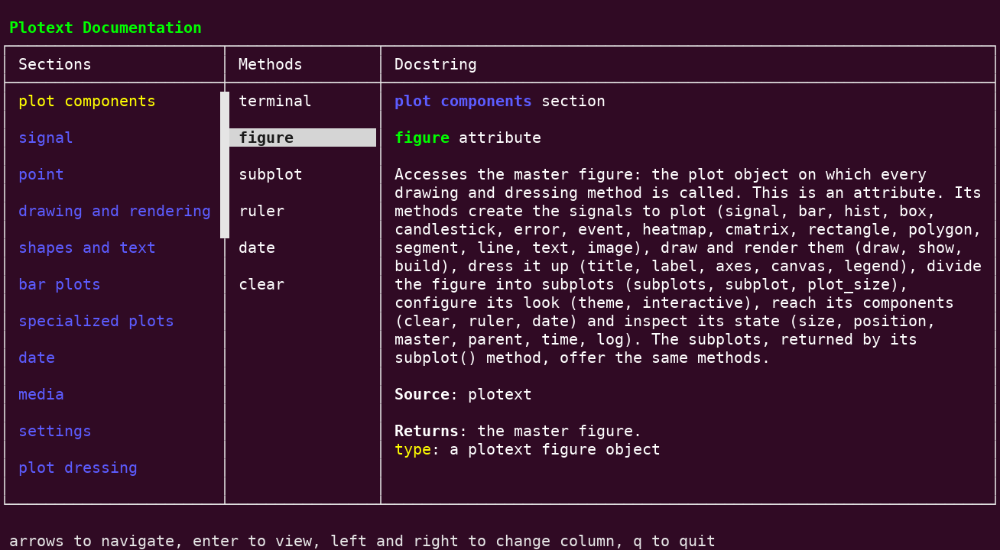
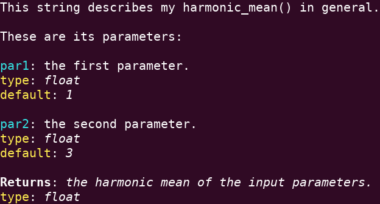
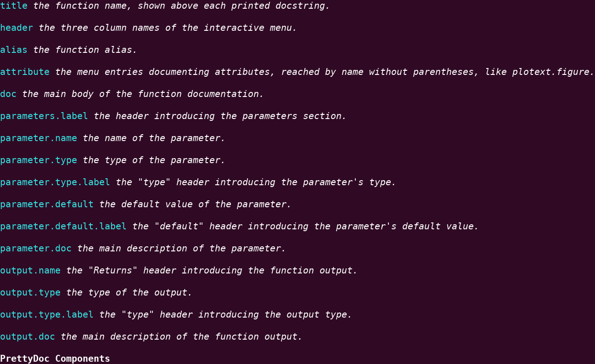

Pretty Docstrings
=================

| The ``prettydoc`` module creates **colorful and elegant** docstrings, browsable one by one or through an interactive menu.
| All the |plotext| documentation is **written with it**: the ``plotext.doc`` container holds every |plotext| docstring, and calling it, as ``plotext.doc()``, opens the menu below.

.. note:: In |plotext|, a single docstring is printed by ``plotext.doc.bar()``, the ``bar()`` entry of the container, or by ``plotext.figure.bar.doc()``: every documented method gains a ``doc()`` method of its own, printing its docstring.

Example
-------

Here is the docstring of a dummy ``harmonic_mean()`` function, documented with `prettydoc`:

produced by the following code:

.. literalinclude:: code/prettydoc.py
   :class: code-block
   :language: python3

The following sections comment and explain the previous code.

Functions
---------

| A new :class:`plotext.prettydoc.docs() <plotext.prettydoc.docs>` manager starts empty: its :meth:`function() <plotext.prettydoc.docs.function>` method adds a function to it, taking the actual function as its parameter.
| Every method after it applies to the **most recently added** function, until the next :meth:`function() <plotext.prettydoc.docs.function>` call.

.. note:: Every piece of documentation is **optional**: a field never added simply does not appear in the rendered docstring.

.. tip:: `prettydoc` documents functions, class methods and attributes alike: an attribute carries no Python ``__name__`` value, so it is added with the ``name`` parameter, as in ``function(figure, name = "figure")``.

Descriptions
------------

The :meth:`description() <plotext.prettydoc.docs.description>` method of the ``docs()`` manager adds the main function documentation, appearing as the docstring intro, and, optionally, the alternative name the function also answers to, through its ``alias`` parameter.

Parameters
----------

| The :meth:`parameter() <plotext.prettydoc.docs.parameter>` method of the ``docs()`` manager details a function parameter: it requires the parameter ``name`` and main ``doc`` description, and optionally takes the ``type`` and ``default`` values, printed under the parameter description.
| When the current function shares a parameter with a previously documented one, the :meth:`past_parameter() <plotext.prettydoc.docs.past_parameter>` method of the ``docs()`` manager can be used to **reuse** the already written description, to avoid writing the same documentation twice: it requires the parameter name and the name of the function that already describes it, as ``"mean"`` in the example above.

.. caution:: A function documented with a :ref:`source path <doc_source>` is named together with it: for example, the ``bar()`` method, with source ``"plotext.figure"``, is named ``"plotext.figure.bar"``, to avoid confusion between methods sharing a name.

.. note:: A copied parameter keeps the type and default value it was given in the other function; passing a new ``type`` or ``default`` to :meth:`past_parameter() <plotext.prettydoc.docs.past_parameter>` replaces that one only.

.. tip:: In the ``type`` and ``default`` fields, ``None`` leaves the value as it is (absent for a new parameter, the copied one for a past parameter), while an empty string removes it.

.. _doc_source:

Source
------

The :meth:`source() <plotext.prettydoc.docs.source>` method of the ``docs()`` manager declares the **source path**: what the user writes before the method name to reach it, such as ``"plotext"`` or ``"plotext.figure"``; a list of source paths is also accepted, for methods reachable from several places. The source renders as the ``Source`` field of the docstring; it also tells methods sharing a name (``clear``, ``copy``, ``set``, …) apart, each named together with its own source, as in ``"plotext.figure.bar"``.

Output
------

| The :meth:`output() <plotext.prettydoc.docs.output>` method of the ``docs()`` manager adds the details of the function output: its basic ``doc`` description and ``type``.
| The :meth:`past_output() <plotext.prettydoc.docs.past_output>` method of the ``docs()`` manager reuses an already described output: it requires the name of the function whose output is copied.

.. _sections:

Sections
--------

| Functions can be grouped into sections, listed in the first column of the :ref:`interactive menu <doc_menu>`: the :meth:`section() <plotext.prettydoc.docs.section>` method of the ``docs()`` manager sets the current section name, and every following :meth:`function() <plotext.prettydoc.docs.function>` entry belongs to it, until the next :meth:`section() <plotext.prettydoc.docs.section>` call; with no argument, or ``None``, the following entries stay without a section.

.. note:: With no sections at all, the menu drops the sections column, keeping only the methods and the docstring.

.. caution:: When only some functions are given a section, the ones without one gather at the end of the menu, in a final section labeled ``Unlabeled``.

Update
------

Once all functions are documented, the :meth:`update() <plotext.prettydoc.docs.update>` method of the ``docs()`` manager:

- writes each docstring into the ``__doc__`` of its function, the string Python shows in ``help()``
- attaches to each function a ``doc()`` method, printing its docstring **in color**, as ``harmonic_mean.doc()`` in the example
- returns the **documentation container**: a distinct object with one printing method per documented entry

The :meth:`string() <plotext.prettydoc.docs.string>` method of the ``docs()`` manager returns every docstring joined in a single string.

.. caution:: The colors are written inside the ``__doc__`` strings as ansi color codes, the standard color characters of the terminal: a tool unaware of them, like the `help() <https://docs.python.org/3/library/functions.html#help>`_ page viewer, shows the codes around the words instead of the colors.

.. tip:: Create the manager with ``docs(colorless = True)`` to write the ``__doc__`` strings as plain text; the ``doc()`` methods and the interactive menu print colored docstrings either way.

.. _doc_menu:

Menu
----

| Calling the documentation container as a method, ``doc()``, opens the interactive menu: three scrollable columns, holding the list of sections, the list of methods and the docstring of the picked method, shown when ``Enter`` is pressed on it.
| With no keyboard to read, as when the program input is piped from a file or another program, the menu cannot run: every docstring is printed instead, one after the other.
| For example, ``plotext.doc()`` opens the menu of the |plotext| documentation, shown at the top of this page.

.. tip:: Arrow keys move within a column, left and right change column, ``q`` quits.

| The :meth:`title() <plotext.prettydoc.docs.title>` method of the ``docs()`` manager sets the title of the menu, the colored text over its top left corner, which would normally contain your package name: it is ``Plotext Documentation`` for the |plotext| documentation, as in the image at the top of this page.

.. _registry:

Registry
--------

| A :class:`plotext.prettydoc.registry() <plotext.prettydoc.registry>` keeps long strings under **short names**, so that a long text needed in many docstrings is written once: a type explanation, a recurring message, any long sentence.
| The :meth:`plotext.prettydoc.registry().add() <plotext.prettydoc.registry.add>` method stores a text under a chosen name; calling the registry with that name gives the text back:

.. code-block:: python

   from plotext.prettydoc import docs, registry

   shared = registry()
   shared.add('float',  'a numeric value')
   shared.add('colors', 'Use plotext.colors() for the available color codes.')

   pd = docs()
   pd.function(mean)
   pd.parameter('par1', 'the first parameter. ' + shared('colors'), shared('float'), 1)

.. _doc_color:

Colors
------
The coloring of each element in the documentation can be customized in the following **two ways**.

.. rubric:: Specific Elements

The first method involves selecting your preferred coloring using the :ref:`colorize <colorize>` tool, then passing this object to any of the documenting methods described in the previous sections. For example, to add a colored alias, use:

.. code-block:: python

   description(alias = plotext.colorize('average', pixel = ('blue+', None, 'italic bold')))

.. rubric:: Default Components

The second method allows you to change the default coloring of a specific docstring component. The :meth:`pixel() <plotext.prettydoc.docs.pixel>` method of the ``docs()`` manager requires a ``component`` string name and a :ref:`pixel <pixel>` representing the desired coloring. For example:

.. code-block:: python

   pd = docs()
   pd.pixel('alias', plotext.pixel('blue+', style = 'italic bold'))

sets the alias *component* (when present) of all generated docstrings to the specific coloring. By calling this code at the beginning, all subsequent alias components will adopt the chosen color settings, unless a specific alias component is changed with the previous method.

.. rubric:: Docstring Components

The available docstring components are printed by :func:`plotext.prettydoc.components() <plotext.prettydoc.components>`, shown in the image below:

Use these codes to customize the default coloring for each *component* of the docstring.

Shortcuts
---------

Using one-word shortcuts can be advantageous when documenting many functions. Using these shortcuts the initial example looks like:

.. literalinclude:: code/prettydoc_short.py
	:language: python

.. note:: Additional technical details can be found in the :ref:`prettydoc API <prettydoc_api>`.
