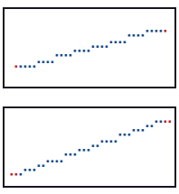

Rulers
======

The *ruler* defines the area of the plot where numerical ticks appear along each axis. Each of the methods below can be applied independently to any axis; see :ref:`axis` for how to target a specific axis.

Limits
------

``lim`` sets the visible numerical range of an axis via the ``lower`` and ``upper`` parameters. Only data values within the given range are drawn — values outside it are dropped silently. Limits affect display only; the underlying data is untouched.

Limits can be given as numeric values or as date strings, depending on the data.

.. code-block:: python

   import plotext as plt
   fig = plt.figure
   fig.clear()

   y = plt.sin()
   signal = fig.signal(y)
   fig.draw(signal)

   fig.lim(50, 150,   axis = "x")    # show only x in [50, 150]
   fig.lim(-0.5, 0.5, axis = "y")    # and y in [-0.5, 0.5]

   fig.title("Limits")
   fig.show()

Ticks
-----

Plotext gives full control over the **placement and appearance of numerical ticks** on both axes. Ticks are managed by two methods: ``frequency`` for automatic placement, and ``ticks`` for manual placement.

Automatic placement
~~~~~~~~~~~~~~~~~~~

``frequency`` sets the number of ticks to display along an axis. Plotext distributes them evenly across the current axis range.

.. code-block:: python

   import plotext as plt
   fig = plt.figure
   fig.clear()

   y = plt.sin()
   signal = fig.signal(y)
   fig.draw(signal)

   fig.frequency(3, axis = "y")

   fig.title("Frequency Method")
   fig.show()

Manual placement
~~~~~~~~~~~~~~~~

Use ``ticks`` when you need full control over tick positions and labels. This is useful when ticks must appear at specific meaningful values (e.g. multiples of π), when values are non-uniformly spaced, or when custom text labels are required instead of numeric values.

.. code-block:: python

   import plotext as plt
   fig = plt.figure
   fig.clear()

   y = plt.sin()
   signal = fig.signal(y)
   fig.draw(signal)

   fig.ticks(positions = [-1, 0, 1],
             labels = ["minimum", "center", "maximum"],
             axis = "y")

   fig.title("Scatter Plot with Manual Tick Placement")
   fig.show()

.. note:: Tick positions may be numeric values; dates, timestamps and datetime objects are also accepted when a date plot is active (see :doc:`date`). Tick labels may be plain strings or :class:`plotext.colorize` objects (see :doc:`colorize`).

.. note:: ``ticks`` takes precedence over ``frequency`` on the same axis.

Tick label colour
~~~~~~~~~~~~~~~~~

``ruler_pixel`` sets the *ruler pixel* — the foreground colour, background colour and style applied to tick labels along an axis. It accepts the same ``axis`` and ``side`` selectors as the rest of the ruler API and recolours any tick labels already placed via ``frequency`` or ``ticks`` in place, so the order of calls is flexible.

.. code-block:: python

   import plotext as plt
   fig = plt.figure
   fig.clear()

   y = plt.sin()
   fig.draw(fig.signal(y))

   fig.ticks([-1, 0, 1], labels = ["min", "mid", "max"], axis = "y")
   fig.ruler_pixel(plt.pixel(foreground = "cyan"), axis = "y")

   fig.title("Cyan y-axis tick labels")
   fig.show()

.. note::

   When ``ticks`` receives **already-colorized** labels (i.e. :class:`plotext.colorize` objects rather than plain strings), the foreground and style baked into each label override the ruler pixel — only the label background is harmonised with the ruler. Calling ``ruler_pixel`` *after* such a ``ticks`` call overwrites the labels' own colours and unifies them with the new ruler pixel.

Tick label alignment
~~~~~~~~~~~~~~~~~~~~

:meth:`~plotext._plotter.plot.plot_class.tick_alignment` sets where tick labels sit inside the ruler region of one or more axes. The naming convention follows the axis: y-axis ticks accept *left*, *center* or *right* (short *l*, *c*, *r*); x-axis ticks accept *top*, *center* or *bottom* (short *t*, *c*, *b*). Both naming sets map to the same ``-1`` / ``0`` / ``1`` integer codes internally. ``None`` (the default) falls back to the per-side built-in default — *right* for left-y ticks, *left* for right-y ticks.

.. code-block:: python

   import plotext as plt
   fig = plt.figure
   fig.clear()

   y = plt.sin()
   fig.draw(fig.signal(y))

   fig.tick_alignment("left", axis = "y")        # y-axis tick labels left-aligned in their strip

   fig.title("Left-aligned y-axis tick labels")
   fig.show()

Scale
-----

``scale`` controls how data values are mapped to positions on an axis. By default axes use a linear scale — equal differences in data correspond to equal distances on the axis. With a logarithmic scale, equal distances on the axis correspond to equal ratios between values instead.

.. note::

   A log scale is useful when data spans several orders of magnitude or grows exponentially. Multiplicative changes (e.g. doubling or halving) appear as equal distances on the axis, revealing relative growth that may be hidden on a linear scale.

The example below draws a sinusoidal signal on a logarithmic x axis, using ``scale`` to switch the x scale, ``frequency`` to set the tick count, and ``grid`` to add vertical gridlines:

.. code-block:: python

   import plotext as plt
   fig = plt.figure
   fig.clear()

   l = 10 ** 4
   y = plt.sin(periods = 2, length = l)
   signal = fig.signal(y).lines(True)
   fig.draw(signal)

   fig.scale("log", axis = "x")
   fig.frequency(5, axis = "x")
   fig.frequency(7, axis = "y")

   fig.grid(axis = "x")

   fig.title("Logarithmic Plot")
   fig.label("x", "logarithmic scale")
   fig.label("y", "linear scale")

   fig.show()

.. image:: https://raw.githubusercontent.com/piccolomo/plotext/master/data/log.png
   :alt: log

.. note:: The logarithm used is ``log10``.

Direction
---------

``direction`` controls **in which direction values increase along an axis**. It changes the visual orientation but **does not modify the data**. The parameter takes ``+1`` (default: values grow left-to-right on x and bottom-to-top on y) or ``-1`` (reversed).

Alignment
---------

When a plot is rendered with a fixed number of bins, each numerical value must be mapped to one of them. The ``alignment`` method controls how the axis numerical limits (the minimum and maximum values) are placed within the first and last bins.

With ``center`` alignment the limits sit at the centre of the outermost bins, producing a symmetrical layout. With ``edge`` alignment they sit at the outer boundary of those bins, flush against the plot edge.

In the two plots above, the top uses centre alignment on both axes and the bottom uses edge alignment. In both cases the first and last markers occupy the same characters on the canvas; only their position within those characters differs.
