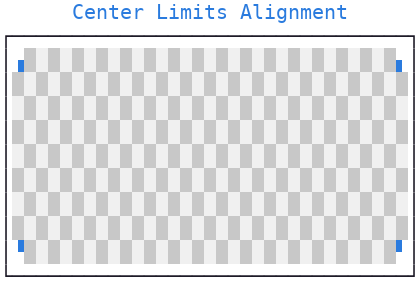
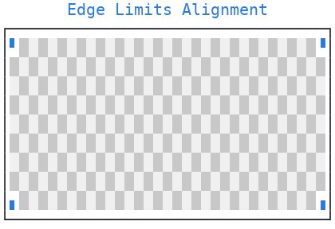
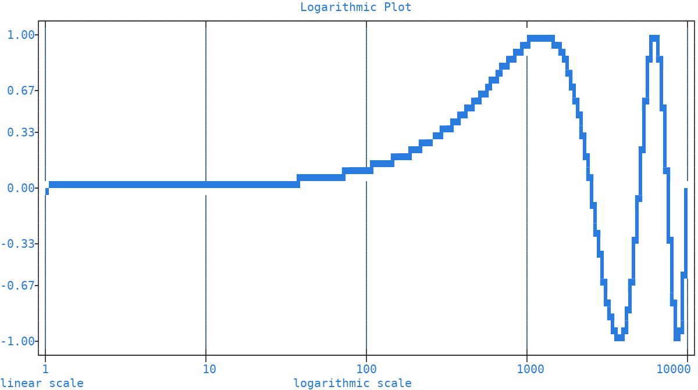
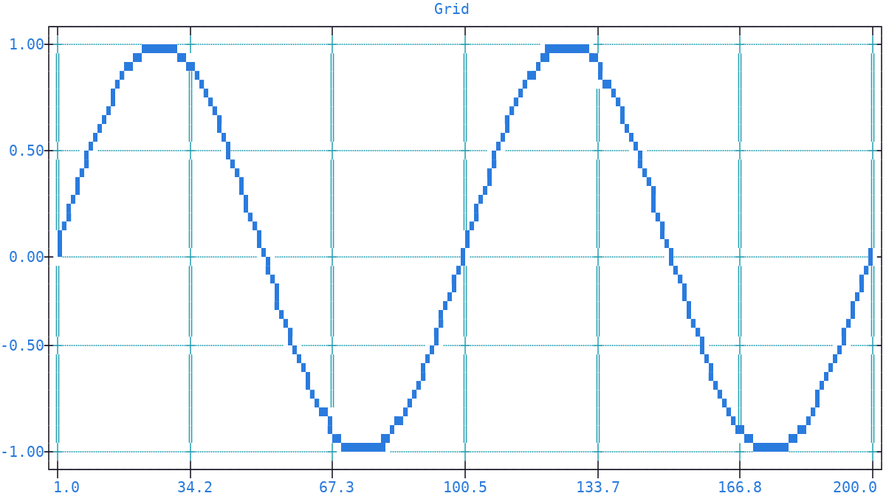

.. _rulers:

Rulers
======

| The *ruler* is the area of the plot where the :ref:`numerical ticks <ticks>` appear, one for each :doc:`axis <axis>` side.
| :meth:`plotext.figure.ruler() <plotext._plotter.plot.plot_class.ruler>` gives back a *ruler selection*: the rulers picked by its ``axis`` and ``side`` parameters, a single one as in ``plotext.figure.ruler("x", "upper")``, or several at once as in ``plotext.figure.ruler("both", "both")``.

.. seealso:: See :ref:`axis selection <axis>` for the accepted forms of the ``axis`` and ``side`` parameters.

Every method described in this section belongs to the selection: it applies to each ruler in it, as in ``plotext.figure.ruler("x").frequency(5)``, and gives the selection back, so that calls can be chained, as in ``plotext.figure.ruler("x").frequency(5).lim(0, 10)``.

Limits
------

:meth:`ruler().lim() <plotext._plotter.frame.ruler.ruler_class.lim>` sets the **visible numerical range** of an :doc:`axis <axis>` via its ``lower`` and ``upper`` parameters. Only data values within the given range are drawn, values outside it are dropped silently. Limits affect **display only**; the underlying data is untouched.

Limits can be given as numeric values or as :doc:`dates <date>`, in any of the accepted forms, once date support is activated on that :doc:`axis <axis>`.

.. code-block:: python

   import plotext as plt
   fig = plt.figure
   fig.clear()

   y = plt.sin()
   signal = fig.signal(y)
   fig.draw(signal)

   fig.ruler("x").lim(50, 150)    # show only x in [50, 150]
   fig.ruler("y").lim(-0.5, 0.5)    # and y in [-0.5, 0.5]

   fig.title("Limits")
   fig.show()

.. note:: Called with no arguments, the range is computed again from the plot content: the drawn signals, the :ref:`numerical tick <ticks>` positions and the :ref:`lines <shape_line>`.

.. _alignment:

Limits Alignment
~~~~~~~~~~~~~~~~

| The numerical limits of a ruler, its minimum and maximum values, fall inside the first and last character cells of the plot :doc:`canvas <canvas>`.
| The limits alignment setting is where exactly each limit sits within its dedicated cell, set by the :meth:`ruler().alignment() <plotext._plotter.frame.ruler.ruler_class.alignment>` method, through its ``lim`` parameter: *center* (the default) or *edge*.

Center
^^^^^^

| On the *x* axis, with the center alignment, in absolute character units, the first column position (that is, a point with coordinate 0) is chosen at the middle of the first canvas character, plus a very small amount, while the last column position (that is, a point with coordinate equal to the canvas columns minus 1) is placed at the middle of the last character, minus the same small amount.
| The same holds on the *y* axis for the first (bottom) and last (top) row positions, the small amount always pushing towards the plot center.

| The example below makes this visible.
| A :ref:`heatmap <heatmap>` checkerboard colors the canvas, one board cell per character cell, and the four corner values of the plot are drawn in blue with the *hd* :doc:`marker <marker>`, which paints quarters of a cell.

.. code-block:: python

   import plotext as plt
   fig = plt.figure
   fig.clear()

   width, height = 33, 9    # both odd, so that every corner cell takes the lighter color
   fig.plot_size(width + 2, height + 3)    # the canvas plus frame borders and title

   light, lighter = (200, 200, 200), (240, 240, 240)
   board = [[lighter if (col + row) % 2 == 0 else light for col in range(width)] for row in range(height)]
   fig.draw(fig.heatmap(board))

   x = [0, width - 1, 0, width - 1]
   y = [0, 0, height - 1, height - 1]
   fig.draw(fig.signal(x, y, marker = plt.marker("hd", pixel = "blue+")))

   fig.ruler("both", "both").frequency(0)
   fig.ruler("both", "both").alignment(lim = "center")

   fig.title("Center Limits Alignment")
   fig.show()

.. note:: The four blue dots end up pointing inwards: each of them falls at the middle of its designated character, slightly off in such a way that all point towards the plot center.

Edge
^^^^

| On the *x* axis, with the edge alignment, in absolute character units, the first column position (that is, a point with coordinate 0) is chosen at the left edge of the first canvas character, plus a very small amount, while the last column position (that is, a point with coordinate equal to the canvas columns minus 1) is placed at the right edge of the last character, minus the same small amount.
| The same holds on the *y* axis for the first (bottom) and last (top) row positions, the small amount always pushing towards the plot center.

The example below differs from the previous one only by the ``lim`` parameter:

.. code-block:: python

   import plotext as plt
   fig = plt.figure
   fig.clear()

   width, height = 33, 9    # both odd, so that every corner cell takes the lighter color
   fig.plot_size(width + 2, height + 3)    # the canvas plus frame borders and title

   light, lighter = (200, 200, 200), (240, 240, 240)
   board = [[lighter if (col + row) % 2 == 0 else light for col in range(width)] for row in range(height)]
   fig.draw(fig.heatmap(board))

   x = [0, width - 1, 0, width - 1]
   y = [0, 0, height - 1, height - 1]
   fig.draw(fig.signal(x, y, marker = plt.marker("hd", pixel = "blue+")))

   fig.ruler("both", "both").frequency(0)
   fig.ruler("both", "both").alignment(lim = "edge")

   fig.title("Edge Limits Alignment")
   fig.show()

.. note:: The four blue dots end up pointing outwards: each of them falls at the outer corner of its designated character; a slight offset makes sure that all of them remain inside the canvas.

.. note:: The edge alignment stretches the range over the whole canvas: with the center one, a half character wide frame around the canvas is lost for plotting, keeping the data half a character away from the frame.

.. _ticks:

Ticks
-----

|plotext| gives full control over the placement and appearance of **numerical ticks** on both :doc:`axes <axis>`. Ticks are managed by two methods: :meth:`ruler().frequency() <plotext._plotter.frame.ruler.ruler_class.frequency>` for automatic placement, and :meth:`ruler().ticks() <plotext._plotter.frame.ruler.ruler_class.ticks>` for manual placement, which takes precedence when both are set on the same ruler.

Automatic placement
~~~~~~~~~~~~~~~~~~~

:meth:`ruler().frequency() <plotext._plotter.frame.ruler.ruler_class.frequency>` sets the number of numerical ticks to display along an :doc:`axis <axis>`. |plotext| distributes them evenly across the current :doc:`axis <axis>` range.

.. code-block:: python

   import plotext as plt
   fig = plt.figure
   fig.clear()

   y = plt.sin()
   signal = fig.signal(y)
   fig.draw(signal)

   fig.ruler("y").frequency(3)

   fig.title("Frequency Method")
   fig.show()

.. note:: The default is 7 numerical ticks on the *x* :doc:`axis <axis>` and 5 on the *y* axis, restored by calling the method with no arguments.

Manual placement
~~~~~~~~~~~~~~~~

Use :meth:`ruler().ticks() <plotext._plotter.frame.ruler.ruler_class.ticks>` when you need full control over numerical tick **positions and labels**. This is useful when ticks must appear at specific meaningful values (for example multiples of π), when values are non-uniformly spaced, or when custom text labels are required instead of numeric values.

.. tip:: An **empty list** of positions removes the ticks from that ruler, exactly as :meth:`ruler().frequency(0) <plotext._plotter.frame.ruler.ruler_class.frequency>` does.

.. code-block:: python

   import plotext as plt
   fig = plt.figure
   fig.clear()

   y = plt.sin()
   signal = fig.signal(y)
   fig.draw(signal)

   fig.ruler("y").ticks(positions = [-1, 0, 1],
                        labels = ["minimum", "center", "maximum"])

   fig.title("Scatter Plot with Manual Tick Placement")
   fig.show()

.. note:: Tick positions may be numeric values; dates, timestamps and datetime objects are also accepted when a :doc:`date plot <date>` is active. Tick labels may be plain strings, :ref:`colorize <colorize>` objects or :ref:`matrix <matrix>` objects.

.. caution:: A label taller than one row, a :class:`plotext.matrix` of several rows or a :class:`plotext.colorize` object containing a new line, is dropped on an *x* ruler, tick mark included, since its strip is one row high. On a *y* ruler it spills over the rows below, where a later tick label overwrites it, and is dropped when those rows fall outside the plot.

.. note:: Called with no arguments, the automatic placement is restored.

.. _ticks_colors:

Ticks Colors
~~~~~~~~~~~~

The :meth:`ruler().pixel() <plotext._plotter.frame.ruler.ruler_class.pixel>` method sets the ruler :ref:`pixel <pixel>`: the foreground color, background color and style painting the tick labels and the **whole strip** they sit in, beside the frame.

.. code-block:: python

   import plotext as plt
   fig = plt.figure
   fig.clear()

   y = plt.sin()
   fig.draw(fig.signal(y))

   fig.ruler("y").ticks([-1, 0, 1], labels = ["min", "mid", "max"])
   fig.ruler("y").pixel(plt.pixel(foreground = "cyan"))

   fig.title("Cyan y-axis tick labels")
   fig.show()

.. note:: A tick label given already colored, as a :class:`plotext.colorize` or :class:`plotext.matrix` object, keeps its own colors and style, whatever the order of the calls. The ruler :ref:`pixel <pixel>` fills in what is missing, usually the background alone.

.. note:: The default ruler pixel is *blue+* on a *white* background, with no style.

.. _tick_alignment:

Ticks Alignment
~~~~~~~~~~~~~~~

| Tick labels are aligned by the same :meth:`ruler().alignment() <plotext._plotter.frame.ruler.ruler_class.alignment>` method that :ref:`aligns the numerical limits <alignment>`, but through its ``tick`` parameter.
| The tick alignment controls **where each label sits** with respect to the numerical position it belongs to.
| It can be *left*, *center* or *right*: the label is anchored to the position by its left edge, its center or its right edge, so that it appears to the right of the position, around it, or to its left, respectively.
| A fourth alignment, *dynamic*, is available on the *x* :doc:`axis <axis>` alone: it finds an intermediate position between the left and right anchors, depending on the space available, aiming at the center one. Its behavior is apparent along the left and right edges of the *x* axis, where a long label may not fit any of the fixed alignments and would otherwise be dropped.

.. code-block:: python

   import plotext as plt
   fig = plt.figure
   fig.clear()

   y = plt.sin()
   fig.draw(fig.signal(y))

   fig.ruler("y").alignment(tick = "left")      # y-axis tick labels left-aligned in their strip

   fig.title("Left-aligned y-axis tick labels")
   fig.show()

.. note:: The *default* alignment type is also allowed: on the *x* :doc:`axis <axis>` it is the dynamic alignment, on the *y* axis it places each label against the axis, right aligned on the left *y* axis, left aligned on the right one.

.. _scale:

Scale
-----

| :meth:`ruler().scale() <plotext._plotter.frame.ruler.ruler_class.scale>` controls how data values are mapped to positions on an :doc:`axis <axis>`.
| By default :doc:`axes <axis>` use a linear scale: equal differences in data correspond to **equal distances** on the axis.
| With a logarithmic scale, equal distances on the :doc:`axis <axis>` correspond to **equal ratios** between values instead.

.. tip::

   A log scale is useful when data spans several orders of magnitude or grows exponentially. Multiplicative changes (for example doubling or halving) appear as equal distances on the :doc:`axis <axis>`, revealing relative growth that may be hidden on a linear scale.

The example below draws a sinusoidal signal with a logarithmic scale on the *x* :doc:`axis <axis>`, using :meth:`scale <plotext._plotter.frame.ruler.ruler_class.scale>` to switch the *x* scale, :meth:`frequency <plotext._plotter.frame.ruler.ruler_class.frequency>` to set the numerical tick count, and :meth:`grid <plotext._plotter.frame.ruler.ruler_class.grid>` to add vertical grid lines:

.. code-block:: python

   import plotext as plt
   fig = plt.figure
   fig.clear()

   l = 10 ** 4
   y = plt.sin(periods = 2, length = l)
   signal = fig.signal(y).lines()
   fig.draw(signal)

   fig.ruler("x").scale("log")
   fig.ruler("x").frequency(5)
   fig.ruler("y").frequency(7)

   fig.ruler("x", "both").grid()

   fig.title("Logarithmic Plot")
   fig.label("logarithmic scale", "x")
   fig.label("linear scale", "y")

   fig.show()

.. note:: The logarithm used is ``log10``.

Direction
---------

:meth:`ruler().direction() <plotext._plotter.frame.ruler.ruler_class.direction>` controls in which direction values **increase** along an :doc:`axis <axis>`. It changes the visual orientation but does not modify the data. The parameter takes ``+1`` (default: values grow left to right on the *x* axis and bottom to top on the *y* axis) or ``-1`` (reversed).

.. code-block:: python

   import plotext as plt
   fig = plt.figure
   fig.clear()

   y = plt.sin()
   fig.draw(fig.signal(y))

   fig.ruler("y").direction(-1)    # y values decrease going up

   fig.title("Reversed y Axis")
   fig.show()

.. _grid:

Grid
----

:meth:`ruler().grid() <plotext._plotter.frame.ruler.ruler_class.grid>` controls the visibility and appearance of the grid lines: each *x* ruler in the selection draws vertical lines at its numerical tick positions, each *y* ruler horizontal ones.

.. code-block:: python

   import plotext as plt
   fig = plt.figure
   fig.clear()

   y = plt.sin()
   fig.draw(fig.signal(y).lines())

   grid_pixel = plt.pixel(foreground = "cyan")
   fig.ruler("x", "both").grid(style = "double", pixel = grid_pixel)    # double cyan vertical grid lines
   fig.ruler("y", "both").grid(style = "dotted", pixel = grid_pixel)    # dotted cyan horizontal ones

   fig.title("Grid")
   fig.show()

| With its parameters you can turn the grid on or off (``active``) and set the :ref:`line style <line_styles>` (``style``): *default*, *double*, *heavy* or *dotted*. Use :func:`plotext.line_styles` for a preview of the available styles.
| Finally, you can set the colors of the lines (``pixel``, as a :ref:`pixel <pixel>` object).

.. note:: The *rounded* style is not available here: this style only shapes corners, which straight grid lines do not have.

.. tip:: The grid is useful, for example, in logarithmic plots, where it makes the non uniform spacing of the values visible: see the example in the :ref:`scale <scale>` section.

Clear
-----

:meth:`ruler().clear() <plotext._plotter.frame.ruler.ruler_class.clear>` resets the selected rulers **only**, leaving the rest of the plot untouched. It resets:

- the limits, computed again from the plot content, and their :ref:`alignment <alignment>`, back to *center*
- the :ref:`numerical ticks <ticks>`: manual positions and labels removed, frequency back to 7 on the *x* axis and 5 on the *y* one, :ref:`alignment <tick_alignment>` back to *default*
- the :ref:`scale <scale>`, back to *linear*, and the direction, back to increasing
- the :doc:`date <date>` support, deactivated
- the :ref:`grid <grid>`, turned off, with default style and colors
- the ruler :ref:`pixel <ticks_colors>`, back to its default colors (*blue+* on *white*, with no style)

For example:

.. code-block:: python

   fig.ruler("y", "right").clear()   # reset the right y axis only
   fig.ruler("both", "both").clear()   # reset all four rulers at once
