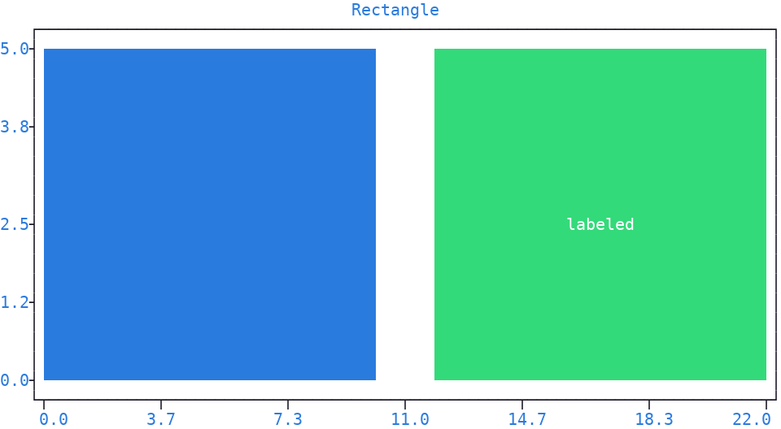
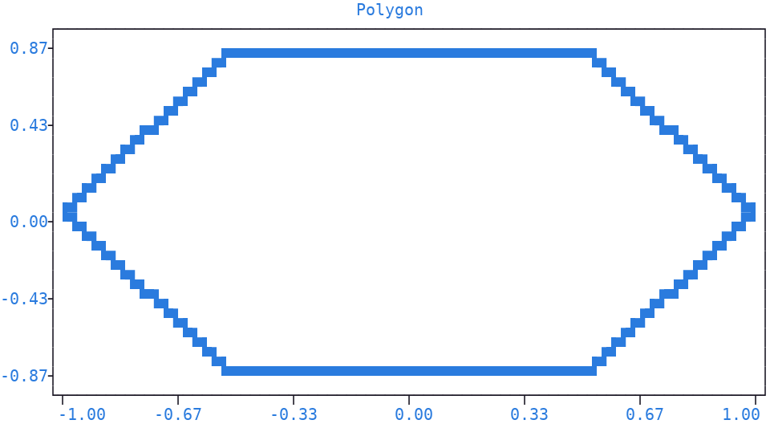
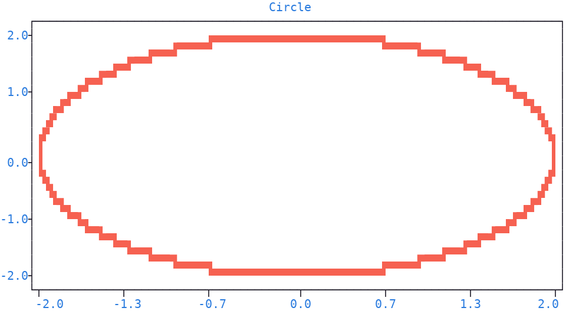
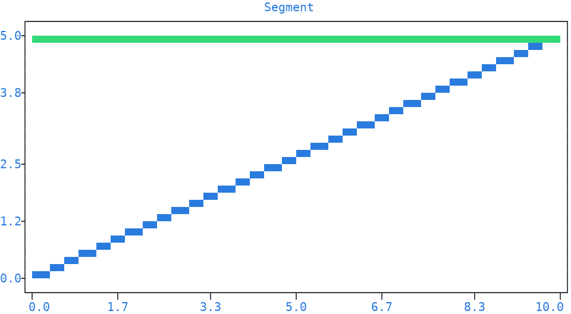
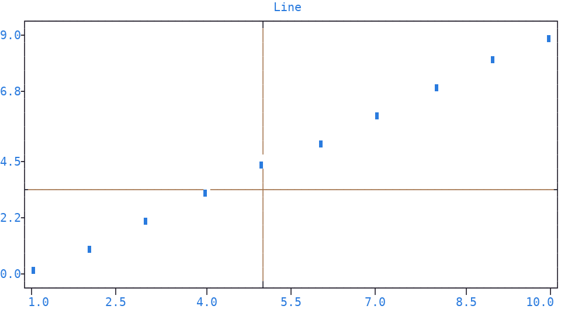
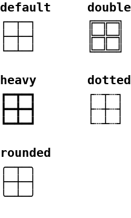
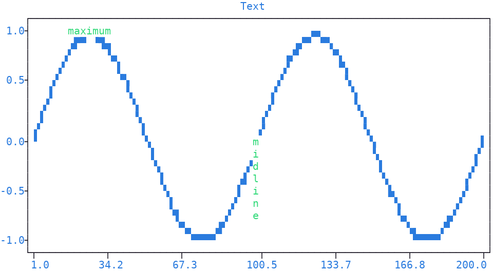

Shapes and Text
===============

|plotext| draws four **geometric shapes** onto the :doc:`canvas <canvas>`:
:meth:`~plotext._plotter.plot.plot_class.rectangle`,
:meth:`~plotext._plotter.plot.plot_class.polygon`,
:meth:`~plotext._plotter.plot.plot_class.segment` and
:meth:`~plotext._plotter.plot.plot_class.line`, plus text annotations with
:meth:`~plotext._plotter.plot.plot_class.text`.
A polygon with many sides can also simulate a circle.

All of them return a :ref:`signal <signal>` to pass to
:meth:`~plotext._plotter.plot.plot_class.draw`, like any other plot, *except*
:meth:`~plotext._plotter.plot.plot_class.line`, which adds itself to the plot
directly.

.. _rectangle:

Rectangle
---------

:meth:`~plotext._plotter.plot.plot_class.rectangle` builds a **filled or outlined** rectangle between two *x* and *y* ranges.

.. code-block:: python

   import plotext as plt
   fig = plt.figure
   fig.clear()

   signal = fig.rectangle((0, 10), (0, 5)).label("filled")
   fig.draw(signal)

   signal = fig.rectangle((12, 22), (0, 5), label = "labeled")
   fig.draw(signal)

   fig.title("Rectangle")
   fig.show()

Or directly from the shell:

.. code-block:: shell

   plotext --figure --rectangle '(0, 10)' '(0, 5)' --label filled --draw \
           --rectangle '(12, 22)' '(0, 5)' label=labeled --draw \
           --title Rectangle --show

| With its parameters you can set the two ranges the rectangle spans (``x`` and ``y``, each a two-value tuple or list) and the symbol rendering it (``marker``, the higher resolution code ``hd`` by default, ``dot`` on Windows: see the :doc:`marker <marker>` page for all the accepted forms).
| You can control its outline and body (``lines`` and ``fill``, both drawn by default).
| Finally, you can write a centered text inside it (``label``), with colors picked automatically: on a filled rectangle they contrast the fill, on an outlined one they match the outline.

.. _polygon:

Polygon
-------

:meth:`~plotext._plotter.plot.plot_class.polygon` builds a **regular polygon** centered at a point.

.. code-block:: python

   import plotext as plt
   fig = plt.figure
   fig.clear()

   signal = fig.polygon(sides = 6).label("hexagon")
   fig.draw(signal)

   fig.title("Polygon")
   fig.show()

Or directly from the shell:

.. code-block:: shell

   plotext --figure --polygon sides=6 --label hexagon --draw --title Polygon --show

| With its parameters you can set the center of the polygon (``x`` and ``y``), the distance of each vertex from the center (``radius``) and their number (``sides``).
| You can tilt the polygon (``up``), placing a vertex or a flat side on top.
| Finally, you can set the symbol rendering it (``marker``, the higher resolution code ``hd`` by default, ``dot`` on Windows: see the :doc:`marker <marker>` page for all the accepted forms).

Circle
~~~~~~

A polygon with many sides **approximates a circle**: from about 50 sides upward the outline is indistinguishable from a real one, with ``radius`` as its actual radius.

.. code-block:: python

   import plotext as plt
   fig = plt.figure
   fig.clear()

   signal = fig.polygon(sides = 100, radius = 2, marker = plt.marker("hd", "red+")).label("circle")
   fig.draw(signal)

   fig.title("Circle")
   fig.show()

Or directly from the shell:

.. code-block:: shell

   plotext --figure --polygon sides=100 radius=2 --label circle --draw --title Circle --show

.. _segment:

Segment
-------

:meth:`~plotext._plotter.plot.plot_class.segment` builds a **straight line** between two endpoints, without going through :meth:`~plotext._plotter.plot.plot_class.signal` and configuring lines manually.

.. code-block:: python

   import plotext as plt
   fig = plt.figure
   fig.clear()

   signal = fig.segment((0, 10), (0, 5)).label("diagonal")
   fig.draw(signal)

   signal = fig.segment((0, 10), (5, 5)).label("horizontal")
   fig.draw(signal)

   fig.title("Segment")
   fig.show()

Or directly from the shell:

.. code-block:: shell

   plotext --figure --segment '(0, 10)' '(0, 5)' --label diagonal --draw \
           --segment '(0, 10)' '(5, 5)' --label horizontal --draw \
           --title Segment --show

| With its parameters you can set the endpoint coordinates (``x`` and ``y``, each a two-value tuple or list) and the symbol rendering the segment (``marker``, the higher resolution code ``hd`` by default, ``dot`` on Windows: see the :doc:`marker <marker>` page for all the accepted forms).

.. _shape_line:

Line
----

| :meth:`~plotext._plotter.plot.plot_class.line` draws a horizontal or vertical line spanning the whole plot :doc:`canvas <canvas>` at the given coordinate, useful to mark thresholds or reference positions.
| It returns no signal: the line has to join the :doc:`axes <axis>` frame with the proper connecting characters at its ends, which no sequence of data points can express, so it is managed by the plot :doc:`rulers <ruler>` and added to the plot *directly*, with no :meth:`~plotext._plotter.plot.plot_class.draw` call needed.

.. code-block:: python

   import plotext as plt
   fig = plt.figure
   fig.clear()

   signal = fig.signal(range(10)).label("data")
   fig.draw(signal)

   fig.line(3, label = "level")
   fig.line(5, orientation = "vertical", label = "position")

   fig.title("Line")
   fig.show()

Or directly from the shell:

.. code-block:: shell

   plotext --figure --signal [0,1,2,3,4,5,6,7,8,9] --label data --draw \
           --line 3 label=level \
           --line 5 orientation=vertical label=position \
           --title Line --show

| With its parameters you can place the line along the perpendicular :doc:`axis <axis>` (``position``, a *y* value when horizontal, an *x* value when vertical), pick its direction (``orientation``) and its line style (``style``, described below).
| Finally, you can add the line to the :ref:`legend <legend>` (``label``).

.. _line_styles:

Line Styles
~~~~~~~~~~~

The ``style`` parameter accepts one of five values:

- ``default`` draws a single solid line (the default)
- ``double`` draws a double solid line
- ``heavy`` draws a thick solid line
- ``dotted`` draws a dashed line
- ``rounded`` draws a solid line with rounded corners at the frame intersections

Use :func:`plotext.line_styles() <plotext.line_styles>` for a preview of the available styles:

.. caution:: ``rounded`` has no effect in :meth:`~plotext._plotter.plot.plot_class.line`, :meth:`~plotext._plotter.plot.plot_class.error`, :meth:`~plotext._plotter.plot.plot_class.event` and :meth:`~plotext._plotter.frame.ruler.ruler_class.grid`, where it renders as ``default``; :meth:`~plotext._plotter.plot.plot_class.axes` displays every style.

Text
----

:meth:`~plotext._plotter.plot.plot_class.text` writes a **text annotation** at the given coordinates.

.. code-block:: python

   import plotext as plt
   fig = plt.figure
   fig.clear()

   y = plt.sin()
   signal = fig.signal(y).lines()
   fig.draw(signal)

   signal = fig.text(25, 1.05, "maximum", alignment = "center")
   fig.draw(signal)

   signal = fig.text(100, 0, "midline", orientation = "vertical")
   fig.draw(signal)

   fig.title("Text")
   fig.show()

Or directly from the shell:

.. code-block:: shell

   plotext --figure --sin --signal --lines --draw \
           --text 25 1.05 maximum alignment=center --draw \
           --text 100 0 midline orientation=vertical --draw \
           --title Text --show

| With its parameters you can set the text coordinates (``x`` and ``y``) and its content (``label``).
| You can write the text horizontally (the default) or vertically (``orientation``), and choose which part of it sits on the given coordinates (``alignment``): *left*, *center* or *right* for horizontal text, *top*, *center* or *bottom* for vertical.
| Finally, you can read *x* and *y* as :doc:`canvas <canvas>` cell coordinates instead of data coordinates (``relative``).

.. tip:: A plain string is written with the default label coloring, while a :ref:`colorize <colorize>` object keeps its own foreground color, background color and style.

.. note:: Text annotations contribute to the plot autoscale: a figure holding only texts, with no signals, still produces sensible :doc:`axis <axis>` limits.

