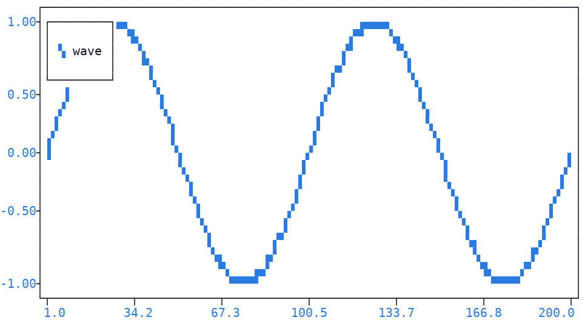

.. _signal:

Signal
======

| A signal is a **sequence of points**, together with the settings describing how they are drawn: the marker symbol, the connecting lines, the fills, the legend label.
| It cannot be created directly: only the :meth:`signal() <plotext._plotter.plot.plot_class.signal>` method of :class:`plotext.figure <plotext._plotter.plot.plot_class>`, or of any :meth:`plotext.figure.subplot() <plotext._plotter.plot.plot_class.subplot>`, produces one.
| The data enters as its **leading arguments**: with a single list, its values are the *y* coordinates; with two lists, the first holds the *x* coordinates and the second the *y* ones.
| The returned signal is configured with the methods of the following sections:

.. note:: With a single list, the points are **counted along** *x*, from 1 to their number, so the first sits at 1. To place them at the list indexes instead, pass those as the *x* coordinates, as in ``plotext.figure.signal(range(len(values)), values)``.

.. code-block:: python

   import plotext as plt
   fig = plt.figure
   fig.clear()

   signal = fig.signal(plt.sin())      # created
   signal.lines().label("wave")        # configured
   fig.draw(signal)                    # drawn

   fig.show()

.. important:: A created signal reaches the plot only through the :meth:`draw() <plotext._plotter.plot.plot_class.draw>` method: without it, nothing is drawn.

.. note:: Before building the signal, :meth:`signal() <plotext._plotter.plot.plot_class.signal>` prepares the input data: it converts dates to timestamps (once :doc:`date <date>` support is activated on the relevant axis) and takes a fresh color from the internal :ref:`color cycler <color_cycling>`, so that successive signals are drawn in different colors.

Lines
-----

The following methods turn the signal into a :ref:`line plot <line>`, connecting its points:

- :meth:`lines() <plotext._signal.signal.signal_class.lines>` connects every consecutive point.
- :meth:`density() <plotext._signal.signal.signal_class.density>`, with the ``line`` scope, sets how densely the connecting lines are drawn, as described below.

.. tip:: :meth:`line() <plotext._signal.signal.signal_class.line>` turns the single line from a point to the previous one on or off, leaving the rest untouched.

.. _density:

Line Density
~~~~~~~~~~~~

|plotext| offers two line drawing methods:

- ``simple`` (the default), draws evenly-spaced points along the line, similar to `numpy.linspace <https://numpy.org/doc/stable/reference/generated/numpy.linspace.html>`_. *Light and fast*, but may leave small gaps on steep segments.
- ``full``, fills every cell crossed by the line, producing a *denser*, visually continuous result.

Switch via :meth:`density() <plotext._signal.signal.signal_class.density>` on the returned signal, as in ``plotext.figure.signal(y).density("full", scope = "line").lines()``.

Fills
-----

The following methods turn the signal into a :ref:`stem plot <stem>`, filling the space between the points and an axis:

- :meth:`fillx() <plotext._signal.signal.signal_class.fillx>` draws a vertical line from each point down to the *x* :doc:`axis <axis>`; :meth:`filly() <plotext._signal.signal.signal_class.filly>` a horizontal one, across to the *y* axis.
- :meth:`fill() <plotext._signal.signal.signal_class.fill>` uses the points of another signal as fill points, as in the :ref:`elaborate stem plot <stem2>`.
- :meth:`density() <plotext._signal.signal.signal_class.density>`, with the ``fill`` scope, makes the same choice for the fills, as described below.

.. _fill_density:

Fill Density
~~~~~~~~~~~~

Stem fills follow the same :ref:`line density <density>` choice as lines, applied to each stem instead. Switch via :meth:`density() <plotext._signal.signal.signal_class.density>` with the ``fill`` scope, as in ``plotext.figure.signal(y).density("full", scope = "fill").fillx()``.

Legend
------

| :meth:`label() <plotext._signal.signal.signal_class.label>` sets the signal entry on the :ref:`legend <legend>`, and that alone makes the legend appear, as in the example above; the :meth:`legend() <plotext._plotter.plot.plot_class.legend>` method is needed only to move it, color it or switch it off.
| Like the :doc:`title and the axis labels <label>`, it accepts a plain string, a :ref:`colorize <colorize>` object or a :ref:`matrix <matrix>` object, so a single entry can carry more than one color.

Inspection
----------

The following methods read the signal, **without changing** it:

- :meth:`length() <plotext._signal.signal.signal_class.length>` returns the number of points currently in the signal.
- :meth:`get() <plotext._signal.signal.signal_class.get>` returns the :ref:`point <point>` at the given index, with its coordinates and marker.
- :meth:`log() <plotext._signal.signal.signal_class.log>` prints a text summary of the signal and of every point.

Reuse
-----

The following methods reuse an existing signal, or empty it:

- :meth:`copy() <plotext._signal.signal.signal_class.copy>` returns a new independent signal, identical to this one, useful to build a second signal with the same settings.
- :meth:`clone() <plotext._signal.signal.signal_class.clone>` overwrites this signal in place with a copy of another, points and settings: useful to change the content of a signal already passed to :meth:`draw() <plotext._plotter.plot.plot_class.draw>`, without registering a new one.
- :meth:`clear() <plotext._signal.signal.signal_class.clear>` removes all points, leaving the signal empty.
