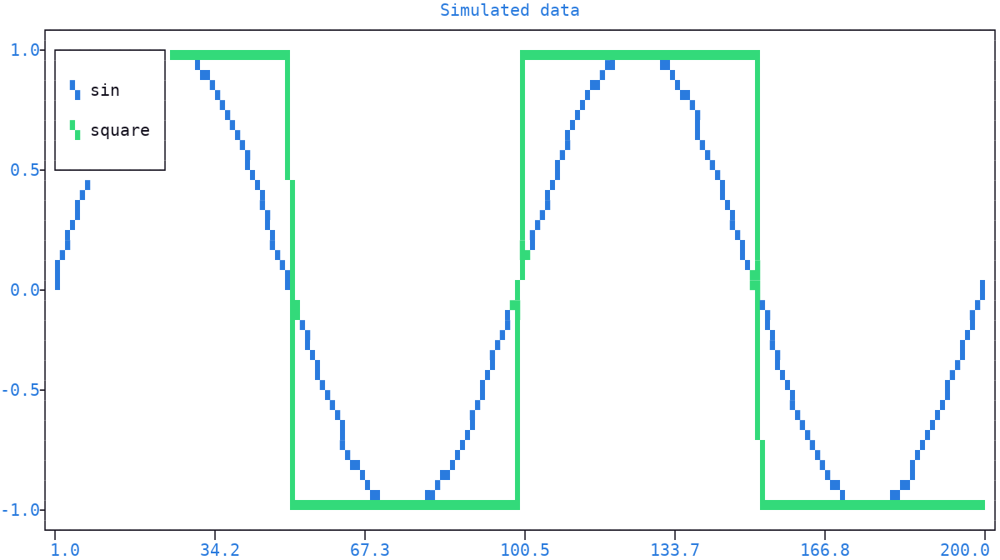

Test Data
=========

This page covers the ready made data |plotext| provides, generated on demand or stored in sample files, to try its methods with.

Simulated Data
--------------

|plotext| provides three data **generators**, useful for tests and examples:

- :func:`sin() <plotext.sin>`, sinusoidal samples, with optional ``phase``, ``decay`` and ``offset``.
- :func:`square() <plotext.square>`, square wave alternating between ``+amplitude`` and ``-amplitude``.
- :func:`noise() <plotext.noise>`, Gaussian samples, with optional ``offset`` (the mean) and ``seed`` for reproducible output.

All three share the ``length`` and ``amplitude`` parameters and return a plain Python list of floats, ready to be passed to :meth:`signal() <plotext._plotter.plot.plot_class.signal>`.

.. code-block:: python

   import plotext as plt

   fig = plt.figure
   fig.clear()
   fig.draw(fig.signal(plt.sin(periods = 2)).lines().label("sin"))
   fig.draw(fig.signal(plt.square(periods = 2)).lines().label("square"))
   fig.title("Simulated data")
   fig.show()

.. note:: The :func:`noise() <plotext.noise>` function is a natural fit for testing :meth:`hist() <plotext._plotter.plot.plot_class.hist>`, its Gaussian samples producing the classic bell shaped histogram, as in the example of the :ref:`histogram <histogram>` section.

.. _sample_files:

Sample Files
------------

The :func:`sample() <plotext.sample>` function completes the set: it returns the **location** of a sample file shipped with |plotext|, useful to try the :doc:`media <media>` and :doc:`file <file>` methods without providing your own files.

The ``name`` parameter picks the sample, without extension:

- *puppy*: the picture of a cuddly puppy, used in the :ref:`image <image>` examples
- *shaq*: an animated gif of a basketball dunk, played in the :ref:`gif <gif>` section
- *pizzas*: a csv table of pizza names and popularity, with no header row, drawn in the :ref:`argument forms <argument_forms>` section of the bar page
- *stock*: a csv table of daily stock prices, with date, open, close, high and low columns, drawn in the :ref:`candlestick <candlestick>` section
