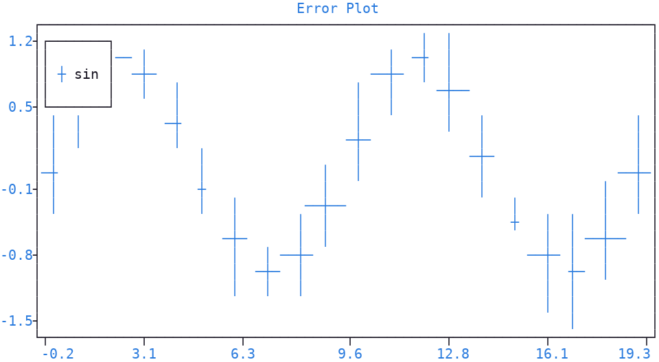
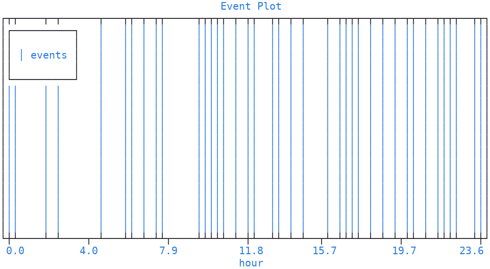
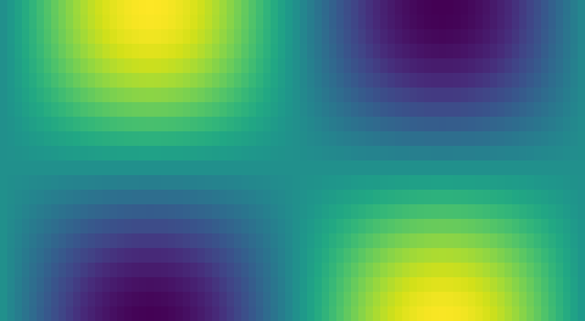
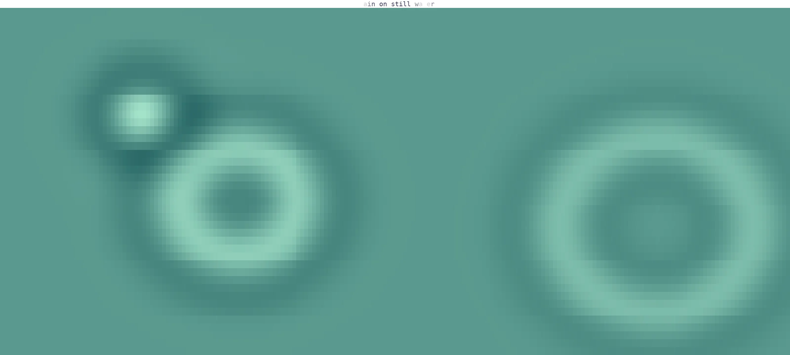
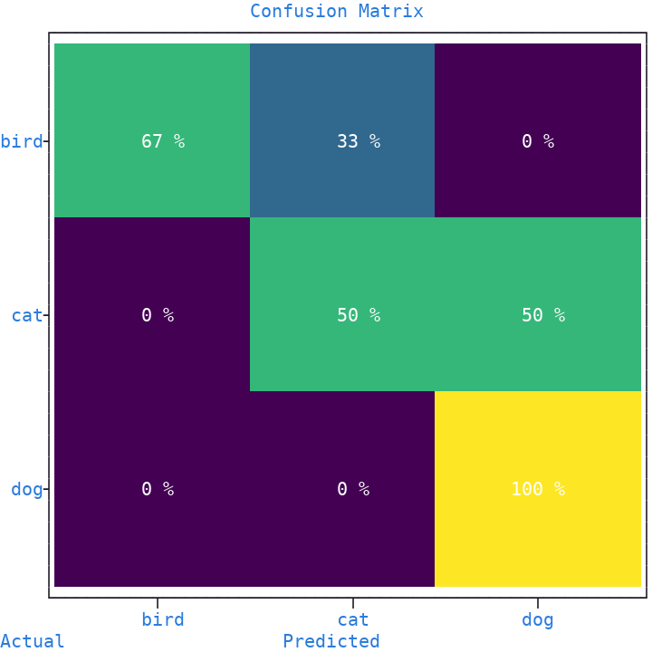
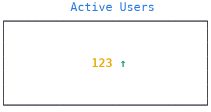

Specialized Plots
=================

This section introduces four specialized plot types:

- :meth:`~plotext._plotter.plot.plot_class.error` draws points with **error bars**, showing the uncertainty around each value
- :meth:`~plotext._plotter.plot.plot_class.event` draws lines marking when discrete **events** occur
- :meth:`~plotext._plotter.plot.plot_class.heatmap` draws a 2D data grid as **colored cells**
- :meth:`~plotext._plotter.plot.plot_class.cmatrix` compares predicted labels against true ones, **counting** each pairing in a colored cell

All of them return a :ref:`signal <signal>` to pass to
:meth:`~plotext._plotter.plot.plot_class.draw`, *except* :meth:`~plotext._plotter.plot.plot_class.event`, which adds
its lines to the plot directly. A final section builds an indicator, a plot
displaying a single prominent value, from existing methods.

.. _error:

Error Bars
----------

:meth:`~plotext._plotter.plot.plot_class.error` draws each point with a vertical and a horizontal line centered on it, whose lengths are the given **errors**, showing the uncertainty around the point.

.. code-block:: python

   import random
   import plotext as plt

   random.seed(0)
   fig = plt.figure
   fig.clear()

   l = 20
   x  = list(range(l))
   y  = plt.sin(length = l)
   ye = [random.random() for _ in range(l)]
   xe = [random.random() for _ in range(l)]

   signal = fig.error(x, y, ye, xe).label("sin")
   fig.draw(signal)

   fig.title("Error Plot")
   fig.show()

Or directly from the shell:

.. code-block:: shell

   plotext --figure --error '[0,1,2,3,4]' '[0.0, 0.84, 0.91, 0.14, -0.76]' \
                   '[0.1, 0.2, 0.15, 0.3, 0.2]' '[0.1, 0.15, 0.2, 0.1, 0.25]' \
           --label sin --draw \
           --title 'Error Plot' --legend --show

| The positional sequences follow the forms ``error(y)``, ``error(x, y)``, ``error(x, y, yerr)`` and ``error(x, y, yerr, xerr)``; each error may be a single number, applied to every point, or a per-point sequence.
| With its parameters you can color every stroke of the bars (``pixel``, taking a fresh color from the cycler if omitted) and pick among the available :ref:`line styles <line_styles>` (``style``).

.. note:: More documentation is available via ``plotext.doc.error()``.

.. _event:

Event Plot
----------

| :meth:`~plotext._plotter.plot.plot_class.event` draws a line spanning the whole :doc:`canvas <canvas>` at every **event coordinate**, useful to mark when discrete events occur.
| Like :meth:`~plotext._plotter.plot.plot_class.line`, it returns no signal: the lines are added to the plot directly, with no :meth:`~plotext._plotter.plot.plot_class.draw` call needed. See the :ref:`Line <shape_line>` paragraph for more details.
| The perpendicular :doc:`axis <axis>` carries no data, so its range is squashed and its :ref:`numerical ticks <ticks>` removed.

.. code-block:: python

   import random
   import plotext as plt

   random.seed(0)
   fig = plt.figure
   fig.clear()

   events = sorted(random.uniform(0, 24) for _ in range(60))   # 60 events across a 24-hour day
   fig.event(events, label = "events")

   fig.title("Event Plot")
   fig.label("hour", axis = "x")
   fig.show()

Or directly from the shell:

.. code-block:: shell

   plotext --figure --event '[2.3, 5.7, 8.1, 9.4, 12.6, 15.2, 18.7, 20.5, 22.8]' label=events \
           --draw --title 'Event Plot' --label hour axis=x --legend --show

| With its parameters you can set the event coordinates (``data``) and pick vertical lines (the default) or horizontal ones (``orientation``).
| You can color the lines (``pixel``) and pick among the available :ref:`line styles <line_styles>` (``style``).
| Finally, you can add a single :ref:`legend <legend>` entry for the whole series (``label``).

.. caution:: In a pure event plot, the perpendicular :doc:`axis <axis>` carries no data, so
   ``event`` freely overwrites its limits and numerical tick frequency to obtain the
   strip look. On a figure that already holds a plot, that :doc:`axis <axis>` carries the
   other plot's values, which would be distorted: to mark events on top of
   existing data, draw a :meth:`~plotext._plotter.plot.plot_class.line` at
   each event coordinate instead.

.. note:: More documentation is available via ``plotext.doc.event()``.

.. _heatmap:

Heatmap
-------

| :meth:`~plotext._plotter.plot.plot_class.heatmap` draws a 2D data grid as colored cells: numeric values are turned into **colors** by the chosen map, while ``(r, g, b)`` triples are used as cell colors directly.
| The first data row is drawn at the top of the :doc:`canvas <canvas>`.

.. code-block:: python

   import math
   import plotext as plt

   fig = plt.figure
   fig.clear()

   cols, rows = plt.terminal.size()
   data = [[math.sin(c / cols * 2 * math.pi) * math.cos(r / rows * math.pi)
            for c in range(cols)] for r in range(rows)]

   fig.axes(0)
   fig.ruler("x").frequency(0)
   fig.ruler("y").frequency(0)
   fig.draw(fig.heatmap(data, map = "viridis", fill = 1))
   fig.show()

Or directly from the shell:

.. code-block:: shell

   plotext --figure --axes 0 \
           --heatmap '[[1,2,3,4],[2,4,6,8],[3,6,9,12],[4,8,12,16]]' map=viridis fill=true \
           --draw --show

| With its parameters you can set the 2D sequence to draw (``data``) and pick the color scale (``map``): *gray* (the default) shades the cells from black at the lowest value to white at the highest, while *viridis* runs from dark blue through green to yellow, easier to read when neighboring values are close.
| You can decide how much of the plot each data cell takes (``fill``): with ``False`` (the default), a single character; with ``True``, a rectangle stretching to the next cell in both directions, so that the heatmap covers the whole plot.
| Finally, you can set the character rendering every cell (``symbol``).

.. note:: More documentation is available via ``plotext.doc.heatmap()``.

.. _heatmap_animation:

Animated Heatmap
~~~~~~~~~~~~~~~~

| A heatmap takes ``(r, g, b)`` triples as readily as numbers, which turns it into a way of **painting the plot**: give every cell the color you want and the plot becomes a picture.
| Redrawing it in a loop, as the :doc:`streaming <stream>` page does, sets that picture moving.
| Here is rain falling on still water, each drop sending out a ring that widens and fades:

.. literalinclude:: code/heatmap_rain.py
   :language: python

.. note:: The title is colored by :func:`plotext.effect() <plotext.effect>`, advanced one step per frame, described in the :ref:`animated text effects <effects>` section.

.. tip:: The grid is given **a few cells more** than the plot has characters. With exactly as many, a rounding of one row leaves a line of empty canvas across the picture; with more, the extra cells simply fall on the same character.

.. _confusion_matrix:

Confusion Matrix
----------------

| :meth:`~plotext._plotter.plot.plot_class.cmatrix` compares predicted labels against true ones: each cell **counts** how many samples with a given true label received a given predicted label.
| Each cell is drawn as a filled rectangle, whose color scales with the count, and carries the count itself as a centered label.
| Tick labels, :doc:`axis <axis>` labels and title are not set automatically; the example below adds them explicitly.

.. code-block:: python

   import plotext as plt

   actual    = ['cat', 'dog', 'cat', 'dog', 'cat', 'bird', 'bird', 'dog', 'cat', 'bird']
   predicted = ['cat', 'dog', 'dog', 'dog', 'cat', 'bird', 'cat', 'dog', 'dog', 'bird']
   labels    = sorted(set(actual + predicted))
   n = len(labels)

   fig = plt.figure
   fig.clear()
   fig.plot_size(60, 30)

   signal = fig.cmatrix(actual, predicted, norm = True, map = 'viridis')
   fig.draw(signal)

   fig.ruler("x").ticks(list(range(n)), labels = labels)
   fig.ruler("y").ticks(list(range(n)), labels = labels[::-1])
   fig.label("Predicted", axis = "x")
   fig.label("Actual",    axis = "y")
   fig.title("Confusion Matrix")
   fig.show()

Or directly from the shell:

.. code-block:: shell

   plotext --figure --cmatrix \
           '["cat","dog","cat","dog","cat","bird","bird","dog","cat","bird"]' \
           '["cat","dog","dog","dog","cat","bird","cat","dog","dog","bird"]' \
           norm=true map=viridis --draw \
           --title 'Confusion Matrix' --show

| With its parameters you can set the true and predicted label of each sample (``actual`` and ``predicted``).
| You can set which labels form the :ref:`matrix <matrix>` rows and columns, and in which order (``labels``), ignoring samples with labels outside the list; if not given, every distinct label found in the data is used, in sorted order.
| With ``norm`` on, the cell labels show percentages relative to their row total instead of raw counts, while the cell colors always follow the counts.
| Finally, you can pick the color scale (``map``), as in :ref:`heatmap <heatmap>`.

.. note:: More documentation is available via ``plotext.doc.cmatrix()``.

.. _indicator:

Indicator
---------

| An indicator displays a **single central value**, with a title and an optional trend arrow, inside a framed box: useful to spotlight one live metric, as in dashboards.
| It has no dedicated method, but a few existing ones are enough to build it:

.. code-block:: python

   import plotext as plt
   fig = plt.figure
   fig.clear()
   fig.plot_size(30, 8)

   value, label, trend = 123, "Active Users", +5

   parts = plt.colorize(str(value), pixel = ('orange+', None, 'bold'))
   if trend is not None:
       arrow       = '↑' if trend > 0 else '↓' if trend < 0 else '↔'
       arrow_color = 'green' if trend > 0 else 'red' if trend < 0 else 'orange'
       parts = parts.hstack(plt.colorize(' ' + arrow, pixel = (arrow_color, None, 'bold')))

   fig.ruler('x').frequency(0); fig.ruler('y').frequency(0)   # hide ticks (frame stays for the boxed look)
   fig.ruler('x').lim(0, 1); fig.ruler('y').lim(0, 1)   # fix the canvas extent
   fig.title(label)
   fig.draw(fig.text(0.5, 0.5, parts, alignment = 'center'))
   fig.show()

.. tip:: To display several indicators side by side, place each one in its own :ref:`subplot <subplots>`.
