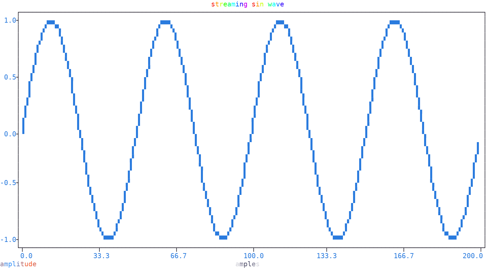

Streaming Plots
===============

| A streaming plot is a *continuous* sequence of plots: at each frame, the previous plot is cleaned and a new one is drawn with **fresh data**.

|plotext| runs the loop smoothly with six tools:

- :meth:`size(update = True) <plotext._kernel.terminal.terminal.size>` takes a **fresh** :doc:`terminal <terminal>` size instead of the last known one, passed to :meth:`plot_size() <plotext._plotter.plot.plot_class.plot_size>`, adapting the stream to an optionally resized terminal
- :meth:`clean(lines) <plotext._kernel.terminal.terminal.clean>`, a method of the :doc:`terminal <terminal>`, cleans the given number of last printed lines, typically the plot height, so that the next frame takes their place with **no scrolling**; the ``if frame`` guard skips it at the first pass, when nothing is on screen yet
- :meth:`clear.data() <plotext._plotter.clear.clear_class.data>` clears **only the data**, so that limits, labels and title, set once before the loop, survive across frames
- :func:`sleep(seconds) <plotext.sleep>` pauses between frames: tweak the time to reduce any remaining flickering
- :meth:`show(flush = True) <plotext._plotter.plot.plot_class.show>` pushes the whole frame to the :doc:`terminal <terminal>` in **one go**, once fully written, avoiding partially drawn frames on screen
- :meth:`is_pressed(key) <plotext._kernel.terminal.terminal.is_pressed>`, a method of the :doc:`terminal <terminal>`, tells whether the given key has been typed, answering right away **without pausing** the program, used here to stop the stream

.. seealso:: Feeding :func:`plotext.effect` to the title and :doc:`axis <axis>` labels, advanced at each frame, animates them too: it returns a single row :ref:`matrix <matrix>` whose characters are colored by a moving effect, described in the :ref:`animated text effects <effects>` section.

A sine wave scrolling left, adapting to the :doc:`terminal <terminal>` size; typing ``q`` stops the stream:

.. code-block:: python

   import math
   import plotext as plt

   fig    = plt.figure
   length = 200

   fig.clear()
   fig.ruler("x").lim(0, length)
   fig.ruler("y").lim(-1, 1)

   x      = range(length)
   y      = lambda frame: [math.sin(2 * math.pi * (k - frame) / length * 4) for k in range(length)]
   title  = lambda frame: plt.effect("streaming sin wave", "rainbow",  step = frame * 0.4)
   xlabel = lambda frame: plt.effect("samples",            "shimmer",  step = frame * 0.4)
   ylabel = lambda frame: plt.effect("amplitude",          "gradient", step = frame * 0.2)

   frame = 0
   while True:

       w, h = plt.terminal.size(update = True)            # take a fresh terminal size
       if frame: plt.terminal.clean(h)                    # clean the previous frame, hint included

       fig.clear.data()                                   # clear the data, keeping the settings
       fig.plot_size(w, h - 1)                            # adapt to the terminal, one row spared for the hint

       fig.title(title(frame))
       fig.label(xlabel(frame), axis = 0)
       fig.label(ylabel(frame), axis = 1)
       fig.draw(fig.signal(x, y(frame)).lines())

       plt.sleep(0.001)                                   # pause between frames
       fig.show(flush = True)

       if plt.terminal.is_pressed('q'): break             # exit on key press
       print("press q to exit")

       frame += 1

.. note:: There is no shell version of a streaming plot: the :doc:`command line <cli>` chain syntax cannot express a loop. If needed, ``python3 -c "<code>"`` runs the Python code above directly.

