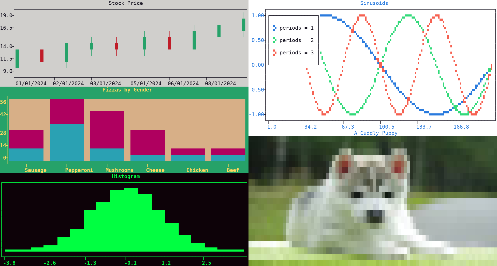

.. _subplots:

Subplots
========

| |plotext| can create and render a grid of subplots, each with its own data and settings.
| Each subplot can itself hold a grid of subplots, **recursively**.
| Settings applied on the figure **propagate** to every subplot, while settings applied on a single subplot stay **local**.

The following example divides the master figure into a 1 × 2 grid, nests a 3 × 1 grid in its left half and a 2 × 1 one in its right half, and fills each final subplot with its own plot type and :doc:`theme <theme>`:

.. code-block:: python

   import plotext as plt

   fig = plt.figure
   fig.clear()

   # the master 1 x 2 grid: a 3 x 1 grid on the left, a 2 x 1 one on the right
   fig.subplots(1, 2)
   left = fig.subplot(1, 1)
   left.subplots(3, 1)
   right = fig.subplot(1, 2)
   right.subplots(2, 1)

   # candlestick plot of the bundled stock sample
   sub = left.subplot(1, 1)
   sub.theme("windows")
   sub.date("x").activate()
   rows = plt.file.csv(plt.sample("stock"))
   stock = {key: list(values) if key == "date" else [float(value) for value in values]
            for key, values in zip(rows[0], zip(*rows[1:]))}
   sub.draw(sub.candlestick(stock))
   sub.title("Stock Price")

   # stacked bar plot
   sub = left.subplot(2, 1)
   sub.theme("dreamland")
   pizzas = ["Sausage", "Pepperoni", "Mushrooms", "Cheese", "Chicken", "Beef"]
   men, women = [14, 36, 11, 8, 7, 4], [12, 20, 35, 15, 2, 1]
   sub.draw(sub.bar(pizzas, [men, women], stacked = True))
   sub.title("Pizzas by Gender")

   # histogram of gaussian noise
   sub = left.subplot(3, 1)
   sub.theme("matrix")
   sub.draw(sub.hist(plt.noise(length = 10000, seed = 1), bins = 18, marker = "fhd"))
   sub.ruler("y").frequency(0)
   sub.title("Histogram")

   # three sinusoidal signals
   sub = right.subplot(1, 1)
   for periods in (1, 2, 3):
       sub.draw(sub.signal(plt.sin(periods = periods), marker = "fhd").label(f"periods = {periods}"))
   sub.title("Sinusoids")

   # the bundled sample image
   sub = right.subplot(2, 1)
   sub.axes(False)
   sub.ruler("both").frequency(0)
   sub.draw(sub.image(plt.sample("puppy")))
   sub.title("A Cuddly Puppy")

   fig.show()

.. note:: The ``fhd`` marker of the example is a :ref:`higher resolution code <resolutions>`, splitting each character into a 3 × 2 grid of sub-points, which fits more data in a small subplot.

.. note:: From the :doc:`terminal <terminal>`, a flat grid can be built with the chain syntax, as in ``plotext --figure --subplots 1 2 --subplot 1 1 --sin --signal --lines --draw --title left --subplot 1 2 --noise --hist --draw --title right --show``; a nested grid, like the one above, needs full Python code, run with ``python3 -c``, as shown in the :ref:`subplots section <cli_subplots>` of the :doc:`command line <cli>` page.

Create
------

The :meth:`subplots() <plotext._plotter.plot.plot_class.subplots>` method divides a plot into a *rows × cols* grid. Called on :class:`plotext.figure <plotext._plotter.plot.plot_class>`, the master, it builds the top level grid; called on any subplot, it turns that subplot into a container for a nested grid.

Address
-------

The :meth:`subplot() <plotext._plotter.plot.plot_class.subplot>` method returns the subplot at a given *(row, col)*, so that it can be addressed directly. The plotting methods, :meth:`signal() <plotext._plotter.plot.plot_class.signal>`, :meth:`draw() <plotext._plotter.plot.plot_class.draw>`, :meth:`title() <plotext._plotter.plot.plot_class.title>`, :meth:`plot_size() <plotext._plotter.plot.plot_class.plot_size>` and so on, are then invoked on that subplot. Each subplot can be resized independently via :meth:`plot_size() <plotext._plotter.plot.plot_class.plot_size>`: see the :doc:`size <size>` page.

Resolve
-------

| Within a grid of subplots of possibly different sizes, the sizes need to be **resolved** before the plot is rendered.
| The resolution happens in two steps, described below; along the way, any subplot with no requested size takes an equal share of the parent dimensions, the terminal ones for the master plot.

Size Policy
~~~~~~~~~~~

| In the first step, all widths in a given column of subplots, and all heights in a given row of subplots, are brought to a **single shared value**.
| When subplots in the same column or row disagree on their requested size, the ``policy`` parameter of :meth:`plot_size() <plotext._plotter.plot.plot_class.plot_size>` decides the rule: with *maximum* (the default), each column or row takes the largest requested size, enlarging the subplots that asked for less; with *minimum*, it takes the smallest, shrinking the ones that asked for more.

Size Direction
~~~~~~~~~~~~~~

| In the second step, the total widths in a row, and the total heights in a column, are fitted within the parent dimensions.
| The ``direction`` parameter of :meth:`plot_size() <plotext._plotter.plot.plot_class.plot_size>` decides the direction in which this check runs.
| With ``+1``, the check runs left to right for widths and top to bottom for heights: every subplot receives at most its requested size, and the **last** subplot along the :doc:`axis <axis>` absorbs whatever space remains.
| With ``-1``, the direction is reversed, and the **first** subplot absorbs the leftover instead.

.. seealso:: A tree of subplots can be navigated, and inspected, with the methods described in the :ref:`navigate <navigate>` section of the :doc:`plot inspection <inspection>` page.
