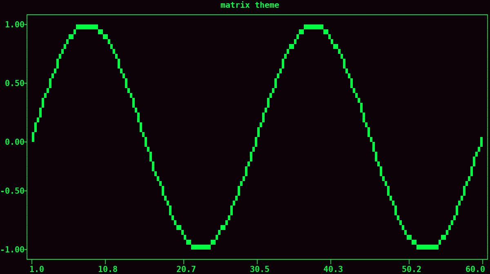
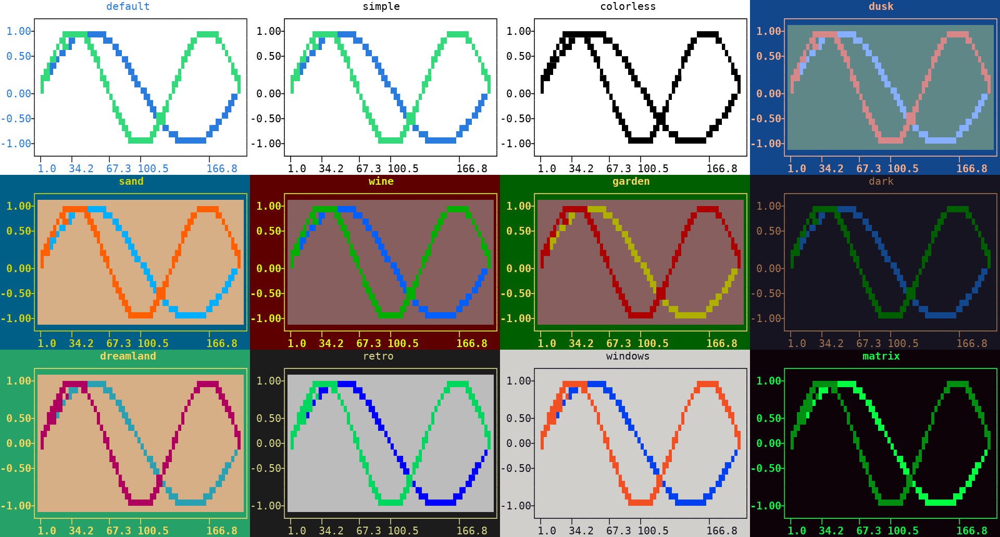
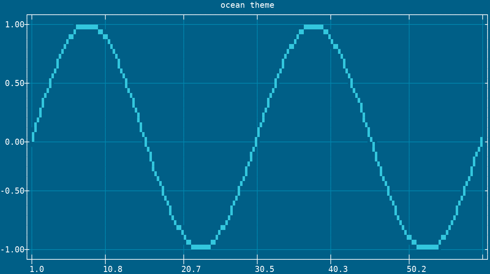

Themes
======

The :meth:`theme() <plotext._plotter.plot.plot_class.theme>` method applies a named color preset **in one call**: the :doc:`canvas <canvas>` background, one shared text :ref:`pixel <pixel>` covering the :doc:`axes <axis>` frame, the :doc:`rulers <ruler>`, the axis labels and the :ref:`legend <legend>`, and the sequence of pixels given to successive signals by the :ref:`cycler <color_cycling>`.

.. code-block:: python

   import plotext as plt
   fig = plt.figure
   fig.clear()

   fig.theme("matrix")    # near black background, bold green text and signals

   fig.draw(fig.signal(plt.sin(length = 60)).lines())
   fig.title("matrix theme")
   fig.show()

Applied to the master figure, the theme colors the whole plot, :ref:`subplots <subplots>` included.

.. note:: An unknown name falls back to the *default* theme.

The available themes:

- *default*: the out-of-the-box look, white canvas, black axes, blue+ labels, the standard 16 color signal sequence
- *simple*: no canvas, frame or numerical tick colors, signals on the default sequence
- *colorless*: no color at all, signals included
- *dusk*: slate teal canvas, bold salmon on blue text, soft pastel signals
- *sand*: warm tan canvas, bold gold on blue text, cyan and orange signals
- *wine*: mauve canvas, bold lime on maroon text, blue and green signals
- *garden*: mauve canvas, bold gold on green text, olive, red and purple signals
- *dark*: black canvas, orange text, cool toned signals
- *dreamland*: tan canvas, bold gold on green text, soft blue and magenta signals
- *retro*: light gray canvas with a darker numerical tick band, amber text
- *windows*: light gray canvas, black text, the classic blue, red, green and yellow accents
- *matrix*: near black canvas, bold green text and signals

.. note:: The *colorless* theme is distinct from :meth:`plotext.figure.clear.pixels() <plotext._plotter.clear.clear_class.pixels>`, which resets the colors to the package defaults rather than removing them: that call is equivalent to the *default* theme.

.. caution:: A theme hands its color sequence to the signals **created after it**, so it belongs before the drawing: a signal already drawn keeps the color it was given, and only the frame, the rulers, the labels and the legend change.

.. tip:: Preview every theme at once with :func:`plotext.themes() <plotext.themes>`, which renders a grid of mini plots, one per theme, titled with its name.

.. _custom_themes:

Custom Themes
-------------

The :func:`plotext.add_theme() <plotext.add_theme>` function registers a custom theme under a **chosen name**, ready to be applied like any built-in one.

.. code-block:: python

   import plotext as plt
   fig = plt.figure
   fig.clear()

   plt.add_theme("ocean",
                 canvas = 24,                                # canvas background color
                 text = ("white", 24),                       # axes, rulers, labels and legend pixel
                 sequence = ["cyan+", "blue+", "white"],     # signal colors
                 grid = 31)                                  # grid lines color

   fig.theme("ocean")

   fig.draw(fig.signal(plt.sin(length = 60)).lines())
   fig.ruler("both", "both").grid(True)

   fig.title("ocean theme")
   fig.show()

| With its parameters you can set the canvas background color (``canvas``), the text pixel shared by the axes, rulers, labels and :ref:`legend <legend>` (``text``, in any accepted :ref:`pixel form <pixel_forms>`), and the signal colors (``sequence``, a list of color codes or pixels, completed with the standard palette).
| You can also give the grid lines their own pixel (``grid``); if not given, they take the text one.

.. note:: Registering an existing name overwrites it, built-ins included.

.. tip:: Cooked up a theme that looks delicious? Share it in a `pull request <https://github.com/piccolomo/plotext/pulls>`_ and it could join the built-ins. Convinced one of the default themes deserves extinction, or just a better name? Ask in an `issue <https://github.com/piccolomo/plotext/issues>`_: no theme is safe.
